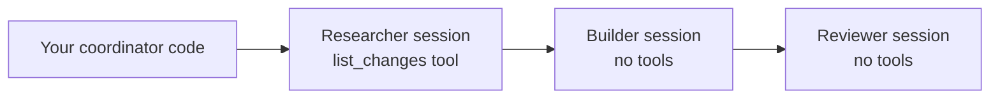
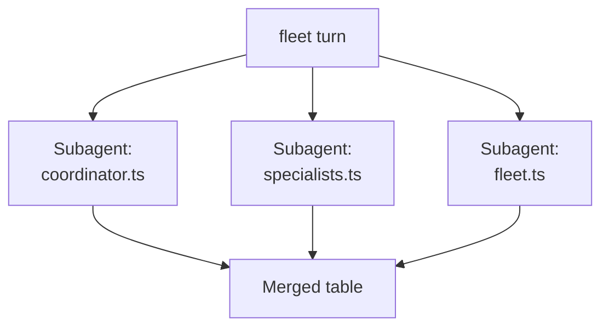

# Building a Multi-Agent System

One agent handles one job well; hard problems need several agents that each own a part and hand work to each other. The Copilot SDK gives you three ways to build that, and they differ in who does the orchestrating. You can drive several sessions from your own code, you can register specialists on one session and select them per turn, or you can hand the decomposition to the CLI's built-in fleet mode.

The finished code for every step below lives in [multi-agent-solution](./multi-agent-solution/), verified against `@github/copilot-sdk` 1.0.14 and Copilot CLI 1.0.87. Build the files yourself as you read; go there when a step misbehaves.

## The pattern

A coordinator breaks a request into parts and delegates each part to a specialist: a researcher that gathers facts, a builder that writes them up, a reviewer that checks the result. Each specialist is an ordinary SDK session with its own system message and its own tool set, and the coordinator is the code that feeds one specialist's answer into the next one's prompt. Because every specialist is just a session, you scale the system by adding sessions rather than by growing one prompt.



## Why it beats one big agent

Splitting the work keeps each agent's context focused, makes failures easy to isolate, and lets you run independent parts in parallel. It also gives you a real tool boundary: the researcher's `list_changes` tool does not exist in the builder's session, so the builder cannot reach past the facts it was handed and reinterpret the raw data. That mirrors the multi-agent orchestration you saw in Implementing Agentic Coding, applied here in code you own end to end.

## Demo

### Prerequisites

The SDK needs Node.js 20.19 or later (or 22.12 or later). It bundles its own Copilot CLI runtime, so you only have to be signed in.

```bash
node --version
copilot --version
```

If you have not authenticated yet, run `copilot` and then `/login`.

> Note: The model name below is an example. Run `/model` in the CLI, or call `client.listModels()` in code, to see which models your account and organization policy allow.

### Step 1: Create the Project

```bash
mkdir multi-agent-system
cd multi-agent-system
npm init -y --init-type module
npm install @github/copilot-sdk@1.0.14 tsx@4.20.6 typescript@5.9.3 @types/node@24.10.1
```

Add a `tsconfig.json` next to it so you can typecheck:

```json
{
  "compilerOptions": {
    "target": "ES2022",
    "module": "NodeNext",
    "moduleResolution": "NodeNext",
    "strict": true,
    "noEmit": true,
    "skipLibCheck": true,
    "types": ["node"]
  },
  "include": ["*.ts"]
}
```

Run `npx tsc --noEmit` before every run. `tsx` executes TypeScript without typechecking it, so a type error in a tool handler or an orchestration helper stays invisible at runtime.

### Step 2: Write the Coordinator

Create `coordinator.ts`. One client, three sessions, and a pipeline that is just three awaits:

```typescript
import {
  CopilotClient,
  defineTool,
  type CopilotSession,
  type SessionConfig,
} from "@github/copilot-sdk";

const MODEL = "gpt-5-mini";

const listChanges = defineTool<{ since: string }>("list_changes", {
  description: "List the merged changes in the repository since a given tag",
  skipPermission: true,
  parameters: {
    type: "object",
    properties: {
      since: {
        type: "string",
        description: "The tag to list changes since",
      },
    },
    required: ["since"],
  },
  handler: async (args) => ({
    since: args.since,
    changes: [
      { id: "a91f2c", area: "cli", summary: "add --fleet to the prompt runner" },
      { id: "4d02be", area: "sdk", summary: "session.factory API for registered factories" },
      { id: "7c1188", area: "sdk", summary: "customAgents accepted at session creation" },
      { id: "be40aa", area: "docs", summary: "correct the tool permission defaults" },
    ],
  }),
});

async function runSpecialist(
  session: CopilotSession,
  label: string,
  prompt: string,
): Promise<string> {
  process.stdout.write(`\n--- ${label} ---\n`);
  const response = await session.sendAndWait({ prompt }, 180_000);
  const text = response?.data.content ?? "";
  console.log(text);
  return text;
}

async function main() {
  const client = new CopilotClient();

  const specialist = (systemMessage: string, tools: SessionConfig["tools"] = []) =>
    client.createSession({
      model: MODEL,
      streaming: false,
      tools,
      availableTools: ["custom:*"],
      systemMessage: { mode: "replace", content: systemMessage },
    });

  const researcher = await specialist(
    "You are a research specialist. Call the tools you are given, then report only the facts you retrieved as a compact bullet list. Never write prose around them.",
    [listChanges],
  );

  const builder = await specialist(
    "You are a release-notes writer. Turn the facts you are handed into a markdown section titled '## Unreleased', one bullet per change, grouped by area. Output the markdown only.",
  );

  const reviewer = await specialist(
    "You are a style reviewer. The house style forbids em dashes and requires every bullet to name its area. Answer with a verdict line 'VERDICT: PASS' or 'VERDICT: FAIL', then one line per violation.",
  );

  const facts = await runSpecialist(
    researcher,
    "researcher",
    "List the changes since tag v2.1 and report them.",
  );

  const draft = await runSpecialist(
    builder,
    "builder",
    `Write the release-notes section from these facts:\n\n${facts}`,
  );

  await runSpecialist(
    reviewer,
    "reviewer",
    `Review this release-notes section against the house style:\n\n${draft}`,
  );

  await client.stop();
  process.exit(0);
}

main();
```

Four details in that file carry the pattern. `systemMessage` uses `mode: "replace"` because a specialist's persona is the whole point of the session; the default `append` mode leaves the runtime's own prompt in front of yours. `availableTools: ["custom:*"]` keeps each session to the tools you gave it, which is what makes "the builder has no data access" true rather than aspirational.

`sendAndWait` returns the final assistant message, so `response?.data.content` is the handoff value and you do not need an event subscription to collect it. The 180 second timeout is the second argument; the 60 second default is short for a specialist that has to call a tool and then write.

### Step 3: Run It and Read the Handoff

```bash
npx tsc --noEmit
npx tsx coordinator.ts
```

```text
--- researcher ---
- a91f2c (cli): add --fleet to the prompt runner
- 4d02be (sdk): session.factory API for registered factories
- 7c1188 (sdk): customAgents accepted at session creation
- be40aa (docs): correct the tool permission defaults

--- builder ---
## Unreleased

### CLI
- Add `--fleet` option to the prompt runner (a91f2c)

### SDK
- Add `session.factory` API for registered factories (4d02be)
- Accept `customAgents` at session creation (7c1188)

### Docs
- Correct default tool permissions (be40aa)

--- reviewer ---
VERDICT: FAIL
Bullet under "CLI" does not name its area: Add `--fleet` option to the prompt runner (a91f2c)
```

The researcher's bullets are the tool's own data, the builder's markdown is derived from those bullets, and the reviewer judged the markdown without ever seeing the tool. A `FAIL` verdict here is a working pipeline, not a broken one: the reviewer applied a rule the builder was never told about, which is exactly what you want a separate reviewer for.

Adding a fourth specialist is one more `specialist(...)` call and one more `runSpecialist(...)` await. Nothing in the existing three changes, because there is no routing table to update.

### Step 4: Let the SDK Own the Specialists

The same three roles can live on one session as `customAgents`, selected per turn. Create `specialists.ts`:

```typescript
import { CopilotClient, defineTool, type CustomAgentConfig } from "@github/copilot-sdk";

const MODEL = "gpt-5-mini";

const agents: CustomAgentConfig[] = [
  {
    name: "researcher",
    displayName: "Researcher",
    description: "Retrieves repository facts and reports them without commentary",
    tools: ["list_changes"],
    prompt:
      "You are a research specialist. Call the tools you are given, then report only the facts you retrieved as a compact bullet list.",
  },
  {
    name: "reviewer",
    displayName: "Reviewer",
    description: "Checks a draft against the house style and returns a verdict",
    tools: [],
    prompt:
      "You are a style reviewer. The house style forbids em dashes and requires every bullet to carry a change id. Answer with 'VERDICT: PASS' or 'VERDICT: FAIL', then one line per violation.",
  },
];

async function main() {
  const client = new CopilotClient();
  const session = await client.createSession({
    model: MODEL,
    streaming: false,
    tools: [listChanges],
    customAgents: agents,
    agent: "researcher",
  });

  const registered = await session.rpc.agent.list();
  console.log("registered agents:");
  for (const agent of registered.agents) {
    console.log(`  ${agent.name}: ${agent.description}`);
  }

  const current = await session.rpc.agent.getCurrent();
  console.log(`\nselected at start: ${current.agent?.name ?? "default"}`);

  const facts = await session.sendAndWait(
    { prompt: "List the changes since tag v2.1 and report them." },
    180_000,
  );
  console.log(`\n--- researcher ---\n${facts?.data.content ?? ""}`);

  const selected = await session.rpc.agent.select({ name: "reviewer" });
  console.log(`\nselected for the next turn: ${selected.agent?.name ?? "default"}`);

  const verdict = await session.sendAndWait(
    { prompt: "Review the bullet list you just produced against the house style." },
    180_000,
  );
  console.log(`\n--- reviewer ---\n${verdict?.data.content ?? ""}`);

  await client.stop();
  process.exit(0);
}

main();
```

Copy `listChanges` from `coordinator.ts`, or take the whole file from [multi-agent-solution/specialists.ts](./multi-agent-solution/specialists.ts).

```bash
npx tsx specialists.ts
```

```text
registered agents:
  researcher: Retrieves repository facts and reports them without commentary
  reviewer: Checks a draft against the house style and returns a verdict

selected at start: researcher

--- researcher ---
Found 3 merged changes since tag v2.1:
- a91f2c — cli: add --fleet to the prompt runner
...

selected for the next turn: reviewer

--- reviewer ---
VERDICT: FAIL
Used em dashes in bullet points; house style forbids em dashes.
```

Three things are worth noting about this route. A `CustomAgentConfig` carries `name`, `prompt`, and a `tools` allowlist of tool names, so per-agent tool scoping is declarative instead of one session per scope. `agent` in the session config selects the starting agent, and `session.rpc.agent.select`, `getCurrent`, and `list` move between them afterwards.

The trade-off is context. All turns share one transcript, which is why the reviewer above could critique "the bullet list you just produced" without being handed it. That is convenient and it is also the isolation you gave up: a specialist here sees everything its predecessors said.

### Step 5: Compare Against Built-In Fleet Mode

Fleet mode is the CLI's own parallel orchestration. It decomposes a prompt, runs subagents concurrently, and merges their reports, so you write the task instead of the coordinator. From the terminal:

```bash
copilot --fleet -p "Audit coordinator.ts, specialists.ts and fleet.ts in this directory. Give each file to its own subagent and report the model string each one uses as a markdown table." --allow-all-tools --model gpt-5-mini
```

That command is the one verified for this guide, run exactly as printed. `--fleet` combines with `-i`, `-p`, or piped stdin, and the CLI also carries a `/fleet` slash command for the same thing from inside an interactive session. The same orchestration is reachable from code as `session.rpc.fleet.start`. Create `fleet.ts`:

```typescript
import { CopilotClient, approveAll, type SessionEvent } from "@github/copilot-sdk";

const MODEL = "gpt-5-mini";

async function main() {
  const client = new CopilotClient();
  const session = await client.createSession({
    model: MODEL,
    streaming: false,
    workingDirectory: process.cwd(),
    onPermissionRequest: approveAll,
  });

  session.on((event: SessionEvent) => {
    if (event.type === "assistant.message") {
      console.log(`\n--- assistant ---\n${event.data.content}`);
    }
  });

  const result = await session.rpc.fleet.start({
    prompt:
      "Audit coordinator.ts, specialists.ts and fleet.ts in this directory. " +
      "Give each file to its own subagent, and have each report the file name, " +
      "the model string it uses, and how many SDK sessions it creates. " +
      "Then print one markdown table of the three results.",
    wait: true,
  });

  console.log(`\nfleet started: ${result.started}`);

  await client.stop();
  process.exit(0);
}

main();
```

```bash
npx tsx fleet.ts
```

The tail of a healthy run is the merged table:

```text
| File | Model string | SDK sessions created |
|---|---:|---:|
| coordinator.ts | gpt-5-mini | 3 |
| specialists.ts | gpt-5-mini | 1 |
| fleet.ts | gpt-5-mini | 1 |

fleet started: true
```



Two flags on that call decide whether you see anything. `wait: true` awaits the whole agentic loop; without it the call resolves as soon as fleet mode is activated and your program exits while the subagents are still working. `onPermissionRequest: approveAll` is needed because fleet subagents use the built-in file tools, and a session with no handler denies every one of them.

Everything above the table is worth reading once. The subagents run in parallel, so their reports interleave and arrive as many separate `assistant.message` events rather than one. The coordinator also tracks its own work in a SQL todo list that it queries and updates as the subagents finish, which is visible in the transcript.

### Step 6: Where defineFactory Fits

The SDK exports `defineFactory` for durable multi-stage pipelines, with `ctx.parallel`, `ctx.pipeline`, `ctx.step`, and `ctx.agent` inside the run body. It is not a third orchestration route for an ordinary SDK program, and `factory-probe.ts` shows why:

```typescript
import { CopilotClient, defineFactory } from "@github/copilot-sdk";

const auditPipeline = defineFactory<{ files: string[] }>({
  meta: {
    name: "audit-pipeline",
    description: "Fans one subagent out per file and merges the findings. args: { files: string[] }",
    phases: [{ title: "Audit" }, { title: "Merge" }],
    argsSchema: {
      type: "object",
      required: ["files"],
      properties: {
        files: { type: "array", items: { type: "string" } },
      },
    },
  },
  run: async (ctx) => {
    ctx.phase("Audit");
    const findings = await ctx.parallel(
      ctx.args.files.map(
        (file) => () => ctx.agent(`Report the model string used in ${file}`, { label: file }),
      ),
    );

    ctx.phase("Merge");
    return await ctx.step("merge", () => ({
      findings: findings.map((finding) => (typeof finding === "string" ? finding : null)),
    }));
  },
});

async function main() {
  const client = new CopilotClient();
  const session = await client.createSession({ model: "gpt-5-mini", streaming: false });

  console.log(`factory defined: ${auditPipeline.meta.name}`);
  console.log(`phases: ${auditPipeline.meta.phases.map((phase) => phase.title).join(", ")}`);

  try {
    const run = await session.factory.run(auditPipeline, {
      args: { files: ["coordinator.ts"] },
    });
    console.log(`run status: ${run.status}`);
  } catch (error) {
    console.log(`session.factory.run rejected: ${(error as Error).message}`);
  }

  await client.stop();
  process.exit(0);
}

main();
```

```bash
npx tsx factory-probe.ts
```

```text
factory defined: audit-pipeline
phases: Audit, Merge

session.factory.run rejected: Agent factories are not available for this session
```

A handle from `defineFactory` is registered only by `joinSession({ factories })`, which comes from `@github/copilot-sdk/extension` and runs inside a CLI extension process discovered from `.github/extensions/<name>/extension.mjs`. Agent Factories are also gated per account, which is the rejection above. Reach for a factory when you are authoring a CLI extension and need durable, resumable runs; use your own coordinator or `session.rpc.fleet.start` otherwise.

One type detail bites immediately inside a run body. `ctx.agent` resolves to `unknown`, so `ctx.parallel` hands back `Array<unknown | null>` and passing it straight to `ctx.step` fails with `TS2322: Type 'unknown[]' is not assignable to type 'JsonValue'`. Narrow each result before journaling it, as the `findings.map` above does.

## Choosing Between the Three

| Route | Who decomposes the work | Context | Reach for it when |
|-------|------------------------|---------|-------------------|
| Several sessions from your code | You, in code | One transcript per specialist, fully isolated | The handoffs are fixed and you want each specialist blind to the others' reasoning |
| `customAgents` on one session | You, by selecting an agent per turn | One shared transcript | The specialists are personas over the same conversation and per-agent tool scoping is the point |
| Fleet mode | The model | Coordinator plus one transcript per subagent | The work splits into independent units whose number you do not know in advance |

## Links & Resources

- [Custom agents](https://github.com/github/copilot-sdk/blob/main/docs/features/custom-agents.md) - `CustomAgentConfig` fields, sub-agent delegation, and per-agent tool scoping
- [Fleet mode](https://github.com/github/copilot-sdk/blob/main/docs/features/fleet-mode.md) - when parallel subagent orchestration helps, when it does not, and the SQL todo coordination it uses
- [Copilot SDK cookbook](https://github.com/github/awesome-copilot/blob/main/cookbook/copilot-sdk/nodejs/README.md) - recipe index for the Node.js SDK, including a multiple-sessions recipe
