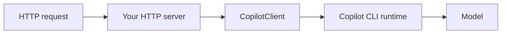

# Deploying an SDK Agent to Azure

A local SDK agent becomes a product when it runs as a hosted service. This topic takes an agent built with the Copilot SDK from your machine to Azure Container Apps, so it can serve requests behind your own API.

The finished service lives in [deploy-azure-solution-node](./deploy-azure-solution-node/), verified against `@github/copilot-sdk` 1.0.14 and Copilot CLI 1.0.87: it builds, containerizes, and answers a real agent call locally. The same service in C# lives in [deploy-azure-solution-cs](./deploy-azure-solution-cs/).

## The hosting pattern

There is no hosting library, and this is the first thing to get straight because it shapes everything else. The SDK gives you a client and sessions; it does not give you an HTTP server, a router, health checks, or request schemas. You write those with whatever you already use, `node:http`, Express, Fastify, and call the SDK from inside your handlers.

What changes when you move off your machine is the runtime connection and the credential, not your agent logic. Your tools, sessions, and system messages are the same objects they were in a terminal script.



## Two ways to reach the runtime

The SDK talks to a Copilot CLI process over JSON-RPC. You choose whether it owns that process or attaches to one you run.

| Mode | How | When to use it |
|------|-----|----------------|
| Bundled | The default. The client spawns the CLI as a child process | One container per service. Simplest, and the agent's lifetime is the service's lifetime |
| External | You run `copilot --headless --port 4321`, then `RuntimeConnection.forUri("localhost:4321")` | Several replicas sharing one runtime, or restarting the API without restarting the runtime |

```typescript
import { CopilotClient, RuntimeConnection } from "@github/copilot-sdk";

const url = process.env.COPILOT_RUNTIME_URL;
const client = new CopilotClient(
  url ? { connection: RuntimeConnection.forUri(url) } : {},
);
```

`RuntimeConnection` also offers `forStdio` and `forTcp` if you want the child process but on a socket rather than pipes.

## Authentication without a login prompt

A container has nobody to type `/login`. Set `COPILOT_GITHUB_TOKEN` (or `GITHUB_TOKEN`) in the environment and the runtime picks up that identity. In Azure, keep the value in Key Vault and reference it as a Container Apps secret rather than passing it as a plain environment variable.

```bash
az containerapp secret set \
  --name copilot-agent-api \
  --resource-group rg-copilot-agent \
  --secrets github-token=keyvaultref:https://<vault>.vault.azure.net/secrets/copilot-github-token,identityref:system

az containerapp update \
  --name copilot-agent-api \
  --resource-group rg-copilot-agent \
  --set-env-vars COPILOT_GITHUB_TOKEN=secretref:github-token
```

## Health checks are yours to write

Nothing supplies one. Add a route that answers without touching the model, so the platform can tell "the process is up" from "the model is reachable". The sample's `/health` returns the model name and which runtime mode it is in, and needs no credentials at all, which is exactly what you want a probe to need.

```typescript
if (req.method === "GET" && req.url === "/health") {
  return json(res, ready ? 200 : 503, { status: ready ? "ok" : "starting" });
}
```

The `ready` flag flips after `await client.start()`. Without it the probe passes while the runtime is still coming up, and the first real request fails.

## Bring your own model

For data-control or cost reasons you can back the hosted agent with your own Azure OpenAI or Foundry deployment instead of the Copilot-hosted model, the same bring-your-own-key idea covered in the Governance module. This is a session option, not an environment convention: you pass a `provider` object and choose your own variable names for the secrets.

```typescript
const session = await client.createSession({
  model: "gpt-5-mini",
  provider: {
    type: "openai",
    baseUrl: "https://<resource-name>.openai.azure.com/openai/v1/",
    wireApi: "responses",
    apiKey: process.env.AZURE_OPENAI_KEY,
  },
});
```

`provider.type` accepts `openai`, `azure`, and `anthropic`. A `bearerTokenProvider` callback is available in place of `apiKey` when you want a managed-identity token refreshed per request rather than a static key.

> Note: Supplying `provider` makes the whole session bring-your-own-key and bypasses Copilot API authentication. Session telemetry is disabled automatically in that mode.

## Demo

Run these from [deploy-azure-solution-node](./deploy-azure-solution-node/).

### Step 1: Run it locally

```bash
npm install
npm run typecheck
npm start
```

In a second terminal:

```bash
curl http://127.0.0.1:8080/health
curl -X POST -H "content-type: application/json" \
  -d '{"prompt":"What is the deployment status of the checkout service?"}' \
  http://127.0.0.1:8080/ask
```

```text
{"status":"ok","model":"gpt-5-mini","runtime":"bundled"}
{"answer":"The checkout service is currently running (revision: local, region: local)."}
```

The answer comes from the service's own `get_service_status` tool, not from the model's general knowledge. Ask for a service name you invented and you still get a status, which is the tool answering.

### Step 2: Containerize it

```bash
docker build -t copilot-agent-api:local .
docker run -d --name cagent -p 8080:8080 -e COPILOT_GITHUB_TOKEN=$GITHUB_TOKEN copilot-agent-api:local
curl http://127.0.0.1:8080/health
docker inspect --format='{{.State.Health.Status}}' cagent
```

`/health` answers 200 with no token. `POST /ask` needs one, because there is no interactive login inside the image. Watch the `HEALTHCHECK` move from `starting` to `healthy`: the Dockerfile gives it a start period, and without one the container is marked unhealthy while the runtime is still booting.

### Step 3: Publish to Container Apps

`deploy.azcli` has the commands, one per step. `az containerapp up --source .` builds the image and creates the app in a single call.

```bash
az containerapp up \
  --name copilot-agent-api \
  --resource-group rg-copilot-agent \
  --environment cae-copilot-agent \
  --source . \
  --ingress external \
  --target-port 8080
```

Then wire the token as a secret as shown above, and confirm the probe answers through the public ingress:

```bash
FQDN=$(az containerapp show --name copilot-agent-api --resource-group rg-copilot-agent --query properties.configuration.ingress.fqdn -o tsv)
curl -s https://$FQDN/health
```

> Note: These commands create billable Azure resources. They are the one part of this topic nobody should run on your behalf, so they are documented and left unexecuted.

### Step 4: Switch the model

Add a `provider` block to the session as shown above, point it at your own deployment, and repeat the `POST /ask` call. The response should be equivalent, which is the point: the provider is configuration and your agent code did not change.

## Watch the timeout

`sendAndWait` defaults to 60 seconds and throws when it expires. A specialist that calls a tool and then writes will pass that, and the failure looks like a broken agent rather than a slow one. Pass a longer timeout as the second argument, and line the platform's limits up behind it: Container Apps ingress has its own request timeout, and anything you put in front adds another.

```typescript
const response = await session.sendAndWait({ prompt }, 180_000);
```

## Links & Resources

- [Backend services setup](https://github.com/github/copilot-sdk/blob/main/docs/setup/backend-services.md) - headless server mode and `RuntimeConnection.forUri`
- [Azure hosted Copilot SDK skill](https://learn.microsoft.com/azure/developer/azure-skills/skills/azure-hosted-copilot-sdk) - deploying an SDK app to Container Apps or App Service
- [Bring your own key](https://github.com/github/copilot-sdk/blob/main/docs/auth/byok.md) - the `provider` object, its wire APIs, and bearer token providers
- [Azure managed identity](https://github.com/github/copilot-sdk/blob/main/docs/setup/azure-managed-identity.md) - authenticating the hosted agent without a static key
