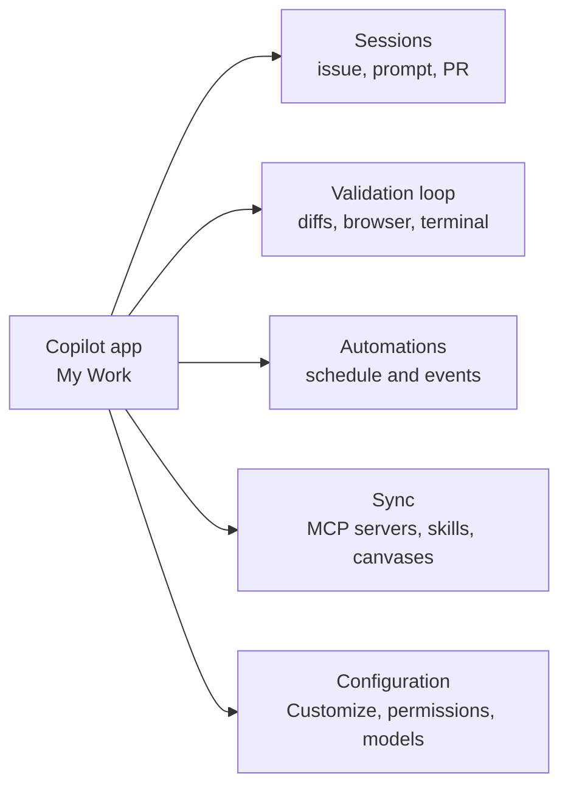

# Meet the Desktop Agents App

The GitHub Copilot app is a standalone desktop application for macOS, Windows, and Linux that runs Copilot agents outside the editor. It went generally available in June 2026 and opened to every Copilot plan a few weeks later, so Free and Education accounts reach the same app as Pro, Pro+, and Max. It is built natively on GitHub, so it carries deep GitHub context: your code, pull requests, issues, checks, and search. Think of it as a dedicated agents view, a place to launch, watch, and validate agentic work that complements rather than replaces your editor sessions.

Because the app is not bound to an IDE, it also runs without a Copilot plan at all when you configure your own model provider. Bring-your-own-key support covers OpenAI, Azure OpenAI, Microsoft Foundry, Anthropic, Ollama, Foundry Local, LM Studio, and any OpenAI-compatible HTTP endpoint, and those models then sit in the picker beside the GitHub-hosted ones. On Copilot Business and Enterprise the app is gated by the GitHub Copilot app policy, which is on by default but is the first thing to check when sign-in works and sessions do not.

The rest of this module walks the app from the outside in. First how a session starts, where it runs, and how autonomous it is, then the in-session validation loop, then automations that run work on a schedule or an event, then how repository capabilities sync, and finally the configuration surfaces that decide what an agent can reach and how far it may go.

## Where the app fits

| Aspect | The Copilot app | The editor (VS Code, Visual Studio, JetBrains) |
|---|---|---|
| Primary view | An agents view outside the editor | Inline coding with agent chat alongside |
| Platforms | macOS, Windows, Linux desktop | Wherever the IDE runs |
| Licensing | Any Copilot plan, or no plan at all with a bring-your-own-key provider | Per the IDE's Copilot setup |
| Strength | Parallel, agent-driven work across issues, PRs, and prompts | Tight edit-and-run loop on a single task |

> Note: The app complements your editor rather than replacing it. Use the editor for the tight inner loop on one file, and the app when you want several agents working across issues and PRs at once.

## My Work is where the day starts

The app does not open on an empty prompt box. **My Work** is the control center: one view of the issues and pull requests you care about across every connected repository, with the default sections All, Active, Review requests, and Done, plus custom sections you define with your own filters. Search takes keywords or qualifiers such as `label:bug`, and the Add filter menu also accepts a plain description of the results you want and generates the filter for you, which you can inspect, edit, or revert.

Since v1.1.23 the sidebar splits My Work into separate **Issues** and **Pull requests** sections, and repositories can be browsed as dedicated pages. The Session column shows each agent's current activity rather than a bare status, so a run that is waiting on you is visible from the list instead of only from inside the session. Picking an item and clicking **New session** is the normal way work starts here, which is why the next topic is about sessions rather than about a prompt box.

## Sessions cross the boundary

The two surfaces are no longer sealed off from each other. With `chat.agentSessions.showExternal` (VS Code 1.135) the Sessions list in VS Code shows recent Copilot or Claude sessions created in other applications, this app included, and lets you continue one there against your Copilot subscription. Start a long run in the app, then pick it up in the editor when the work turns into a tight inner loop. [The Agents Window](../../04-agent-sessions/01-agents-window/) covers the receiving end.

## The five capability areas

The app organizes its value into five ideas this module covers in order. Sessions are where agents run, the validation loop is how you confirm their work, automations schedule that work or fire it on an event, sync keeps repository tools consistent across surfaces, and configuration decides which capabilities and permissions a session gets in the first place.

> Note: The app ships fast and this module tracks release v1.1.23. When a menu or setting has moved, the changelog in the `github/app` repository is the authoritative record of what changed and when.

## Demo

Make My Work the view you start your day from, rather than a list you scroll past on the way to a prompt box.

1. Open the GitHub Copilot app, sign in, and connect two repositories you work in regularly. Expected result: both appear in the sidebar, and My Work shows their open issues and pull requests in one list.
2. Walk the four default sections, **All**, **Active**, **Review requests**, and **Done**, and note which one holds the item you would genuinely pick up next. Expected result: Review requests is usually the shortest and the most urgent, which is the argument for opening the app here rather than at an empty prompt.
3. Search with a qualifier, `label:bug`, and confirm the list narrows. Expected result: only issues carrying that label remain.
4. Open the **Add filter** menu and describe what you want in plain words instead, for example "my open pull requests that are waiting on review". Expected result: the app generates a filter you can inspect, edit, or revert before it applies.
5. Save that filter as a custom section and name it. Expected result: the section appears in the sidebar and keeps itself current as work moves.
6. Switch to the separate **Issues** and **Pull requests** sections, then browse one repository as its own page. Expected result: the same items, scoped to one repository instead of all of them.
7. Pick one issue and click **New session**. Expected result: a session opens with the issue's title and body as its task, and [Sessions](../02-sessions/) picks the story up from there.
8. Leave that session running and return to My Work. Expected result: the **Session** column reports the agent's current activity rather than a bare status, so you can tell from the list alone whether it is waiting on you.

## Links & Resources

- [About the GitHub Copilot app](https://docs.github.com/en/copilot/concepts/agents/github-copilot-app) - platforms, plans, session modes, canvases, and automations in one concept page
- [Managing issues and pull requests with the GitHub Copilot app](https://docs.github.com/en/copilot/how-tos/github-copilot-app/managing-issues-and-pull-requests) - the My Work sections, filters, and starting a session from an item
- [GitHub Copilot app changelog](https://github.com/github/app/blob/main/changelog.md) - the release-by-release record of what the app added or fixed
- [VS Code 1.135 release notes](https://code.visualstudio.com/updates/v1_135) - continuing external agent sessions in VS Code with `chat.agentSessions.showExternal`

[← Back to Copilot App](../readme.md) | [Next: Sessions from Issues, Prompts & Pull Requests →](../02-sessions/readme.md)
