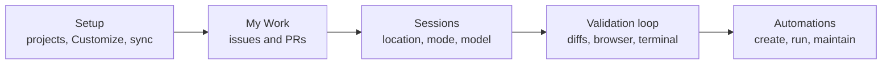

# Meet the Desktop Agents App

The GitHub Copilot app is a standalone desktop application for macOS, Windows, and Linux that runs Copilot agents outside the editor. It went generally available in June 2026 and opened to every Copilot plan a few weeks later, so Free and Education accounts reach the same app as Pro, Pro+, and Max. It is built natively on GitHub, so it carries deep GitHub context: your code, pull requests, issues, checks, and search. Think of it as a dedicated agents view, a place to launch, watch, and validate agentic work that complements rather than replaces your editor sessions.

Because the app is not bound to an IDE, it also runs without a Copilot plan at all when you configure your own model provider. Bring-your-own-key support covers OpenAI, Azure OpenAI, Microsoft Foundry, Anthropic, Ollama, Foundry Local, LM Studio, and any OpenAI-compatible HTTP endpoint, and those models then sit in the picker beside the GitHub-hosted ones. On Copilot Business and Enterprise the app is gated by the GitHub Copilot app policy, which is on by default but is the first thing to check when sign-in works and sessions do not.

The rest of this module follows a working day in the app. First you set up the workspace, then you pick work from My Work, start a session with the right location, mode, permissions, and model, validate what it produced, and finally hand the recurring part of that work to automations and keep their runs under control.

## Where the app fits

| Aspect | The Copilot app | The editor (VS Code, Visual Studio, JetBrains) |
|---|---|---|
| Primary view | An agents view outside the editor | Inline coding with agent chat alongside |
| Platforms | macOS, Windows, Linux desktop | Wherever the IDE runs |
| Licensing | Any Copilot plan, or no plan at all with a bring-your-own-key provider | Per the IDE's Copilot setup |
| Strength | Parallel, agent-driven work across issues, PRs, and prompts | Tight edit-and-run loop on a single task |

> Note: The app complements your editor rather than replacing it. Use the editor for the tight inner loop on one file, and the app when you want several agents working across issues and PRs at once.

## A tour of the sidebar

The sidebar is the map of the app, and every entry in it is a stop in this module. The top block holds the four places you navigate between, and the Projects block below it holds the repositories and folders your sessions run against.

| Entry | What it opens | Covered in |
|---|---|---|
| **New** | A new session or chat, with a project picker | [Sessions](../04-sessions/) |
| **My work** | Issues and pull requests across every connected repository | [My Work](../03-my-work/) |
| **Automations** | Saved automations, their triggers, and recent runs | [Automations](../06-automations/) and [Running Automations](../07-automation-runs/) |
| **Customize** | Plugins, skills, MCP servers, canvases, and custom agents | [Setup](../02-setup/) |
| **Projects** | Repositories and folders you added, each with its sessions nested below | [Setup](../02-setup/) |
| **Chats** | Brainstorming threads with no branch or workspace behind them | [Sessions](../04-sessions/) |

Projects are added with the **+** beside the Projects heading, and the filter icon beside it groups and sorts the list. A project you no longer want in view can be hidden rather than removed from Project Settings, which keeps its sessions and settings intact for the day you need it again. `Cmd/Ctrl+Shift+N` starts a session with no project at all when the work is not about a repository.

Accounts live under Settings in a single **Connected accounts** list with one **Add account** menu for GitHub.com, Enterprise Cloud, and Enterprise Server. Connecting a work and a personal account side by side is normal, and the project decides which account a session uses.

## Sessions cross the boundary

The two surfaces are no longer sealed off from each other. With `chat.agentSessions.showExternal` (VS Code 1.135) the Sessions list in VS Code shows recent Copilot or Claude sessions created in other applications, this app included, and lets you continue one there against your Copilot subscription. Start a long run in the app, then pick it up in the editor when the work turns into a tight inner loop. [The Agents Window](../../04-agent-sessions/01-agents-window/) covers the receiving end.

## The flow of a working day

The app organizes its value around the order you use it in. Setup decides which capabilities every session inherits, My Work decides what to pick up, sessions are where agents run, the validation loop is how you confirm their work, and automations take the recurring part off your plate.

> Note: The app ships fast and this module tracks release v1.1.23. When a menu or setting has moved, the changelog in the `github/app` repository is the authoritative record of what changed and when.

## Demo

Find your way around the app before any agent does work in it.

1. Open the GitHub Copilot app and sign in. Expected result: the sidebar shows **New**, **My work**, **Automations**, **Customize**, and an empty or short **Projects** list.
2. Open Settings, then **Connected accounts**, and add a second account if you have one. Expected result: both accounts appear in one list.
3. Add a repository you work in with the **+** beside Projects. Expected result: the project appears in the sidebar with no sessions under it yet.
4. Click each top-level entry once, **New**, **My work**, **Automations**, and **Customize**, and name the question each one answers. Expected result: you can say which of the later topics covers each view.
5. Hide a project you do not need from Project Settings, then show it again. Expected result: its sessions and settings survive the round trip.
6. Press `Cmd/Ctrl+Shift+N`. Expected result: a session opens with no project selected, ready for work that is not about a repository.

## Links & Resources

- [About the GitHub Copilot app](https://docs.github.com/en/copilot/concepts/agents/github-copilot-app) - platforms, plans, session modes, canvases, and automations in one concept page
- [GitHub Copilot app how-tos](https://docs.github.com/en/copilot/how-tos/github-copilot-app) - the task guides for sessions, automations, canvases, issues and pull requests, BYOK, and deep links
- [GitHub Copilot app changelog](https://github.com/github/app/blob/main/changelog.md) - the release-by-release record of what the app added or fixed
- [VS Code 1.135 release notes](https://code.visualstudio.com/updates/v1_135) - continuing external agent sessions in VS Code with `chat.agentSessions.showExternal`

[← Back to Copilot App](../readme.md) | [Next: Set Up Your Workspace: Projects, Customize & Sync →](../02-setup/readme.md)
