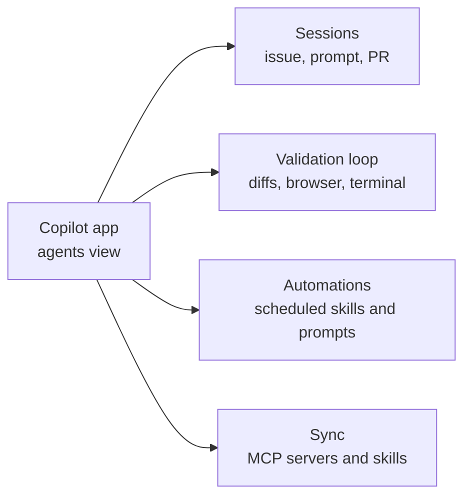

# Overview

The GitHub Copilot app is a standalone desktop application for macOS (Apple Silicon), Windows, and Linux that runs Copilot agents outside the editor. It is the only desktop experience for agent-driven development built natively on GitHub, so it carries deep GitHub context: your code, pull requests, issues, and search. Think of it as a dedicated agents view: a place to launch, watch, and validate agentic work that complements, rather than replaces, your editor sessions.

Because the app is not bound to an IDE, it works with every GitHub Copilot plan (Free, Pro, Pro+, and Max) and supports a bring-your-own-key endpoint. That means the same person can drive a licensed Copilot session on one machine and a BYOK session on another, and the app behaves the same way in both. The point of a separate surface is parallelism: you can open work from real issues, pull requests, or freeform prompts and let several agents run at once without switching between tools.

The rest of this module walks the app from the outside in. First how a session starts and stays isolated, then the in-session validation loop, then scheduled automations that run work on a repeating basis, and finally how repository MCP servers and skills sync so an agent has the same tools everywhere.

## Where the app fits

| Aspect | The Copilot app | The editor (VS Code, Visual Studio, JetBrains) |
|---|---|---|
| Primary view | An agents view outside the editor | Inline coding with agent chat alongside |
| Platforms | macOS, Windows, Linux desktop | Wherever the IDE runs |
| Licensing | Any Copilot plan or a BYOK endpoint | Per the IDE's Copilot setup |
| Strength | Parallel, agent-driven work across issues, PRs, and prompts | Tight edit-and-run loop on a single task |

> Note: The app complements your editor rather than replacing it. Use the editor for the tight inner loop on one file, and the app when you want several agents working across issues and PRs at once.

## The four capability areas

The app organizes its value into four ideas this module covers in order. Sessions are where agents run, the validation loop is how you confirm their work, automations schedule that work to repeat, and sync keeps tools consistent across surfaces.

## Links & Resources

- [GitHub Copilot desktop app](https://github.com/features/ai/github-app) - product page for the desktop app, supported platforms, plans, and BYOK
- [GitHub Copilot documentation](https://docs.github.com/en/copilot) - full product documentation and feature reference
- [GitHub Copilot plans](https://docs.github.com/en/copilot/about-github-copilot/subscription-plans-for-github-copilot) - the Free, Pro, Pro+, and Max plans the app works with
