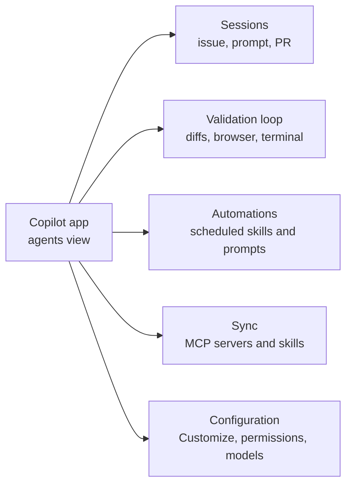

# Meet the Desktop Agents App

The GitHub Copilot app is a standalone desktop application for macOS (Apple Silicon), Windows, and Linux that runs Copilot agents outside the editor. It is the only desktop experience for agent-driven development built natively on GitHub, so it carries deep GitHub context: your code, pull requests, issues, and search. Think of it as a dedicated agents view: a place to launch, watch, and validate agentic work that complements, rather than replaces, your editor sessions.

Because the app is not bound to an IDE, it works with every GitHub Copilot plan (Free, Pro, Pro+, and Max) and supports a bring-your-own-key endpoint. That means the same person can drive a licensed Copilot session on one machine and a BYOK session on another, and the app behaves the same way in both. The point of a separate surface is parallelism: you can open work from real issues, pull requests, or freeform prompts and let several agents run at once without switching between tools.

The rest of this module walks the app from the outside in. First how a session starts and stays isolated, then the in-session validation loop, then scheduled automations that run work on a repeating basis, then how repository MCP servers and skills sync, and finally the configuration surfaces that decide what an agent can reach and how far it may go.

## Where the app fits

| Aspect | The Copilot app | The editor (VS Code, Visual Studio, JetBrains) |
|---|---|---|
| Primary view | An agents view outside the editor | Inline coding with agent chat alongside |
| Platforms | macOS, Windows, Linux desktop | Wherever the IDE runs |
| Licensing | Any Copilot plan or a BYOK endpoint, with model and reasoning effort picked per session | Per the IDE's Copilot setup |
| Strength | Parallel, agent-driven work across issues, PRs, and prompts | Tight edit-and-run loop on a single task |

> Note: The app complements your editor rather than replacing it. Use the editor for the tight inner loop on one file, and the app when you want several agents working across issues and PRs at once.

## Sessions cross the boundary

The two surfaces are no longer sealed off from each other. With `chat.agentSessions.showExternal` (VS Code 1.135) the Sessions list in VS Code shows recent Copilot or Claude sessions created in other applications, this app included, and lets you continue one there against your Copilot subscription. Start a long run in the app, then pick it up in the editor when the work turns into a tight inner loop. [The Agents Window](../../04-agent-sessions/01-agents-window/) covers the receiving end.

## The five capability areas

The app organizes its value into five ideas this module covers in order. Sessions are where agents run, the validation loop is how you confirm their work, automations schedule that work to repeat, sync keeps repository tools consistent across surfaces, and configuration decides which capabilities and permissions a session gets in the first place.

> Note: The app ships fast and this module tracks release v1.1.14. When a menu or setting has moved, the changelog in the `github/app` repository is the authoritative record of what changed and when.

## Links & Resources

- [GitHub Copilot app](https://github.com/features/ai/github-app) - product page for the desktop app, supported platforms, plans, and BYOK
- [GitHub Copilot app changelog](https://github.com/github/app/blob/main/changelog.md) - the release-by-release record of what the app added or fixed
- [GitHub Copilot plans](https://docs.github.com/en/copilot/about-github-copilot/subscription-plans-for-github-copilot) - the Free, Pro, Pro+, and Max plans the app works with
- [VS Code 1.135 release notes](https://code.visualstudio.com/updates/v1_135) - continuing external agent sessions in VS Code with `chat.agentSessions.showExternal`
