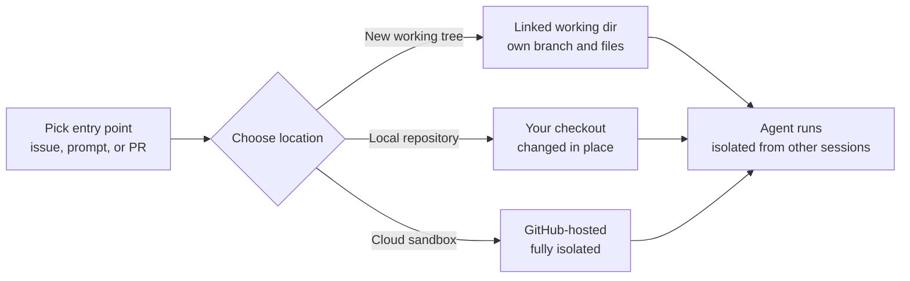
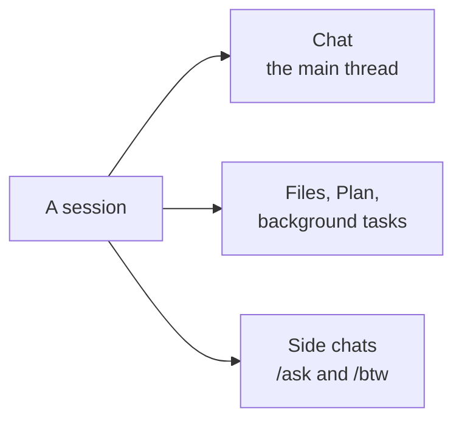

# Sessions from Issues, Prompts & Pull Requests

A session in the Copilot app starts from one of three entry points: a GitHub issue, a freeform prompt, or a pull request already in flight. This mirrors how real work arrives, so you open a session from the artifact you already have rather than describing the task from scratch. An issue carries the acceptance criteria, a PR carries the diff and review comments, and a prompt is the escape hatch for work that does not yet have a tracking artifact.

Starting a session asks you two more questions before the agent moves. Where should it run, and how much autonomy should it have. Those two choices are independent, and getting them right is most of what separates a session you can leave alone from one that stops on every tool call.

## Session entry points

| Start from | You get | Best when |
|---|---|---|
| A GitHub issue | The issue's context and acceptance criteria as the task | The work is already tracked and specified |
| A freeform prompt | A blank task you describe in natural language | There is no issue or PR yet |
| A pull request in flight | The existing branch, diff, and review comments | You are iterating on or finishing open work |

> Note: Starting from an issue or PR pulls in the surrounding GitHub context automatically, so the agent begins with the acceptance criteria or the existing diff instead of a blank slate.

## Where the session runs

Each session runs in an isolated space with its own branch and files, so parallel sessions never interfere with each other. The dropdown under the prompt box offers three places to put that space, and they differ in what they cost you and what they can reach.

| Location | What it is | Best when |
|---|---|---|
| New working tree | A linked working directory of your local clone, with its own branch and files | The normal choice for parallel local work |
| Local repository | Your existing checkout, changed in place | You want the result sitting in the folder you already have open |
| Cloud sandbox | A fully isolated environment hosted by GitHub (public preview) | The task is long, untrusted, or should not touch your machine |

Cloud sandboxes are enabled per organization or enterprise, so a session that refuses to start there is a policy answer rather than a bug. Two settings save you from answering the location question every time: a worktree toggle switches working trees on or off for all repositories at once, and a worktree location setting decides where those directories are created. Point the location at a fast local disk rather than a synced folder, and a session that checks out a large repository stops paying for someone else's file watcher.

A session is not limited to one checkout for its whole life either. You can create a child session inside an existing project checkout, which is the cheap way to split a task that grew a second front without paying for another clone.

## How autonomous the session is

The mode decides how far the agent goes before it comes back to you. Switch it from the mode menu or with `Cmd/Ctrl+Shift+M`, and watch the composer's color change with it, because the mode is the setting people most often forget they left on.

| Mode | Behavior | Use when |
|---|---|---|
| Interactive | The agent proposes changes and works with you turn by turn | Normal collaborative work |
| Plan | The agent writes a plan and waits for your approval before executing | The task is large or the approach is not obvious |
| Autopilot | The agent writes, runs, and tests on its own until the task is done | The work is well specified and the blast radius is contained |

Autopilot is worth a persistent target rather than a one-line prompt. `/goal` sets an objective the agent keeps working towards across turns, `/autopilot` now sets one the same way instead of only flipping the mode, and the Goal pill in the composer shows live status, the completion summary, the turn count, and the AI Credits the run has spent. Mode and permissions are separate axes, and [Configuring the App](../06-configuration/) covers the permission half.

> Note: Autopilot with tool permissions set to Always ask is a contradiction the app will point out. It recommends a permission mode that lets the run continue unattended, with a one-click option to apply it.

## Inside a running session

A session is more than a chat transcript. Alongside the conversation it carries a **Files** tab for the working tree, a **Plan** tab for the steps the agent intends to take, and a **background tasks** tab for work that is still running. Reading the Plan tab before the agent gets far is the cheapest correction you will ever make, because steering a plan costs one sentence and steering a finished diff costs a review.

The Files tab is no longer only the repository. Generated artifacts such as Markdown files the agent wrote open there alongside repository files, with a switcher between the two sources and an option to promote an artifact into the repository once it has earned a place there. That distinction matters: an artifact is the agent's scratch output until you promote it, so a session can produce a report without dirtying the branch.

Side questions no longer cost you the run. `/ask` and `/btw` put a question to the agent without interrupting the response in progress, a side chat lets you explore an option in parallel with the main thread, and the Chats pill above the composer shows which side chats are unread or waiting on input. `/restart-session` restarts a chat or side chat while preserving its history, which beats opening a fresh session when a long conversation has gone sideways but you still want its context.

A few commands are worth knowing before the first run. `/chronicle` reports what previous sessions did, so `/chronicle standup` writes your standup out of real session history rather than memory. `/security-review` scans the working changes for vulnerabilities, and `/rubber-duck` asks the agent to argue with its own implementation before you review it.

> Note: A session started here is not stuck here. With `chat.agentSessions.showExternal` (VS Code 1.135), VS Code's Sessions list shows recent Copilot and Claude sessions created in other applications and lets you continue them in the editor.

## Chats are the cheap option

Not every question deserves a branch. A **Chat**, the option formerly labelled "Start from scratch", is a brainstorming thread with no dedicated branch or workspace behind it. Use it to think through an approach, then open a real session once you know what you want built.

## Demo

Practice opening the three kinds of session in the Copilot desktop app and confirming their isolation.

1. Install and open the GitHub Copilot desktop app on your platform, then sign in with a GitHub account on any Copilot plan, or add your own provider under Settings if you are running BYOK.
2. Set the **worktree location** to a fast local path, and turn the all-repositories worktree toggle on so new sessions stop asking.
3. Start a session from a **prompt**: create a new session, leave the location on **New working tree**, and describe a small, safe task such as "add a short section to the README explaining how to run the app".
4. While it runs, open the **Plan** tab and read the steps the agent intends to take; use `/btw` to ask a clarifying question without interrupting the run.
5. Start a second session from an **issue** in My Work: pick an existing issue in a repository you own, click **New session**, choose **Plan** mode, and approve or redirect the plan before any code is written.
6. Start a third session from a **pull request** that is already in flight, and confirm the session opens on that PR's branch with its existing changes present.
7. With all three sessions running, confirm they do not collide: each has its own branch and files, so a change in one does not appear in the others.
8. Switch one session to **Autopilot** with `Cmd/Ctrl+Shift+M`, set a target with `/goal`, and watch the Goal pill report status and AI Credits as the run proceeds.
9. Ask an agent to write a short Markdown report, find it in the **Files** tab under the artifacts source, and decide whether to promote it into the repository.
10. Run `/chronicle standup` in any session and compare what it reports against what you remember doing.
11. Turn on `chat.agentSessions.showExternal` in VS Code, find one of these app sessions in its Sessions list, and continue the conversation there.

## Links & Resources

- [Working with agent sessions in the GitHub Copilot app](https://docs.github.com/en/copilot/how-tos/github-copilot-app/agent-sessions) - entry points, the working tree, local repository, and cloud sandbox locations, and the Interactive, Plan, and Autopilot modes
- [Working with GitHub issues](https://docs.github.com/en/issues/tracking-your-work-with-issues/about-issues) - the issues that seed a session's task and acceptance criteria
- [About pull requests](https://docs.github.com/en/pull-requests/collaborating-with-pull-requests/proposing-changes-to-your-work-with-pull-requests/about-pull-requests) - the in-flight PRs a session can continue
- [VS Code 1.135 release notes](https://code.visualstudio.com/updates/v1_135) - external agent sessions surfaced and continued in VS Code

[← Previous: Meet the Desktop Agents App](../01-overview/readme.md) | [Back to Copilot App](../readme.md) | [Next: The Validation Loop →](../03-validation-loop/readme.md)
