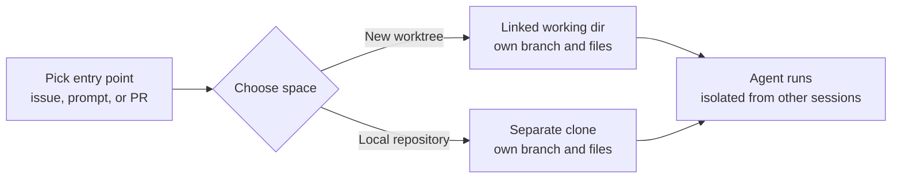

# Sessions from Issues, Prompts & Pull Requests

A session in the Copilot app starts from one of three entry points: a GitHub issue, a freeform prompt, or a pull request already in flight. This mirrors how real work arrives, so you open a session from the artifact you already have rather than describing the task from scratch. An issue carries the acceptance criteria, a PR carries the diff and review comments, and a prompt is the escape hatch for work that does not yet have a tracking artifact.

Each session runs in an isolated space with its own branch and files, so parallel sessions never interfere with each other. When you open a session you choose how that space is created: a new worktree, or a local repository clone. This isolation is what makes it safe to run several agents against the same repository at the same time, which is the whole reason to work in a dedicated agents view.

The worktree and clone options differ in how they relate to your existing local checkout. A worktree is a linked working directory of the same repository, sharing history while keeping a separate branch and files. A local repository is a separate clone. Both give the session a clean, independent place to work.

## Session entry points

| Start from | You get | Best when |
|---|---|---|
| A GitHub issue | The issue's context and acceptance criteria as the task | The work is already tracked and specified |
| A freeform prompt | A blank task you describe in natural language | There is no issue or PR yet |
| A pull request in flight | The existing branch, diff, and review comments | You are iterating on or finishing open work |

> Note: Starting from an issue or PR pulls in the surrounding GitHub context automatically, so the agent begins with the acceptance criteria or the existing diff instead of a blank slate.

## How a session gets its isolated space

## Exercise

Practice opening the three kinds of session in the Copilot desktop app and confirming their isolation.

1. Install and open the GitHub Copilot desktop app on your platform, and sign in with a GitHub account that has a Copilot plan or configure a bring-your-own-key endpoint.
2. Start a session from a **prompt**: create a new session, describe a small, safe task such as "add a short section to the README explaining how to run the app", and choose **New worktree** when asked how to create the space.
3. Start a second session from an **issue**: pick an existing issue in a repository you own, open it as a session, and confirm the agent begins with the issue's title and body as its task.
4. Start a third session from a **pull request** that is already in flight, and confirm the session opens on that PR's branch with its existing changes present.
5. With all three sessions running, confirm they do not collide: each has its own branch and files, so a change in one does not appear in the others.

## Links & Resources

- [GitHub Copilot desktop app](https://github.com/features/ai/github-app) - sessions from issues, prompts, and PRs, and the worktree vs local repository choice
- [Working with GitHub issues](https://docs.github.com/en/issues/tracking-your-work-with-issues/about-issues) - the issues that seed a session's task and acceptance criteria
- [About pull requests](https://docs.github.com/en/pull-requests/collaborating-with-pull-requests/proposing-changes-to-your-work-with-pull-requests/about-pull-requests) - the in-flight PRs a session can continue
