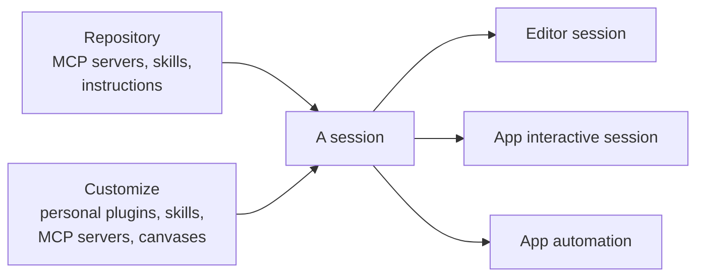

# Set Up Your Workspace: Projects, Customize & Sync

Every session and every automation inherits what you set up here, so a setting you get wrong shows up later as an agent that lacks a tool. Two sources feed a session. The repository you added as a project brings its own MCP servers, skills, and instructions, and **Customize** brings the capabilities you installed personally. This topic covers both halves before the first session starts.

The Copilot app syncs a repository's MCP servers and skills automatically, so the tools an agent has in the editor are the same tools it has in the app. You do not reconfigure integrations per surface: connect the repository once and its capabilities follow. This keeps behavior consistent whether an agent runs in VS Code or in the desktop app.

Two kinds of capability sync from the repository. MCP servers sync automatically to sessions, so an agent can reach the external data and tools those servers expose. Custom Copilot skills sync across sessions, so a skill you authored is available to every session in that repository. Repository instructions ride along the same way, which is why an agent in the app follows the same house rules as one in the editor.

A session also carries whatever you have installed personally. Personal skills, plugins, MCP servers, and canvases are managed in Customize and follow you rather than the repo, which makes them the right home for a habit that is yours alone. The two scopes stack, so a session sees the union: the repository's capabilities plus your own.

This is also what makes the [automations](../06-automations/) later in the module dependable. A scheduled or event-triggered session that fires without you at the keyboard still has the exact skills and MCP tools the repository defines, because the app resolved them from the repo rather than from a per-machine setup. That is the argument for keeping anything a teammate needs in the repository: personal capabilities do not travel to their machine or to a session someone else starts.

## What syncs and why it matters

| What syncs | Where it is defined | Effect |
|---|---|---|
| MCP servers | The repository's MCP configuration | Sessions reach the same external data and tools |
| Custom skills | The repository's skill folders | Every session can invoke the same skills |
| Repository instructions | The repository, applied under Projects settings | App agents follow the same house rules as editor agents |
| Personal skills, plugins, MCP servers, canvases | Customize, on your account | Follow you across repositories, not shared with the team |
| Net result | Repository plus personal scope | Editor and app agents behave the same way |

> Note: Because repository capabilities are resolved from the repository, an unattended automation has the same skills and MCP tools as an interactive session you run yourself.

## Two scopes, one session

> Note: If a capability must work for the whole team or for an unattended automation someone else inherits, define it in the repository. Customize is for capabilities only you need.

## What Customize manages

Customize is the single management view for plugins, skills, MCP servers, and canvases. It is available to everyone rather than behind a flag, and it is where personal skills are created, edited, and removed with Markdown preview and validation. Plugins installed there can be updated one at a time or in bulk, and can keep themselves current with auto-update. `/settings` opens app settings straight from the composer when the thing you need to change is a setting rather than a capability.

Capabilities arrive in Customize from marketplaces you configure as sources, added with the settings icon next to the marketplace dropdown. The Featured sections carry ready-to-install extensions, skills, MCP servers, and canvases, so a team on Azure Boards and Repos gets the same one-click path as a team on GitHub. An MCP server can also arrive through a deep link, which opens a prefilled review form and adds nothing until you confirm it, so a teammate can share a server as a single link.

| Item | What it gives the agent | Scope |
|---|---|---|
| Plugins | Packaged capabilities installed from a marketplace | Personal, updated individually or in bulk |
| Skills | Instruction folders the agent loads on demand | Personal, authored in place with validation |
| MCP servers | External data and tools over the Model Context Protocol | Personal, alongside the repository's own servers |
| Canvases | Shared, interactive surfaces a session and a person edit together | Personal, some arriving through a plugin |
| Custom agents | Named agents you pick with the agent picker or `/agent` | Personal or plugin-owned |

> Note: Customize holds your personal capabilities. Skills and MCP servers defined in a repository still sync on their own, so a session sees the union of both.

## When a capability arrives through a plugin

Not every capability is a bare skill or server. A plugin can carry several at once, including custom agents and canvases, and since v1.1.21 two custom agents that share a display name are distinguished in the agent picker by the plugin that owns them. That disambiguation is the tell that the plugin, not the agent name, is the unit you install, update, and remove.

The same holds for canvases. Installing the Azure DevOps plugin, for example, brings a canvas for planning and managing Azure DevOps work, so a team on Azure Boards gets a working surface rather than only a set of tools. A capability that needs a plugin says so before it will open.

## Canvases are the app's working surfaces

A canvas is a shared, interactive surface for a work artifact: a plan, a triage board, a browser session, a release checklist, a dashboard, an incident, or a spreadsheet. It is bidirectional, so the agent updates it while you edit the same surface, which is what separates it from a report the agent hands you when it is done. Browse the featured ones under **Customize**, then **Canvas**, install any plugin a canvas requires, and open a **New session** against it.

Two featured canvases show the pattern well. The **Jira** canvas, renamed from Atlassian in v1.1.15, pulls Jira issues onto a shared surface so you can choose what moves forward and let the agent carry that context into investigation, implementation, and pull request preparation. The **Sentry** canvas, added in v1.1.23, triages live Sentry issues so the path from a crash report to a code fix stays inside one surface. Inside a session, `/create-canvas` builds a new canvas and opens it in the right side panel.

## Demo

Set up a workspace, then prove that repository capabilities travel and personal ones do not.

1. Confirm the repository defines at least one skill folder and one MCP server. If it defines neither, commit a small skill from [`02-agentic-harness/04-skills/`](../../02-agentic-harness/04-skills/) first. Expected result: both live in the repository, not on your machine.
2. In the Copilot app, open that repository and start a session without configuring anything. Expected result: typing `/` offers the repository skill, and the MCP server's tools are available to the agent.
3. Ask the agent to invoke the skill and to make one call through the MCP server. Expected result: both succeed on a machine where you configured neither by hand.
4. Add repository instructions under Projects settings, then ask the agent something the instructions answer. Expected result: it follows the repository's house rules, the same ones an agent in the editor follows.
5. Open **Customize** and inventory what is already installed: plugins, skills, MCP servers, canvases, and custom agents. Expected result: you can say which came from a repository and which are personal.
6. Create a **personal skill** in Customize with a clear `name` and `description`, use the Markdown preview to check it renders, and fix anything validation flags. Expected result: it is available in your sessions in every repository, including ones that never heard of it.
7. Add a marketplace source with the settings icon beside the marketplace dropdown, then install one capability from a **Featured** section.
8. Open **Customize**, then **Canvas**, install the **Jira** or **Sentry** canvas, and open a **New session** against it; then run `/create-canvas` in a session and watch a canvas build in the right side panel.
9. Open the same repository from a second machine or ask a teammate to open it in their app. Expected result: they get the repository skill and server and not your personal Customize skill, which is the distinction this whole topic turns on.

## Links & Resources

- [Customizing the GitHub Copilot app](https://docs.github.com/en/copilot/how-tos/github-copilot-app/customize-github-copilot-app) - global and repository instructions, skills, MCP servers, custom agents, plugins, canvases, and custom marketplaces
- [Working with canvas extensions in the GitHub Copilot app](https://docs.github.com/en/copilot/how-tos/github-copilot-app/working-with-canvas-extensions) - what a canvas is, installing featured canvases, and `/create-canvas`
- [About the Model Context Protocol (MCP)](https://docs.github.com/en/copilot/concepts/about-mcp) - what MCP servers connect an agent to
- [About GitHub Copilot skills](https://docs.github.com/en/copilot/concepts/agents/about-agent-skills) - repository skills that follow the agent across surfaces

[← Previous: Meet the Desktop Agents App](../01-overview/readme.md) | [Back to Copilot App](../readme.md) | [Next: My Work: Picking Up the Day →](../03-my-work/readme.md)
