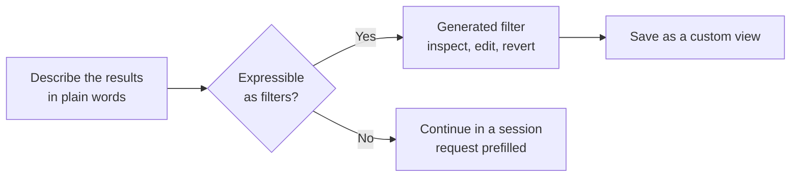

# My Work: Picking Up the Day

The app does not open on an empty prompt box. **My Work** is the control center: one view of the issues and pull requests you care about across every connected repository, with the default sections All, Active, Review requests, and Done, plus custom sections you define with your own filters. Picking an item and clicking **New session** is the normal way work starts here, which is why sessions come after this topic rather than before it.

The view earns its place by answering one question fast: what should I pick up next, and which of my running agents is waiting on me. Filters answer the first half, and the Session column answers the second.

## Sections and views

Since v1.1.23 the sidebar splits My Work into separate **Issues** and **Pull requests** sections, and repositories can be browsed as dedicated pages. Each repository's Issues and Pull requests views can be edited, reordered, duplicated, and deleted exactly like the custom views in My Work, so a repository you own gets its own triage lanes rather than inheriting the global ones.

| View | Holds | Use it for |
|---|---|---|
| All | Every issue and pull request you are involved in | A full sweep at the start of the week |
| Active | Items with movement since you last looked | The daily check |
| Review requests | Pull requests waiting on your review | The shortest and most urgent list |
| Done | Closed and merged items | Confirming what landed |
| Custom view | Whatever your filter describes | A lane per concern, such as bugs in one repository |

> Note: My Work holds up to 10 custom views. When you reach the limit it tells you why a new one cannot be created, so prune an old lane before adding a new one.

## Filters you describe instead of write

Search takes keywords or qualifiers such as `label:bug`, and the **Add filter** menu also accepts a plain description of the results you want and generates the filter for you, which you can inspect, edit, or revert. The generated filter is ordinary qualifiers, so reading it teaches you the syntax for the next time. Merged date filtering and a reorganized **All filters** menu sit beside it.

When the description cannot be turned into filters, the app offers to continue in a session with your original request and repository prefilled. That fallback is the hint that the question was not a filter at all but a task, such as "find the issues that are probably duplicates", which an agent answers better than a query.

## The Session column shows who is waiting on you

The Session column shows each agent's current activity rather than a bare status, with readable labels for attention and error states and **Idle** for inactive sessions. A run that needs your input is visible from the list instead of only from inside the session, so My Work doubles as the place you check on agents you left running. The column is wider by default because the activity text is the point of it.

## Demo

Make My Work the view you start your day from, rather than a list you scroll past on the way to a prompt box.

1. Connect two repositories you work in regularly. Expected result: My Work shows their open issues and pull requests in one list.
2. Walk the four default sections, **All**, **Active**, **Review requests**, and **Done**, and note which one holds the item you would genuinely pick up next. Expected result: Review requests is usually the shortest and the most urgent, which is the argument for opening the app here rather than at an empty prompt.
3. Search with a qualifier, `label:bug`, and confirm the list narrows. Expected result: only issues carrying that label remain.
4. Open the **Add filter** menu and describe what you want in plain words instead, for example "my open pull requests that are waiting on review". Expected result: the app generates a filter you can inspect, edit, or revert before it applies.
5. Save that filter as a custom view and name it. Expected result: the view appears in the sidebar and keeps itself current as work moves.
6. Describe something that is not a filter, such as "issues that look like duplicates of each other". Expected result: the app offers to continue in a session with the request and repository prefilled.
7. Switch to the separate **Issues** and **Pull requests** sections, then browse one repository as its own page and duplicate one of its views. Expected result: the same items, scoped to one repository, in a lane you can edit.
8. Pick one issue and click **New session**, leave it running, and return to My Work. Expected result: the **Session** column reports the agent's current activity, and [Sessions](../04-sessions/) picks the story up from there.

## Links & Resources

- [Managing issues and pull requests with the GitHub Copilot app](https://docs.github.com/en/copilot/how-tos/github-copilot-app/managing-issues-and-pull-requests) - the My Work sections, filters, and starting a session from an item
- [Searching issues and pull requests](https://docs.github.com/en/search-github/searching-on-github/searching-issues-and-pull-requests) - the qualifiers a generated filter is made of
- [GitHub Copilot app changelog](https://github.com/github/app/blob/main/changelog.md) - the release-by-release record of My Work changes

[← Previous: Set Up Your Workspace: Projects, Customize & Sync](../02-setup/readme.md) | [Back to Copilot App](../readme.md) | [Next: Sessions from Issues, Prompts & Pull Requests →](../04-sessions/readme.md)
