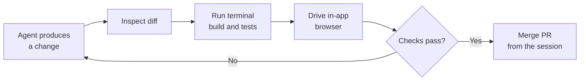

# The Validation Loop

The Copilot app builds validation into each session so you can confirm an agent's work before it lands. Instead of switching to another tool to check a diff or run the app, the session gives you the diff view, an in-app browser, and a terminal in one place. When you are satisfied, you merge the pull request directly from inside the session.

These four capabilities map to the questions you actually ask when reviewing agentic work. The diff answers "what changed", the terminal answers "does it build and pass", the in-app browser answers "does it behave", and the merge answers "ship it". Keeping them in one surface removes the context-switch tax that otherwise makes reviewing agent output slower than writing the code yourself.

The loop is iterative. If a diff looks wrong or a test fails, you steer the agent with another instruction and re-check, rather than accepting the first result. Only when the checks pass do you merge.

## What each capability answers

| Capability | The question it answers | Typical action |
|---|---|---|
| Inspect diffs | What did the agent change? | Read the diff hunk by hunk |
| Terminal checks | Does it build and pass tests? | Run the build, run the test suite |
| In-app browser | Does the running app behave? | Open the local URL and click through |
| Merge the PR | Is it ready to ship? | Merge from inside the session |

> Note: The in-app browser means you can exercise a running web app without leaving the session, so a UI change is verified in the same window where you read its diff.

## The review-and-merge loop

## Exercise

Run a full validation loop on a small change inside the Copilot desktop app.

1. Open a session against a web app you can run locally, and give the agent a small, verifiable task such as "change the page heading and add a passing unit test for it".
2. When the agent reports it is done, open the **diff** view and read every changed hunk; confirm the change matches what you asked and nothing unexpected was touched.
3. Open the **terminal** in the session and run the build and the test suite; confirm the new test passes and nothing else broke.
4. Start the app from the terminal, then open the **in-app browser** at the local URL and confirm the heading renders as expected.
5. If any check fails, give the agent a follow-up instruction to fix it and repeat steps 2 through 4; once everything passes, **merge the pull request** from inside the session.

## Links & Resources

- [GitHub Copilot desktop app](https://github.com/features/ai/github-app) - the in-session diff, browser, terminal, and merge capabilities
- [Reviewing proposed changes in a pull request](https://docs.github.com/en/pull-requests/collaborating-with-pull-requests/reviewing-changes-in-pull-requests/reviewing-proposed-changes-in-a-pull-request) - how to read a diff before merging
- [Merging a pull request](https://docs.github.com/en/pull-requests/collaborating-with-pull-requests/incorporating-changes-from-a-pull-request/merging-a-pull-request) - what happens when you merge the PR from the session
