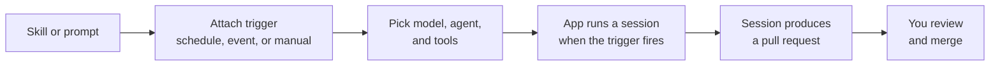

# Automations: Scheduled, Triggered & On Demand

Automations turn skills and prompts into repeatable work that the Copilot app runs for you, without starting each session by hand. This is the natural next step for a skill you authored earlier: promote it from an on-demand tool into a job that fires on a clock, on a GitHub event, or on a button press. Automations are available by default, so a scheduled prompt runs without a feature flag to find first.

The value comes from pairing a stable capability with a trigger. A skill is a portable folder of instructions the agent already knows how to run, and a prompt is a reusable instruction; either becomes an automation once it has a trigger attached. Recurring maintenance is the obvious fit, a nightly dependency check or a weekly documentation sweep, but the event triggers open a second class of work: react to the issue that was just filed rather than to the hour that just struck.

Because the automation runs a session just like an interactive one, its output is still a reviewable pull request. Automation moves the starting of the work off your plate, not the reviewing of it. You come back to a finished session, inspect the diff with the same validation loop as any other session, and merge.

## From on-demand to automated

| Property | On-demand skill or prompt | Automation |
|---|---|---|
| Trigger | You start it in a session | A schedule, a GitHub event, or a play button |
| Cadence | Whenever you need it | Hourly, daily, weekly, a CRON expression, or per event |
| Input | A skill folder or a reusable prompt | The same skill or prompt, plus a trigger and a model |
| Output | A session you review and merge | A session you review and merge |

> Note: An automation still produces a normal session and pull request, so nothing merges on its own; you review the result through the same validation loop covered in the previous topic.

## Choosing the trigger

An automation is created from the **Automations** tab with **New automation**, where you name it and pick what sets it off. A single automation can carry more than one trigger, so "every morning, and also whenever a bug is filed" is one automation rather than two.

| Trigger | Fires | Best for |
|---|---|---|
| Manual | Only when you press the play button on its card | A checklist you run before a release |
| Hourly, Daily, Weekly | On that cadence | Dependency checks, documentation sweeps, triage |
| CRON | On a custom expression, for local automations | A cadence the fixed options do not express |
| Issue | When a matching issue event occurs | First-response triage and labelling |
| Pull request | When a matching pull request event occurs | Review preparation and checks on incoming PRs |

The event triggers take filters, so an automation aimed at bug reports does not wake up for every issue in the repository. Start narrower than feels necessary: an automation that fires on everything teaches you nothing except how fast your session list grows.

## What the automation actually runs

The prompt box is where you describe the task, and skills are reachable there with `/` exactly as they are in an interactive session. Model, reasoning effort, and agent are configured on the automation itself, which matters more here than in a session you are watching, because nobody is present to notice that a cheap model made a poor call at 3am. Cloud automations add a **Tools** dropdown that decides what the run may do on its own, such as pushing changes, updating labels, or creating a pull request.

Each saved automation appears on the Automations tab with its name, schedule, associated repository, and last run status. **Create and run** starts it immediately after saving, which is how you find out that a prompt is ambiguous before the first unattended run does.

## Keeping the session list from silting up

A daily automation produces a session every day, and most of them are finished business within the hour. Session settings carry a **Session cleanup** section that archives inactive sessions automatically and deletes archived ones on a schedule you set, so the list stays a view of live work rather than a log. Set the archival window longer than your slowest review turnaround, or you will archive a session you were still reading.

Cleanup is worth configuring before you add the first automation rather than after. An interval you picked while looking at six sessions is a different interval from the one you would pick while looking at two hundred, and the second situation is the one automations create. Prompts delivered by scheduled automations now appear as compact "Scheduled prompt" cards that open the full text in a dialog and stay out of composer history recall, so the automated traffic does not crowd out what you typed yourself.

## Demo

Promote the Agent Skill from the [Artifacts & Tools module](../../02-agentic-harness/04-skills/) into an automation, then add an event trigger beside it.

1. Pick one skill from the [`02-agentic-harness/04-skills/`](../../02-agentic-harness/04-skills/) topic that describes recurring work, for example a documentation or code-quality skill, and confirm its `SKILL.md` has a clear `name` and `description`.
2. Confirm the skill lives in the repository you will connect, so it syncs to the app; the next topic on [sync](../05-sync/) covers why repository skills and MCP servers become available automatically.
3. In the Copilot desktop app, open the repository and start a one-off session that invokes the skill with `/`; verify it does the work you expect and produces a reviewable change.
4. Open the **Automations** tab, click **New automation**, name it, and give it a **Daily** trigger with the same prompt and skill.
5. Set the model, reasoning effort, and agent on the automation deliberately, and for a cloud automation open the **Tools** dropdown and grant only what the task needs.
6. Save with **Create and run** so the first run happens while you are watching, and fix the prompt if the result is not what you expected.
7. Add a second trigger to the same automation: an **Issue** trigger filtered to a single label, then file a matching issue and confirm the automation fires for it and not for an unrelated one.
8. Open **Session cleanup** in Sessions settings and set an archival window longer than the time you normally take to review a pull request, plus a deletion schedule for archived sessions.
9. Return after the next scheduled run, open the resulting session, review the diff with the validation loop, and merge or discard the pull request.

## Links & Resources

- [Using automations in the GitHub Copilot app](https://docs.github.com/en/copilot/how-tos/github-copilot-app/using-automations) - creating an automation, the Manual, Hourly, Daily, Weekly, CRON, Issue, and Pull request triggers, and the Tools dropdown
- [About the GitHub Copilot app](https://docs.github.com/en/copilot/concepts/agents/github-copilot-app) - where automations sit among the app's capabilities
- [About GitHub Copilot skills](https://docs.github.com/en/copilot/concepts/agents/about-agent-skills) - what a skill is and how the agent loads it

[← Previous: The Validation Loop](../03-validation-loop/readme.md) | [Back to Copilot App](../readme.md) | [Next: Syncing Skills & MCP Servers →](../05-sync/readme.md)
