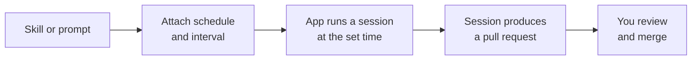

# Scheduled Automations

Scheduled automations turn skills and prompts into repeatable work that the Copilot app runs on a regular basis, without you starting each session by hand. This is the natural next step for a skill you authored earlier: promote it from an on-demand tool into an unattended, repeating job. The app lets you set the interval, so the same well-scoped task runs on the cadence you choose.

The value comes from pairing a stable capability with a schedule. A skill is a portable folder of instructions the agent already knows how to run, and a prompt is a reusable instruction; either becomes an automation once it has a trigger time attached. Recurring maintenance work is the obvious fit: a nightly dependency check, a weekly documentation sweep, a scheduled triage of new issues.

Because the automation runs a session just like an interactive one, its output is still a reviewable pull request. Automation moves the starting of the work off your plate, not the reviewing of it. You come back to a finished session, inspect the diff with the same validation loop as any other session, and merge.

## From on-demand to scheduled

| Property | On-demand skill or prompt | Scheduled automation |
|---|---|---|
| Trigger | You start it in a session | The app starts it on a schedule |
| Cadence | Whenever you need it | A customizable recurring interval |
| Input | A skill folder or a reusable prompt | The same skill or prompt, plus a schedule |
| Output | A session you review and merge | A session you review and merge |

> Note: An automation still produces a normal session and pull request, so nothing merges on its own; you review the result through the same validation loop covered in the previous topic.

## How an automation fires

## Exercise

Promote the Agent Skill from the [Artifacts & Tools module](../../02-agentic-harness/04-skills/) into a scheduled automation.

1. Pick one skill from the [`02-agentic-harness/04-skills/`](../../02-agentic-harness/04-skills/) topic that describes recurring work, for example a documentation or code-quality skill, and confirm its `SKILL.md` has a clear `name` and `description`.
2. Confirm the skill lives in the repository you will connect, so it syncs to the app; the next topic on [sync](../05-sync/) covers why repository skills and MCP servers become available automatically.
3. In the Copilot desktop app, open the repository and start a one-off session that invokes the skill by a prompt matching its description; verify it does the work you expect and produces a reviewable change.
4. Create a **scheduled automation** from that same skill or prompt, and set a recurring interval such as daily or weekly.
5. Let the automation fire once, then return to the app, open the resulting session, review the diff with the validation loop, and merge or discard the pull request.

## Links & Resources

- [GitHub Copilot desktop app](https://github.com/features/ai/github-app) - turning skills and prompts into scheduled, repeatable work
- [About GitHub Copilot skills](https://docs.github.com/en/copilot/concepts/agents/agent-skills) - what a skill is and how the agent loads it
- [GitHub Copilot documentation](https://docs.github.com/en/copilot) - full product documentation and feature reference
