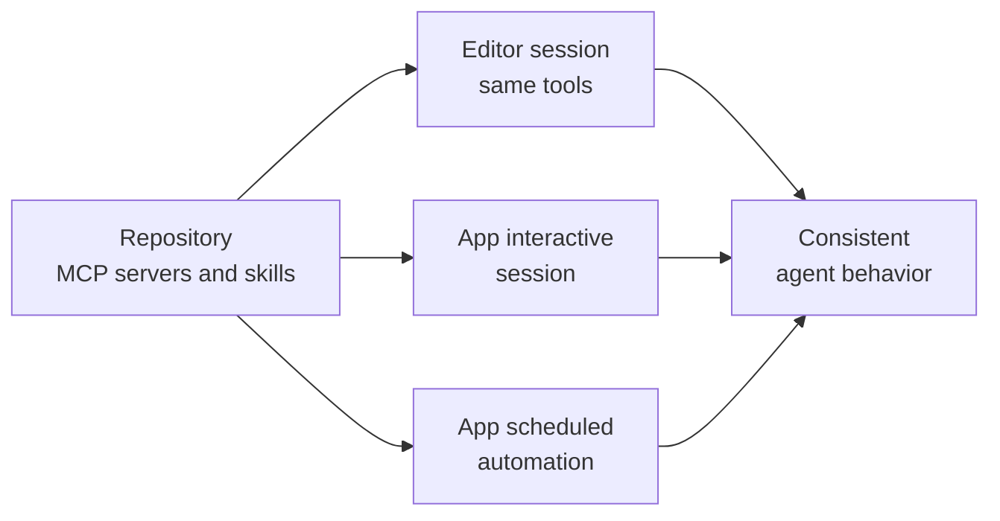

# Syncing Skills & MCP Servers

The Copilot app syncs a repository's MCP servers and skills automatically, so the tools an agent has in the editor are the same tools it has in the app. You do not reconfigure integrations per surface: connect the repository once and its capabilities follow. This keeps behavior consistent whether an agent runs in VS Code or in the desktop app.

Two kinds of capability sync. MCP servers sync automatically to sessions, so an agent can reach the external data and tools those servers expose. Custom Copilot skills sync across sessions, so a skill you authored is available to every session in that repository. Because both are defined in the repository rather than on a single machine, the connection travels with the repo.

This is what makes the automations from the previous topic dependable. A scheduled session that fires without you at the keyboard still has the exact skills and MCP tools the repository defines, because the app resolved them from the repo rather than from a per-machine setup. Consistency across surfaces is the point: one place to define a capability, every surface gets it.

## What syncs and why it matters

| What syncs | Where it is defined | Effect |
|---|---|---|
| MCP servers | The repository's MCP configuration | Sessions reach the same external data and tools |
| Custom skills | The repository's skill folders | Every session can invoke the same skills |
| Net result | The repository | Editor and app agents behave the same way |

> Note: Because capabilities are resolved from the repository, an unattended scheduled automation has the same skills and MCP tools as an interactive session you run yourself.

## One definition, every surface

## Links & Resources

- [GitHub Copilot desktop app](https://github.com/features/ai/github-app) - automatic sync of repository MCP servers and skills to app sessions
- [About the Model Context Protocol (MCP)](https://docs.github.com/en/copilot/concepts/about-mcp) - what MCP servers connect an agent to
- [About GitHub Copilot skills](https://docs.github.com/en/copilot/concepts/agents/agent-skills) - repository skills that follow the agent across surfaces
