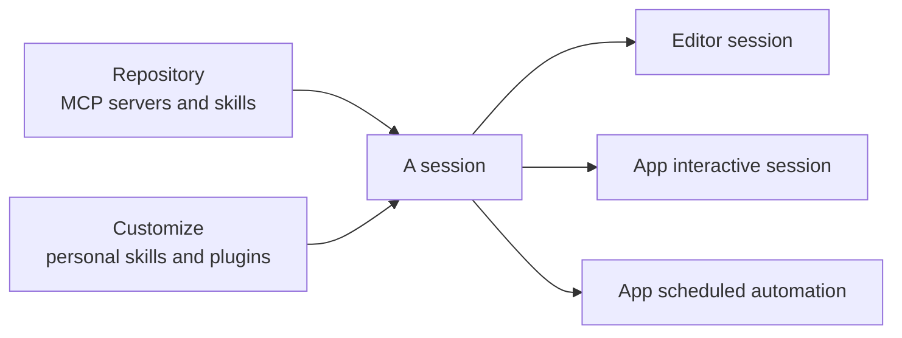

# Syncing Skills & MCP Servers

The Copilot app syncs a repository's MCP servers and skills automatically, so the tools an agent has in the editor are the same tools it has in the app. You do not reconfigure integrations per surface: connect the repository once and its capabilities follow. This keeps behavior consistent whether an agent runs in VS Code or in the desktop app.

Two kinds of capability sync from the repository. MCP servers sync automatically to sessions, so an agent can reach the external data and tools those servers expose. Custom Copilot skills sync across sessions, so a skill you authored is available to every session in that repository. Because both are defined in the repository rather than on a single machine, the connection travels with the repo.

A session also carries whatever you have installed personally. Personal skills, plugins, and MCP servers are managed in Customize and follow you rather than the repo, which makes them the right home for a habit that is yours alone. The two scopes stack, so a session sees the union: the repository's capabilities plus your own. The next topic, [Configuring the App](../06-configuration/), covers the Customize surface where the personal half is managed.

This is what makes the automations from the previous topic dependable. A scheduled session that fires without you at the keyboard still has the exact skills and MCP tools the repository defines, because the app resolved them from the repo rather than from a per-machine setup. That is also the argument for keeping anything a teammate needs in the repository: personal capabilities do not travel to their machine or to a session someone else starts.

## What syncs and why it matters

| What syncs | Where it is defined | Effect |
|---|---|---|
| MCP servers | The repository's MCP configuration | Sessions reach the same external data and tools |
| Custom skills | The repository's skill folders | Every session can invoke the same skills |
| Personal skills, plugins, MCP servers | Customize, on your account | Follow you across repositories, not shared with the team |
| Net result | Repository plus personal scope | Editor and app agents behave the same way |

> Note: Because repository capabilities are resolved from the repository, an unattended scheduled automation has the same skills and MCP tools as an interactive session you run yourself.

## Two scopes, one session

> Note: If a capability must work for the whole team or for an unattended automation someone else inherits, define it in the repository. Customize is for capabilities only you need.

## Links & Resources

- [GitHub Copilot app](https://github.com/features/ai/github-app) - automatic sync of repository MCP servers and skills to app sessions
- [About the Model Context Protocol (MCP)](https://docs.github.com/en/copilot/concepts/about-mcp) - what MCP servers connect an agent to
- [About GitHub Copilot skills](https://docs.github.com/en/copilot/concepts/agents/agent-skills) - repository skills that follow the agent across surfaces
