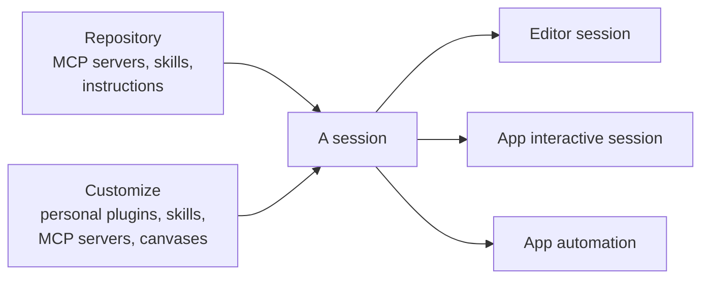

# Syncing Skills & MCP Servers

The Copilot app syncs a repository's MCP servers and skills automatically, so the tools an agent has in the editor are the same tools it has in the app. You do not reconfigure integrations per surface: connect the repository once and its capabilities follow. This keeps behavior consistent whether an agent runs in VS Code or in the desktop app.

Two kinds of capability sync from the repository. MCP servers sync automatically to sessions, so an agent can reach the external data and tools those servers expose. Custom Copilot skills sync across sessions, so a skill you authored is available to every session in that repository. Repository instructions ride along the same way, which is why an agent in the app follows the same house rules as one in the editor.

A session also carries whatever you have installed personally. Personal skills, plugins, MCP servers, and canvases are managed in Customize and follow you rather than the repo, which makes them the right home for a habit that is yours alone. The two scopes stack, so a session sees the union: the repository's capabilities plus your own. The next topic, [Configuring the App](../06-configuration/), covers the Customize surface where the personal half is managed.

This is what makes the automations from the previous topic dependable. A scheduled or event-triggered session that fires without you at the keyboard still has the exact skills and MCP tools the repository defines, because the app resolved them from the repo rather than from a per-machine setup. That is also the argument for keeping anything a teammate needs in the repository: personal capabilities do not travel to their machine or to a session someone else starts.

## What syncs and why it matters

| What syncs | Where it is defined | Effect |
|---|---|---|
| MCP servers | The repository's MCP configuration | Sessions reach the same external data and tools |
| Custom skills | The repository's skill folders | Every session can invoke the same skills |
| Repository instructions | The repository, applied under Projects settings | App agents follow the same house rules as editor agents |
| Personal skills, plugins, MCP servers, canvases | Customize, on your account | Follow you across repositories, not shared with the team |
| Net result | Repository plus personal scope | Editor and app agents behave the same way |

> Note: Because repository capabilities are resolved from the repository, an unattended automation has the same skills and MCP tools as an interactive session you run yourself.

## Two scopes, one session

> Note: If a capability must work for the whole team or for an unattended automation someone else inherits, define it in the repository. Customize is for capabilities only you need.

## When a capability arrives through a plugin

Not every capability is a bare skill or server. A plugin can carry several at once, including custom agents and canvases, and since v1.1.21 two custom agents that share a display name are distinguished in the agent picker by the plugin that owns them. That disambiguation is the tell that the plugin, not the agent name, is the unit you install, update, and remove.

The same holds for canvases. Installing the Azure DevOps plugin, for example, brings a canvas for planning and managing Azure DevOps work, so a team on Azure Boards gets a working surface rather than only a set of tools. A capability that needs a plugin says so before it will open.

## Demo

Prove that repository capabilities travel and personal ones do not, on a repository you own.

1. Confirm the repository defines at least one skill folder and one MCP server. If it defines neither, commit a small skill from [`02-agentic-harness/04-skills/`](../../02-agentic-harness/04-skills/) first. Expected result: both live in the repository, not on your machine.
2. In the Copilot app, open that repository and start a session without configuring anything. Expected result: typing `/` offers the repository skill, and the MCP server's tools are available to the agent.
3. Ask the agent to invoke the skill and to make one call through the MCP server. Expected result: both succeed on a machine where you configured neither by hand.
4. Add repository instructions under Projects settings, then ask the agent something the instructions answer. Expected result: it follows the repository's house rules, the same ones an agent in the editor follows.
5. Open **Customize** and create a personal skill that exists only there. Expected result: it is available in your sessions in every repository, including ones that never heard of it.
6. Build an automation from the repository skill and let it fire unattended, as in [the previous topic](../04-automations/). Expected result: the unattended session has the same repository skills and MCP tools as the interactive one you ran in step 2.
7. Open the same repository from a second machine or ask a teammate to open it in their app. Expected result: they get the repository skill and server and not your personal Customize skill, which is the distinction this whole topic turns on.

## Links & Resources

- [Customizing the GitHub Copilot app](https://docs.github.com/en/copilot/how-tos/github-copilot-app/customize-github-copilot-app) - global and repository instructions, skills, MCP servers, custom agents, plugins, and canvases
- [About the GitHub Copilot app](https://docs.github.com/en/copilot/concepts/agents/github-copilot-app) - how instructions, MCP servers, and skills reach a session
- [About the Model Context Protocol (MCP)](https://docs.github.com/en/copilot/concepts/about-mcp) - what MCP servers connect an agent to
- [About GitHub Copilot skills](https://docs.github.com/en/copilot/concepts/agents/about-agent-skills) - repository skills that follow the agent across surfaces

[← Previous: Automations: Scheduled, Triggered & On Demand](../04-automations/readme.md) | [Back to Copilot App](../readme.md) | [Next: Configuring the App: Customize, Permissions & Models →](../06-configuration/readme.md)
