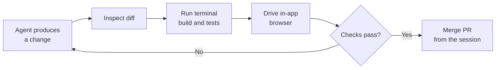

# The Validation Loop

The Copilot app builds validation into each session so you can confirm an agent's work before it lands. Instead of switching to another tool to check a diff or run the app, the session gives you the diff view, an in-app browser, and a terminal in one place. When you are satisfied, you open the pull request and merge it directly from inside the session.

These capabilities map to the questions you actually ask when reviewing agentic work. The diff answers "what changed", the terminal answers "does it build and pass", the in-app browser answers "does it behave", and the merge answers "ship it". Keeping them in one surface removes the context-switch tax that otherwise makes reviewing agent output slower than writing the code yourself.

The loop is iterative. If a diff looks wrong or a test fails, you steer the agent with another instruction and re-check, rather than accepting the first result. Only when the checks pass do you merge.

## What each capability answers

| Capability | The question it answers | Typical action |
|---|---|---|
| Inspect diffs | What did the agent change? | Read the diff hunk by hunk in **Files changed** |
| Terminal checks | Does it build and pass tests? | Run the build, run the test suite |
| In-app browser | Does the running app behave? | Open the local URL and click through |
| `/security-review` | Did the change introduce a vulnerability? | Scan the working changes before review |
| Insights | How did the agent get there? | Read the tool timeline and context-window graph |
| Agent Merge | Are the review comments and failing checks actually resolved? | Let the agent work the threads and the CI failures |
| Merge the PR | Is it ready to ship? | Merge from inside the session |

> Note: An empty right panel now shows a launcher list for Changes, Browser, Terminal, Files, and Canvas, so the validation surfaces are one click away instead of hidden behind an add-tab menu.

## The review-and-merge loop

## Running the agent's commands in a sandbox

Since v1.1.23 the agent's shell commands can run in a local sandbox that restricts filesystem access to the session's workspace. Turn it on with the project setting or the `/sandbox` command, and a command that wanders outside the workspace fails instead of succeeding quietly. This is the cheapest guard available for a session pointed at your local repository rather than a working tree, because the isolation that a worktree gives you by construction has to be enforced some other way there.

The sandbox is a containment boundary, not a correctness check. It stops a command from touching the rest of your disk; it does nothing about a change that is wrong inside the workspace, which is what the rest of this loop is for.

## Fixing what review finds, without leaving the review

Review comments and failing checks each carry a Copilot button that hands the problem back to the agent. The chevron beside it offers **Fix with instructions**, which lets you add guidance before the fix runs, and that one extra sentence is usually the difference between a fix that addresses the comment and one that addresses the symptom. Submit the review itself from the pull request detail view once the threads read the way you want them to.

Agent Merge takes the same idea to the end of the pipeline: it works the blocking threads and merges as soon as GitHub allows, running in the background and surviving an app restart. It decides nothing about correctness. A pull request whose comments are all resolved is not the same as one whose behavior you verified.

## Evidence the agent produces for you

An agent can attach screenshots, diagrams, and recordings to a pull request description or comment. That turns "I changed the heading" into a picture of the heading, and it is the same evidence you would otherwise capture by hand after driving the in-app browser yourself. Screenshots taken from the browser preview open straight into annotation, with a pencil tool for freehand marks and full undo and redo for drawing, moving, resizing, recoloring, and deleting.

The diff view carries its own visual evidence. Changed PNG, JPG, and SVG files show before and after previews rather than a binary-file placeholder, so an icon swap is reviewable as an icon swap.

The review surface keeps its own state honest as the code moves under it. A comment written against a line that has since changed is badged **Outdated**, and you can delete stale local review comments from the Changes view rather than carrying them into the merge. Reading a review thread without those signals is how a resolved-looking pull request turns out to have unaddressed feedback.

## Insights: where the session spent its time

The **Insights** tab in the session panel answers a question the diff cannot: how the agent got there. It shows a timeline of tool calls and sub-agent activity with a summary of time spent per tool, and a context-window graph that tracks how much of the window was in use over the run, with zoom and pan synced to the tool timeline. A run that spent twenty minutes re-reading the same files, or filled its context window before the real work started, is visible here long before it shows up as a strange diff.

Read Insights when a session was slow or its result was odd, not after every run. It is the evidence you want before rewriting a prompt or a skill, because it tells you whether the agent lacked information or wasted the information it had.

## Demo

Run a full validation loop on a small change inside the Copilot desktop app.

1. Open a session against a web app you can run locally, turn on the sandbox with `/sandbox`, and give the agent a small, verifiable task such as "change the page heading and add a passing unit test for it".
2. When the agent reports it is done, open **Files changed** and read every changed hunk; confirm the change matches what you asked and nothing unexpected was touched.
3. Open the **terminal** in the session and run the build and the test suite; confirm the new test passes and nothing else broke.
4. Start the app from the terminal, then open the **in-app browser** at the local URL and confirm the heading renders as expected.
5. Capture a screenshot of the changed page from the browser preview, annotate it with the pencil tool, undo one mark to prove undo works, and ask the agent to attach it to the pull request description.
6. Run `/security-review` over the working changes and read what it reports, even when you expect nothing.
7. Leave a review comment on a line, then use the fix button's **Fix with instructions** option to tell the agent how you want it addressed; watch the original comment pick up the **Outdated** badge and delete it if it no longer applies.
8. Open the **Insights** tab and find the tool that took the most time and the point where the context window filled fastest.
9. If any check fails, give the agent a follow-up instruction and repeat steps 2 through 4; once everything passes, **merge the pull request** from inside the session, or enable Agent Merge and let it land once GitHub allows.

## Links & Resources

- [Managing issues and pull requests with the GitHub Copilot app](https://docs.github.com/en/copilot/how-tos/github-copilot-app/managing-issues-and-pull-requests) - the Files changed tab, requesting fixes for comments and failing checks, submitting a review, and Agent Merge
- [Working with agent sessions in the GitHub Copilot app](https://docs.github.com/en/copilot/how-tos/github-copilot-app/agent-sessions) - the in-session panels and the `/security-review` command
- [Reviewing proposed changes in a pull request](https://docs.github.com/en/pull-requests/collaborating-with-pull-requests/reviewing-changes-in-pull-requests/reviewing-proposed-changes-in-a-pull-request) - how to read a diff and handle outdated review comments before merging
- [Merging a pull request](https://docs.github.com/en/pull-requests/collaborating-with-pull-requests/incorporating-changes-from-a-pull-request/merging-a-pull-request) - what happens when you merge the PR from the session

[← Previous: Sessions from Issues, Prompts & Pull Requests](../04-sessions/readme.md) | [Back to Copilot App](../readme.md) | [Next: Automations: Creating Them in the UI →](../06-automations/readme.md)
