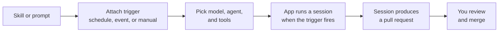

# Automations: Creating Them in the UI

Automations turn skills and prompts into repeatable work that the Copilot app runs for you, without starting each session by hand. This is the natural next step for a skill you authored earlier: promote it from an on-demand tool into a job that fires on a clock, on a GitHub event, or on a button press. Automations are available by default, so a scheduled prompt runs without a feature flag to find first.

The value comes from pairing a stable capability with a trigger. A skill is a portable folder of instructions the agent already knows how to run, and a prompt is a reusable instruction; either becomes an automation once it has a trigger attached. Recurring maintenance is the obvious fit, a nightly dependency check or a weekly documentation sweep, but the event triggers open a second class of work: react to the issue that was just filed rather than to the hour that just struck.

Because the automation runs a session just like an interactive one, its output is still a reviewable pull request. Automation moves the starting of the work off your plate, not the reviewing of it. You come back to a finished session, inspect the diff with the same validation loop as any other session, and merge. This topic covers creating automations; [the next one](../07-automation-runs/) covers watching and maintaining their runs.

## From on-demand to automated

| Property | On-demand skill or prompt | Automation |
|---|---|---|
| Trigger | You start it in a session | A schedule, a GitHub event, or a play button |
| Cadence | Whenever you need it | Hourly, daily, weekly, a CRON expression, or per event |
| Input | A skill folder or a reusable prompt | The same skill or prompt, plus a trigger and a model |
| Output | A session you review and merge | A session you review and merge |

> Note: An automation still produces a normal session and pull request, so nothing merges on its own; you review the result through the same [validation loop](../05-validation-loop/).

## Local or cloud

The first decision in the **New automation** dialog is where the run happens, and it decides more than location. A local automation runs from your machine, so it only fires while the app is running, and it uses your Settings and per-project instructions exactly as an interactive session does. New local automations default to the same local repository or worktree preference you set for new sessions. A cloud automation runs in a GitHub-hosted environment, so it fires with your computer off, and it carries its own **Tools** allowance because nobody is there to approve a push.

| Aspect | Local automation | Cloud automation |
|---|---|---|
| Runs | On your machine, while the app is running | In a GitHub-hosted environment, computer on or off |
| Schedules | Manual, Hourly, Daily, Weekly, CRON | Manual, Hourly, Daily, Weekly at quarter-hour times |
| Events | Issue and pull request events | Issue and pull request events grouped by subject |
| What it may do | Whatever the session's permission mode allows | What the **Tools** dropdown grants |
| Prerequisite | None beyond the app | Organization policy for Copilot cloud agent and automations |

> Note: Cloud automations need the Copilot cloud agent policy and automations to be allowed for the organization. Both are on by default, so a cloud automation that will not save is usually a policy that someone turned off.

## Choosing the trigger

An automation is created from the **Automations** tab with **New automation**, where you name it and pick what sets it off. A single automation can carry more than one trigger, so "every morning, and also whenever a bug is filed" is one automation rather than two: it runs when any of its triggers occurs.

| Trigger | Fires | Best for |
|---|---|---|
| Manual | Only when you press the play button on its card | A checklist you run before a release |
| Hourly, Daily, Weekly | On that cadence | Dependency checks, documentation sweeps, triage |
| CRON | On a custom expression, for local automations | A cadence the fixed options do not express |
| Issue | When a matching issue event occurs | First-response triage and labelling |
| Pull request | When a matching pull request event occurs | Review preparation and checks on incoming PRs |

Daily accepts several hours and a minute, so "at 8:00 and at 13:00" needs no CRON expression, and cloud schedules take quarter-hour times such as :15 and :45. When the fixed options run out, the CRON editor for local automations splits the expression into segments, validates each one inline, and shows a plain-language preview such as "every 15 minutes on weekdays", so you read the schedule instead of decoding it.

The event triggers take filters, so an automation aimed at bug reports does not wake up for every issue in the repository. Cloud triggers are grouped by subject with the specific event shown inline, such as a pull request opened, synchronized, or merged, and every trigger with a query field uses the same search input as My Work, with qualifier autocomplete and hints. A cloud trigger can also require that whoever caused the event has write access to the repository, which keeps a drive-by issue from a stranger from starting a run on your budget. Start narrower than feels necessary: an automation that fires on everything teaches you nothing except how fast your session list grows.

## What the automation actually runs

The prompt box is where you describe the task, and skills are reachable there with `/` exactly as they are in an interactive session. Model, reasoning effort, and agent are configured on the automation itself, which matters more here than in a session you are watching, because nobody is present to notice that a cheap model made a poor call at 3am. Cloud automations remember the model and effort you chose when you edit them later, and scheduled runs honor the saved long-context model setting. The cloud **Tools** dropdown decides what the run may do on its own, such as pushing changes, updating labels, or creating a pull request.

Each saved automation appears on the Automations tab with its name, schedule, associated repository, and last run status. **Create and run** starts it immediately after saving, which is how you find out that a prompt is ambiguous before the first unattended run does.

## Automations from inside a session

Not every automation starts on the Automations tab. Inside a chat or a workspace session you can ask the agent to wake up later or to repeat a prompt on a schedule, and it saves a session automation for you; the timeline records that as "Saved automation" rather than hiding it in generic tool output. The composer then shows a pill for the schedule, where you view its details or cancel it without leaving the conversation, and the session carries a badge in the sidebar with the next run time in its hover preview.

This is the right shape for work that belongs to one thread: "check this pull request's CI every hour until it is green" lives with the session that cares about the answer. Archiving the chat removes its scheduled automations and those of its side chats with it, so a finished thread does not keep firing.

## Sharing an automation as a link

The `ghapp://automations/new` deep link opens the **New automation** dialog with the name, prompt, and trigger schedule already filled in. Nothing is created until the person who opened it clicks **Create**, so the link is a proposal rather than an installation. That makes it a practical way to hand a team the same nightly check: publish the link in the repository's readme or a pinned issue, and everyone reviews the prompt before it runs on their machine.

## Demo

Promote the Agent Skill from the [Artifacts & Tools module](../../02-agentic-harness/04-skills/) into an automation, then add an event trigger beside it.

1. Pick one skill from the [`02-agentic-harness/04-skills/`](../../02-agentic-harness/04-skills/) topic that describes recurring work, for example a documentation or code-quality skill, and confirm its `SKILL.md` has a clear `name` and `description`.
2. Confirm the skill lives in the repository you will connect, so it syncs to the app; [Set Up Your Workspace](../02-setup/) covers why repository skills and MCP servers become available automatically.
3. In the Copilot desktop app, open the repository and start a one-off session that invokes the skill with `/`; verify it does the work you expect and produces a reviewable change.
4. Open the **Automations** tab, click **New automation**, choose **Local**, name it, and give it a **Daily** trigger at two different hours with the same prompt and skill.
5. Set the model, reasoning effort, and agent on the automation deliberately.
6. Save with **Create and run** so the first run happens while you are watching, and fix the prompt if the result is not what you expected.
7. Add a second trigger to the same automation: an **Issue** trigger filtered to a single label, then file a matching issue and confirm the automation fires for it and not for an unrelated one.
8. Create a second automation as **Cloud**, give it a pull request trigger, turn on the write-access requirement, and open the **Tools** dropdown to grant only what the task needs.
9. Switch a local automation to **CRON**, type `*/15 * * * 1-5`, and read the plain-language preview before saving.
10. In an ordinary chat, ask the agent to repeat a short status check every hour, then find the schedule pill in the composer, open its details, and cancel it.
11. Open `ghapp://automations/new` with a name and prompt filled in, confirm the dialog is prefilled, and close it without clicking **Create**.

## Links & Resources

- [Using automations in the GitHub Copilot app](https://docs.github.com/en/copilot/how-tos/github-copilot-app/using-automations) - creating an automation, local and cloud automations, the Manual, Hourly, Daily, Weekly, CRON, Issue, and Pull request triggers, and the Tools dropdown
- [About the GitHub Copilot app](https://docs.github.com/en/copilot/concepts/agents/github-copilot-app) - where automations sit among the app's capabilities
- [About GitHub Copilot skills](https://docs.github.com/en/copilot/concepts/agents/about-agent-skills) - what a skill is and how the agent loads it
- [GitHub Copilot app changelog](https://github.com/github/app/blob/main/changelog.md) - session automations, the CRON editor, cloud triggers, and the automations deep link

[← Previous: The Validation Loop](../05-validation-loop/readme.md) | [Back to Copilot App](../readme.md) | [Next: Automations: Running & Maintaining Them →](../07-automation-runs/readme.md)
