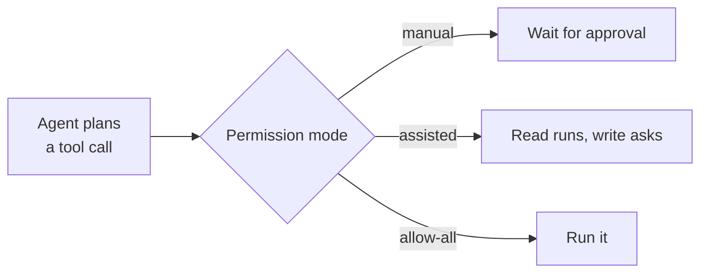
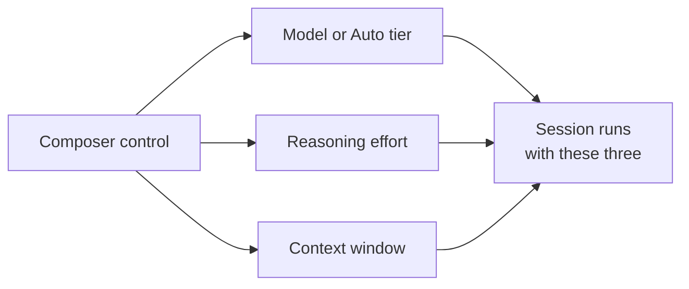

# Configuring the App: Customize, Permissions & Models

Everything the app can reach and everything it is allowed to do is configured in three places: Customize for capabilities, the permission mode for authority, and the composer control for the model. Sessions and automations inherit all three, so a setting you get wrong here shows up as an agent that lacks a tool, stalls on an approval prompt, or burns budget on the wrong model. This topic covers the surfaces you touch before the first session, not the session itself.

Customize is the single management view for plugins, skills, MCP servers, and canvases. It is available to everyone rather than behind a flag, and it is where personal skills are created, edited, and removed with Markdown preview and validation. Plugins installed there can be updated one at a time or in bulk, and can keep themselves current with auto-update. `/settings` opens app settings straight from the composer when the thing you need to change is a setting rather than a capability.

Capabilities arrive in Customize from marketplaces you configure as sources, added with the settings icon next to the marketplace dropdown. The Featured sections carry ready-to-install extensions, skills, MCP servers, and canvases, so a team on Azure Boards and Repos gets the same one-click path as a team on GitHub. The previous topic on [sync](../05-sync/) covers the repository half of this story; Customize is the personal half.

## What Customize manages

| Item | What it gives the agent | Scope |
|---|---|---|
| Plugins | Packaged capabilities installed from a marketplace | Personal, updated individually or in bulk |
| Skills | Instruction folders the agent loads on demand | Personal, authored in place with validation |
| MCP servers | External data and tools over the Model Context Protocol | Personal, alongside the repository's own servers |
| Canvases | Shared, interactive surfaces a session and a person edit together | Personal, some arriving through a plugin |
| Custom agents | Named agents you pick with the agent picker or `/agent` | Personal or plugin-owned |

> Note: Customize holds your personal capabilities. Skills and MCP servers defined in a repository still sync on their own, so a session sees the union of both.

## Canvases are the app's working surfaces

A canvas is a shared, interactive surface for a work artifact: a plan, a triage board, a browser session, a release checklist, a dashboard, an incident, or a spreadsheet. It is bidirectional, so the agent updates it while you edit the same surface, which is what separates it from a report the agent hands you when it is done. Browse the featured ones under **Customize**, then **Canvas**, install any plugin a canvas requires, and open a **New session** against it.

Two featured canvases show the pattern well. The **Jira** canvas, renamed from Atlassian in v1.1.15, pulls Jira issues onto a shared surface so you can choose what moves forward and let the agent carry that context into investigation, implementation, and pull request preparation. The **Sentry** canvas, added in v1.1.23, triages live Sentry issues so the path from a crash report to a code fix stays inside one surface. Inside a session, `/create-canvas` builds a new canvas and opens it in the right side panel.

## Permission modes decide how far an agent goes

The app's permission modes match the GitHub Copilot CLI, so the vocabulary you learned at the command line carries over. You set the mode with `/permissions` and inspect the current one with `/permissions show`. This is a separate axis from the Interactive, Plan, and Autopilot session modes covered in [Sessions](../02-sessions/): the session mode decides how much the agent decides for itself, and the permission mode decides which of its tool calls need your approval.

| Mode | Behavior | Use when |
|---|---|---|
| `manual` | Every tool call waits for your approval | You are auditing exactly what an agent does |
| `assisted` | Reads run freely, writes and commands ask | Normal interactive work |
| `allow-all` | Nothing prompts | A throwaway working tree you can discard |

Three more commands sit beside it. `/allow-all-tools on|off|show` and `/yolo on|off|show` flip blanket approval, `/reset-allowed-tools` clears the per-tool approvals a session accumulated, and `/sandbox` confines the agent's shell commands to the session's workspace regardless of which permission mode is active. Turning on Autopilot while tool permissions are set to Always ask is the common trap, and the app catches it: it recommends a permission mode that lets the run continue unattended, with a one-click option to apply it.

Permission choices are a governance decision as much as a convenience one, and [Trust, Safety & the Permission Model](../../08-governance/01-permissions/) treats them as such. Pick the loosest mode the blast radius justifies: a session in its own working tree tolerates far more than one pointed at your main checkout, and a cloud sandbox tolerates more still.

## Choosing the model for a session

Model, reasoning effort, and context window are chosen together in one combined composer control, so the three settings that decide cost and quality are no longer scattered. New sessions start on GPT-5.6 Sol at medium reasoning, and a session then inherits whatever you last picked rather than resetting to a default. Raising reasoning effort buys deliberation on a hard refactor and wastes credits on a docstring, which makes this control the lever the [cost model](../../08-governance/02-cost/) topic argues about.

**Auto** is the option for when you do not want to decide per task, and since September 2026 it takes a stance rather than a guess. Its Efficiency, Balance, and Intelligence tiers say how Copilot should weigh cost against quality and response time, and when Auto switches the model mid-conversation a notice tells you, with the model that produced each reply shown in the hover metadata.

Bring-your-own-key endpoints are first-class here. Add a provider under Settings, then **Model providers**, then **Add provider**, supplying a display name, base URL, and API key; OpenAI, Azure OpenAI, Microsoft Foundry, Anthropic, Ollama, Foundry Local, LM Studio, and any OpenAI-compatible HTTP endpoint are supported, and Microsoft Foundry also accepts your existing `az login` session instead of a key. Those models then appear in the picker beside the GitHub-hosted ones, and you need no Copilot plan to use them.

> Note: The app tracks a fast-moving product. The behavior described here matches release v1.1.23; check the changelog in the `github/app` repository when something does not match your build.

## Demo

Configure the app end to end before running any real work through it.

1. Open **Customize** and inventory what is already installed: plugins, skills, MCP servers, canvases, and custom agents. Note which of them came from a repository and which are personal.
2. Create a **personal skill** in Customize with a clear `name` and `description`, use the Markdown preview to check it renders, and fix anything validation flags.
3. Add a marketplace source with the settings icon beside the marketplace dropdown, then install one capability from a **Featured** section.
4. Open **Customize**, then **Canvas**, install the **Jira** or **Sentry** canvas, and open a **New session** against it; then run `/create-canvas` in a session and watch a canvas build in the right side panel.
5. Run `/permissions show` in a session, then set `manual` and give the agent a task that writes a file. Approve each call and observe how much it asks for.
6. Switch the same session to **Autopilot** mode, accept the permission setting the app recommends, and rerun a comparable task. Compare how many prompts you answered in each mode, and note that you changed two different settings to get there.
7. Turn on `/sandbox` and ask the agent to run a command that touches a path outside the workspace; confirm it fails rather than succeeding quietly.
8. Open the composer control and run one task twice against the same prompt: once at low reasoning effort, once at high. Compare the diffs and decide which tasks in your own backlog justify the higher setting.
9. Switch the model to **Auto**, try the Efficiency and Intelligence tiers on the same prompt, and read the hover metadata to see which model actually answered.

## Links & Resources

- [Customizing the GitHub Copilot app](https://docs.github.com/en/copilot/how-tos/github-copilot-app/customize-github-copilot-app) - the Customize tab for plugins, skills, MCP servers, canvases, custom agents, and custom marketplaces
- [Working with canvas extensions in the GitHub Copilot app](https://docs.github.com/en/copilot/how-tos/github-copilot-app/working-with-canvas-extensions) - what a canvas is, installing featured canvases, and `/create-canvas`
- [Using your own LLM models in the GitHub Copilot app](https://docs.github.com/en/copilot/how-tos/github-copilot-app/use-byok-models) - the supported providers and the Model providers settings page
- [GitHub Copilot CLI permission modes](https://docs.github.com/en/copilot/how-tos/use-copilot-agents/use-copilot-cli) - the `manual`, `assisted`, and `allow-all` vocabulary the app shares with the CLI

[← Previous: Syncing Skills & MCP Servers](../05-sync/readme.md) | [Back to Copilot App](../readme.md)
