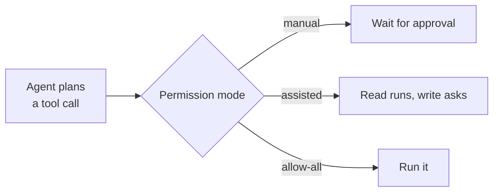
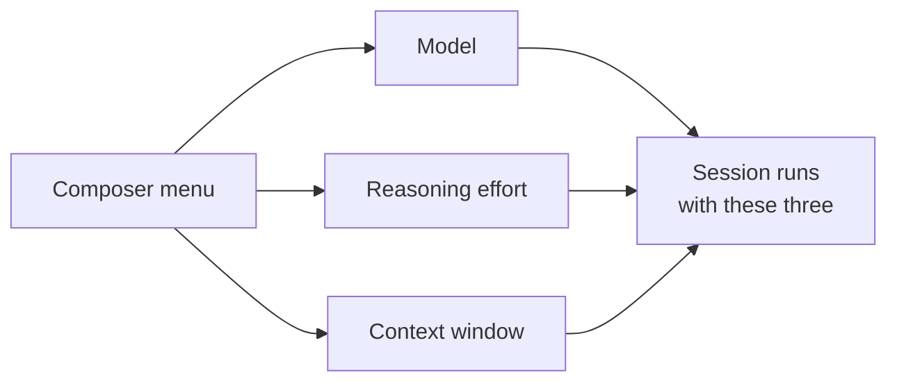

# Configuring the App: Customize, Permissions & Models

Everything the app can reach and everything it is allowed to do is configured in three places: Customize for capabilities, the permission mode for authority, and the composer menu for the model. Sessions and automations inherit all three, so a setting you get wrong here shows up as an agent that lacks a tool, stalls on an approval prompt, or burns budget on the wrong model. This topic covers the surfaces you touch before the first session, not the session itself.

Customize is the single management view for plugins, skills, MCP servers, and canvases. It is available to everyone rather than behind a flag, and it is where personal skills are created, edited, and removed with Markdown preview and validation. Plugins installed there can be updated one at a time or in bulk, and can keep themselves current with auto-update.

Capabilities arrive in Customize from marketplaces you configure as sources. The Featured section carries ready-to-install integrations, including Azure DevOps, so a team on Azure Boards and Repos gets the same one-click path as a team on GitHub. The previous topic on [sync](../05-sync/) covers the repository half of this story; Customize is the personal half.

## What Customize manages

| Item | What it gives the agent | Scope |
|---|---|---|
| Plugins | Packaged capabilities installed from a marketplace | Personal, updated individually or in bulk |
| Skills | Instruction folders the agent loads on demand | Personal, authored in place with validation |
| MCP servers | External data and tools over the Model Context Protocol | Personal, alongside the repository's own servers |
| Canvases | Persistent working surfaces a session writes into | Personal |

> Note: Customize holds your personal capabilities. Skills and MCP servers defined in a repository still sync on their own, so a session sees the union of both.

## Permission modes decide how far an agent goes

The app's permission modes match the GitHub Copilot CLI, so the vocabulary you learned at the command line carries over. You set the mode with `/permissions` and inspect the current one with `/permissions show`. Autopilot is the mode to reach for when you want an agent to run a multi-step job without stopping at every tool call, and the app recommends the permission setting that matches it when you turn it on.

| Mode | Behavior | Use when |
|---|---|---|
| `manual` | Every tool call waits for your approval | You are auditing exactly what an agent does |
| `assisted` | Reads run freely, writes and commands ask | Normal interactive work |
| `allow-all` | Nothing prompts | A throwaway worktree you can discard |

Permission choices are a governance decision as much as a convenience one, and [Trust, Safety & the Permission Model](../../08-governance/01-permissions/) treats them as such. Pick the loosest mode the blast radius justifies: a session in its own worktree tolerates far more than one pointed at your main checkout.

## Choosing the model for a session

Model, reasoning effort, and context window are chosen together in one composer menu, so the three settings that decide cost and quality are no longer scattered. Raising reasoning effort buys deliberation on a hard refactor and wastes credits on a docstring, which makes this menu the lever the [cost model](../../08-governance/02-cost/) topic argues about. Bring-your-own-key endpoints are first-class here: a custom provider model exposes its own supported reasoning-effort levels, configured in Settings, and the composer then offers exactly those.

> Note: The app tracks a fast-moving product. The behavior described here matches release v1.1.14; check the changelog in the `github/app` repository when something does not match your build.

## Exercise

Configure the app end to end before running any real work through it.

1. Open **Customize** and inventory what is already installed: plugins, skills, MCP servers, and canvases. Note which of them came from a repository and which are personal.
2. Create a **personal skill** in Customize with a clear `name` and `description`, use the Markdown preview to check it renders, and fix anything validation flags.
3. Add a marketplace source, then install one capability from **Featured**; if your team uses Azure Boards or Azure Repos, install the Azure DevOps integration and confirm it opens.
4. Run `/permissions show` in a session, then set `manual` and give the agent a task that writes a file. Approve each call and observe how much it asks for.
5. Switch the same session to Autopilot, accept the permission setting the app recommends, and rerun a comparable task. Compare how many prompts you answered in each mode.
6. Open the composer menu and run one task twice against the same prompt: once at low reasoning effort, once at high. Compare the diffs and decide which tasks in your own backlog justify the higher setting.

## Links & Resources

- [GitHub Copilot app](https://github.com/features/ai/github-app) - the desktop app, its configuration surfaces, and supported plans
- [GitHub Copilot CLI permission modes](https://docs.github.com/en/copilot/how-tos/use-copilot-agents/use-copilot-cli) - the `manual`, `assisted`, and `allow-all` vocabulary the app shares with the CLI
- [About the Model Context Protocol (MCP)](https://docs.github.com/en/copilot/concepts/about-mcp) - what the MCP servers managed in Customize connect an agent to
- [Supported AI models in GitHub Copilot](https://docs.github.com/en/copilot/reference/ai-models/supported-models) - the models and reasoning behavior the composer menu offers
