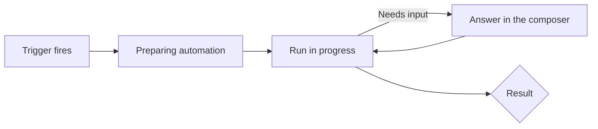
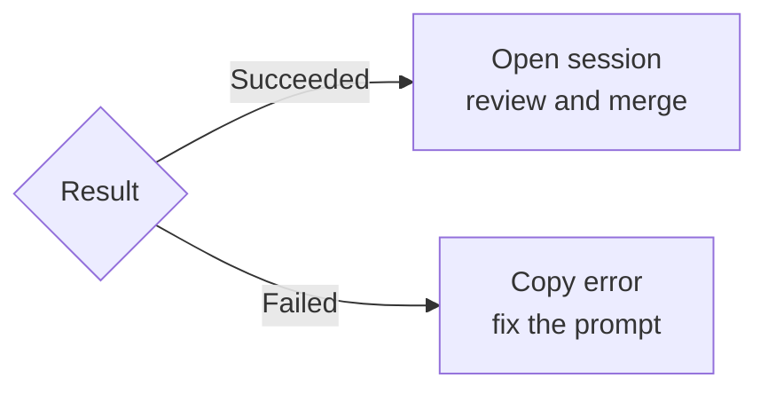

# Automations: Running & Maintaining Them

An automation you created is a promise to review work you did not start. The **Automations** view is where you keep that promise: it shows what ran, what is running, what failed, and what each run cost, and it is where you pause, stop, and clean up. An automation nobody watches is worse than no automation, because it produces pull requests that age into noise.

Maintenance has two halves. The first is the runs themselves, which you check the way you check My Work: a quick glance for red, then a closer look at anything that failed or cost more than expected. The second is the session list, which a daily automation fills with a new session every day.

## Reading the Automations view

The **Automations** entry in the sidebar shows green and red counts of succeeded and failed runs instead of a single status dot, so a failure is visible without opening the view. Inside it, **Recent runs** lists every run, the run timeline keeps the oldest above the newest like the session timeline, and a running automation shows a live indicator you can filter on with the **Running** status.

| Where | What it tells you | Action |
|---|---|---|
| Sidebar counts | How many runs succeeded and failed | Open the view when the red count moves |
| Recent runs | Every run, with a live indicator while running | Filter by the Running status |
| Run details | Duration, token and context usage, AI credits spent | Compare a run's cost with the value it produced |
| Run context menu | Stop the run or open its session | Right-click without opening the details |
| Automation context menu | Enable or disable the automation | Pause a noisy schedule without deleting it |

Starting a run shows a **Preparing automation** state immediately, and **Open session** is the primary action in the run view, because the session is where the work actually is. A failed run shows its error with an inline copy button, so the exact text goes into an issue or a prompt fix without retyping.

## A run can still need you

An unattended run is not always unattended to the end. When a run hits a prompt or a permission request, the composer stays available during the run, so you answer it in place instead of opening the session separately. If that happens on every run, the automation's permissions or Tools allowance are too tight for the task, and the fix belongs in the automation rather than in your daily routine.

## Cost per run

Automation runs show token, context, and AI-credit usage in the run details popover, the same figures a chat session displays, and reopening a past run shows what that run spent. Duration sits beside the timestamp of every completed run. Together they turn "is this automation worth it" from a feeling into a comparison: a nightly run that costs a noticeable share of the monthly budget and produces a pull request nobody merges is the first one to disable.

Disabling is reversible and deleting is not. Use the automation's context menu to disable a schedule that has gone quiet or noisy, and delete it only once you know you will not want its prompt again. Manual automations have no disable command, because they never fire on their own.

## Keeping the session list from silting up

A daily automation produces a session every day, and most of them are finished business within the hour. Session settings carry a **Session cleanup** section that archives inactive sessions automatically and deletes archived ones on a schedule you set, so the list stays a view of live work rather than a log. Set the archival window longer than your slowest review turnaround, or you will archive a session you were still reading.

Cleanup is worth configuring before you add the first automation rather than after. An interval you picked while looking at six sessions is a different interval from the one you would pick while looking at two hundred, and the second situation is the one automations create. Prompts delivered by scheduled automations now appear as compact "Scheduled prompt" cards that open the full text in a dialog and stay out of composer history recall, so the automated traffic does not crowd out what you typed yourself.

## Demo

Run the automations from [the previous topic](../06-automations/) for a day and keep them under control.

1. Open **Session cleanup** in Sessions settings and set an archival window longer than the time you normally take to review a pull request, plus a deletion schedule for archived sessions.
2. Press the play button on a manual automation, then watch the **Preparing automation** state and the live indicator in **Recent runs**. Filter the list by **Running** while it is active.
3. Right-click the running entry and choose **Open session**. Expected result: the session opens without going through the run details.
4. If the run asks for input, answer it in the composer during the run, then note which permission or tool the automation should have been given.
5. Open the details of a completed run and read its duration, token usage, and AI credits. Compare them with a run of a different automation.
6. Force a failure, for example by pointing the prompt at a file that does not exist, then copy the error with the inline button and fix the prompt.
7. Check the sidebar counts on the **Automations** entry after both runs. Expected result: one green and one red.
8. Disable the noisier automation from its context menu and confirm it no longer fires at its next scheduled time.
9. Return after the next scheduled run, open the resulting session, review the diff with the validation loop, and merge or discard the pull request.
10. Open a session that received a scheduled prompt and click its "Scheduled prompt" card. Expected result: the full prompt opens in a dialog, and it does not appear when you recall composer history.

## Links & Resources

- [Using automations in the GitHub Copilot app](https://docs.github.com/en/copilot/how-tos/github-copilot-app/using-automations) - creating, running, and managing automations
- [About the GitHub Copilot app](https://docs.github.com/en/copilot/concepts/agents/github-copilot-app) - sessions, automations, and settings in one concept page
- [GitHub Copilot app changelog](https://github.com/github/app/blob/main/changelog.md) - run history, run cost, the Running filter, and session cleanup changes

[← Previous: Automations: Creating Them in the UI](../06-automations/readme.md) | [Back to Copilot App](../readme.md)
