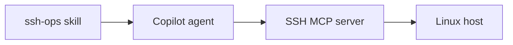
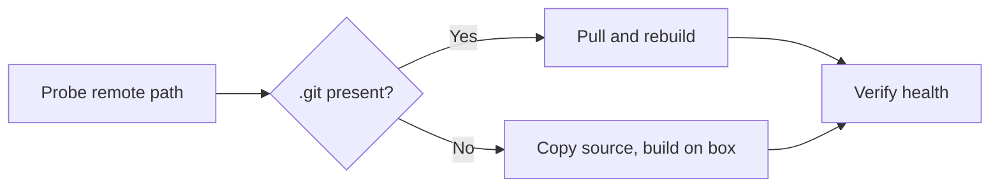

# Remote Configuration over SSH

Not all infrastructure sits behind a cloud control plane. A rented VPS, an on-premises Hyper-V guest, a lab machine, or a customer-owned box has no `az`, no ARM, and no resource graph: the only management surface is a shell on port 22. Copilot can still operate that target, but only once it can reach it and only once it knows the rules that keep remote operations from going wrong.

This topic wires three pieces together. The SSH MCP server gives the agent a transport to the box, the `ssh-ops` skill gives it the procedures for keys, diagnostics, and deployment, and the prompts below drive an end-to-end bring-up that the agent verifies itself.



## Why an MCP server instead of a terminal command

Copilot can already run `ssh` through the terminal tool, so the MCP server has to earn its place. It does three things a raw terminal call does not.

The connection target, credentials, and timeout live in configuration rather than in every command the agent composes, so the agent cannot accidentally aim a destructive command at the wrong host. The server holds one session open across many calls, which matters because each `ssh` invocation otherwise pays a fresh handshake. And the tool surface is explicit, so a policy that allows remote reads but not remote writes has something to attach to.

The tradeoff is that the target is pinned per repository. An MCP server configured for one box cannot reach another, which is the single most common cause of a failed handshake.

## Configuring the SSH MCP server

Add the server to `.mcp.json` at the repository root. Key authentication is the default for any host you did not build yourself.

```json
{
  "mcpServers": {
    "ssh-mcp": {
      "type": "stdio",
      "command": "npx",
      "args": [
        "-y",
        "ssh-mcp",
        "--",
        "--host=<HOST_OR_IP>",
        "--port=22",
        "--user=<USER>",
        "--key=<ABSOLUTE_PATH_TO_PRIVATE_KEY>",
        "--timeout=120000",
        "--maxChars=none"
      ]
    }
  }
}
```

Password authentication uses `--password` and `--sudoPassword` in place of `--key`, and is the right choice only for a throwaway lab host. Either way the file holds a live credential, so keep it out of version control and commit a `.mcp.json.example` with placeholders instead.

> Note: A hardened host with `PasswordAuthentication no` will reject a password-configured server on every call, and the error looks like a network timeout rather than an auth failure. Check the authentication method before you check the firewall.

## Installing the ssh-ops skill

The skill lives at [`.github/skills/ssh-ops/`](../../../../.github/skills/ssh-ops/) in this repository. It carries the procedures that repeated remote work has proven necessary: matching a local key to the host that actually trusts it, reading a failed connection in the right order, and deploying to a box that has no git checkout.

```
.github/skills/ssh-ops/
├── SKILL.md
└── references/
    ├── ssh-mcp.md
    ├── keys-and-access.md
    └── remote-ops.md
```

Copilot loads only the name and description at startup and pulls a reference in when your request matches, so the detail costs nothing until the moment a remote operation is on the table.

## Exercise: Bring up a stack on a remote host

Provision a small Linux VPS with any provider, or use a local Hyper-V or WSL guest, then add its address and key to `.mcp.json` as shown above. Restart the IDE so the server is picked up.

Step one is to prove the transport works before asking for anything ambitious.

```prompt
Using the ssh-mcp server, report the host's OS release, kernel version, available disk on /, and whether docker and docker compose are installed. Do not install anything yet.
```

Step two hands the agent a real task and lets the skill supply the sequence.

```prompt
Install Docker Engine and the compose plugin on the remote host, then copy the compose file from src/food-app to /opt/food-app on the box, bring the stack up, and confirm every container reports healthy. Show me the command output for the health check, not a summary.
```

Step three is the one that separates a working setup from a plausible-looking one. Break the connection deliberately by changing the port in `.mcp.json` to `2222`, then ask the agent to diagnose it.

```prompt
The ssh-mcp connection is failing. Diagnose it and tell me whether the problem is the configuration, the route, or the host, before proposing any fix.
```

A correct answer names the configuration and does not suggest rebooting the box.

## In Practice: Deploying to a Box with No Git Checkout

A team ships an internal API to a single rented VPS. The box was provisioned from a synced source tree rather than a clone, so `/opt/api` has no `.git` directory and the usual `git pull && docker compose up -d --build` does nothing useful. The developer who set it up left, and the deployment runbook is a paragraph in a wiki that describes a machine that no longer exists.

Without an agent this is an afternoon: SSH in, discover the missing checkout, work out which local paths correspond to which remote paths, copy the right subtree, rebuild the right service, and find out afterwards that the container came up but the reverse proxy still points at the old one. Each of those steps is fast, and the cost is entirely in reconstructing the sequence from a cold start.

With the SSH MCP server configured and the `ssh-ops` skill installed, the developer asks Copilot to deploy the current branch to the box. The agent probes the remote path first, sees no `.git`, and switches to the copy-then-build path the skill describes rather than failing on a `git pull`. It copies only the changed source, rebuilds the single affected service instead of the whole stack, then queries the container health endpoint through the same session and reports the actual response body.

The value is not that the agent typed the commands. It is that the procedure lived in a skill rather than in one person's memory, so the sequence survived the person leaving.



## Links & Resources

- [Model Context Protocol servers](https://modelcontextprotocol.io/docs/concepts/architecture) - how an MCP server exposes tools and how clients connect to one
- [Extending Copilot Chat with MCP](https://docs.github.com/en/copilot/customizing-copilot/extending-copilot-chat-with-mcp) - registering and configuring MCP servers for GitHub Copilot
- [OpenSSH manual pages](https://www.openssh.com/manual.html) - authoritative reference for ssh, scp, ssh-keygen, and sshd_config
