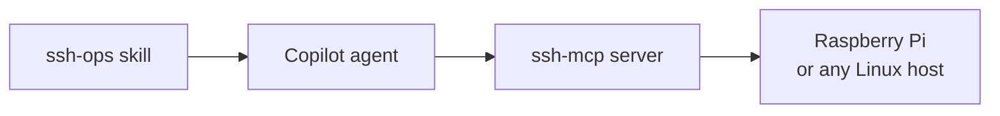

# Remote Configuration over SSH

Not every machine sits behind a cloud control plane. A Raspberry Pi on your desk, a lab VM, or a customer-owned box has no `az` and no resource graph: the only management surface is a shell on port 22. Any Linux host you can reach works for this topic, and a Pi is the cheapest one to break.

Agentic SSH means you describe the outcome and the agent runs the commands, reads the output, and decides what to do next. The MCP server is what makes that safe to do repeatedly: the host, user, and key live in configuration instead of in every command the agent composes, and one session stays open across many calls rather than paying a fresh handshake each time.



## Connecting the Agent to the Box

VS Code reads MCP servers from `.vscode/mcp.json` under the top-level `servers` key. Key authentication is the default for any host you did not build yourself:

```json
{
  "servers": {
    "ssh-mcp": {
      "type": "stdio",
      "command": "npx",
      "args": [
        "-y",
        "ssh-mcp",
        "--",
        "--host=<PI_ADDRESS>",
        "--port=22",
        "--user=<USER>",
        "--key=<ABSOLUTE_PATH_TO_PRIVATE_KEY>",
        "--timeout=120000",
        "--maxChars=none"
      ]
    }
  }
}
```

Raise `--timeout` before you need it. A first `docker build` on a Pi routinely runs past two minutes, and the failure is indistinguishable from a dead connection.

> Note: The Copilot CLI does not read this file. Register the same server for the CLI with `copilot mcp add`, which writes to `~/.copilot/mcp-config.json`.

The file holds a live credential, so keep it out of version control and commit a placeholder copy beside it. Password authentication uses `--password` and `--sudoPassword` in place of `--key`, and only for a host you are willing to reinstall.

## The Agent and the Skill

Two assets in this repository do the work once the transport exists. [`.github/agents/raspberri-pi.agent.md`](../../../../.github/agents/raspberri-pi.agent.md) is an agent scoped to `ssh-mcp/*` that knows Raspberry Pi specifics: WiFi, GPIO, services, and the operations it refuses to run without confirmation.

[`.github/skills/ssh-ops/`](../../../../.github/skills/ssh-ops/) carries the procedures underneath it, split so only the relevant one loads: configuring and debugging the server, working out which local key the host actually trusts, and running commands or deploying on a box with no git checkout.

## Demo: Drive the Pi from Chat

Add your host and key to `.vscode/mcp.json`, reload the window, and select the Raspi SSH agent. Prove the transport before asking for anything ambitious:

```prompt
Using the ssh-mcp server, report the OS release, kernel version, architecture, available disk on /, and whether docker is installed. Do not install anything yet.
```

Then hand it a real task and let it verify its own work:

```prompt
Install Docker Engine on the host, run the nginx image published on port 8080, and confirm it serves a page. Show me the actual curl output, not a summary.
```

When something fails, ask for a diagnosis instead of a fix. The skill's order is configuration, route, port, authentication, and a correct answer names which one before proposing anything:

```prompt
The ssh-mcp connection is failing. Diagnose it and tell me whether the problem is the configuration, the route, or the host, before proposing any fix.
```

## Links & Resources

- [Extend Copilot Chat with MCP](https://docs.github.com/en/copilot/how-tos/provide-context/use-mcp-in-your-ide/extend-copilot-chat-with-mcp) - registering and configuring MCP servers for GitHub Copilot
- [Model Context Protocol architecture](https://modelcontextprotocol.io/docs/learn/architecture) - how an MCP server exposes tools and how clients connect to one
- [Raspberry Pi remote access documentation](https://www.raspberrypi.com/documentation/computers/remote-access.html) - enabling SSH on the Pi and the key setup it expects
- [OpenSSH manual pages](https://www.openssh.com/manual.html) - authoritative reference for ssh, scp, ssh-keygen, and sshd_config

[← Previous: Automation using Azure CLI](../01-azure-cli/readme.md) | [Back to IaC & Configuration](../readme.md) | [Next: Declarative Templates with Bicep and Terraform →](../03-declarative/readme.md)
