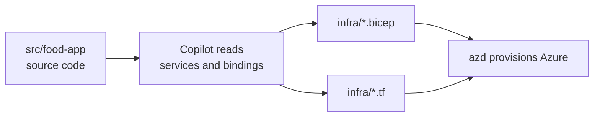

# Declarative Templates with Bicep and Terraform

The two topics before this one provision imperatively: an `az` script runs commands in order, and an SSH session applies configuration to a host that is already there. A declarative template inverts that. You write the desired end state, and the engine works out what to create, update, or leave alone.

Azure has two such engines in common use. Bicep is Microsoft's own domain-specific language, compiled to ARM templates and scoped to Azure. Terraform is HashiCorp's, uses HCL, and reaches Azure through the `azurerm` provider alongside every other provider in its ecosystem. Both plug into the Azure Developer CLI, which is what lets one application ship with either.

This demo generates both sets of templates for the same application, `src/food-app`, so the difference is the language rather than the workload.

The finished templates live in [declarative-solution](./declarative-solution/), verified against Bicep CLI 0.44.1 and Terraform 1.14.5. Build the files yourself as you read; go there when a step misbehaves.



## Which Engine azd Uses

The provider setting in `azure.yaml` decides which files azd reads. Bicep is the default, so a Bicep project needs no entry at all. Terraform is opt-in:

```yaml
infra:
  provider: terraform
```

Terraform also needs its state kept somewhere. For remote state, add a `provider.conf.json` file to the `infra/` folder with the storage account details; without it, Terraform keeps state in the working directory, which is fine for a demo and wrong for a team.

## Bicep

This part creates the Azure resources for the food-app as Bicep modules following azd conventions, with parameterization for environment-specific values. The scope is `src/food-app` and nothing else under `src/`.

```prompt
Create Azure Infrastructure as Code bicep files for src/food-app following azd conventions.

Include:
- Main bicep file (main.bicep) with module references
- Separate modules for azure container apps and networking
- Parameters file with environment-specific values
- Outputs for deployment results

Structure the files in a way that matches azd expected directory layout:
- infra/ directory with main.bicep
- infra/modules/ directory with individual resource modules
- infra/main.parameters.json for configuration

The food-app consists of:
- catalog-service: Backend API service
- food-shop: Frontend application
```

The parameters file is named `main.parameters.json` because azd looks for a parameters file that matches the deployment template by name.

Check that the templates compile and see what a deployment would change before anyone provisions anything:

```bash
az bicep build --file infra/main.bicep
az deployment sub what-if --location westeurope --template-file infra/main.bicep --parameters infra/main.parameters.json
```

## Terraform

The same application, the same azd layout, expressed in HCL. This part narrows to hosting the food-shop frontend on an Azure Static Web App, which keeps the generated files small enough to read in one sitting.

```prompt
Create Terraform files for src/food-app following azd conventions:
- main.tf with Azure Static Web App for food-shop frontend
- variables.tf for environment configuration
- outputs.tf for deployment results
- provider.tf with Azure provider setup
```

Terraform validates syntax and provider schemas without touching a subscription or a state backend:

```bash
cd infra
terraform init -backend=false
terraform validate
terraform fmt -check
```

> Note: Both validation passes run offline, so they are safe to demonstrate on any machine that has the CLI installed and no Azure credentials configured.

## Links & Resources

- [azd Bicep conventions](https://learn.microsoft.com/en-us/azure/developer/azure-developer-cli/make-azd-compatible) - the infra folder layout and tags azd expects to find
- [Bicep modules](https://learn.microsoft.com/en-us/azure/azure-resource-manager/bicep/modules) - how the module layout the prompt asks for is declared and consumed
- [Use Terraform with the Azure Developer CLI](https://learn.microsoft.com/en-us/azure/developer/azure-developer-cli/use-terraform-for-azd) - the provider setting and the provider.conf.json remote state layout
- [azurerm provider reference](https://registry.terraform.io/providers/hashicorp/azurerm/latest/docs) - resource arguments for every Azure resource the generated files declare

[← Previous: Remote Configuration over SSH](../02-ssh/readme.md) | [Back to IaC & Configuration](../readme.md)
