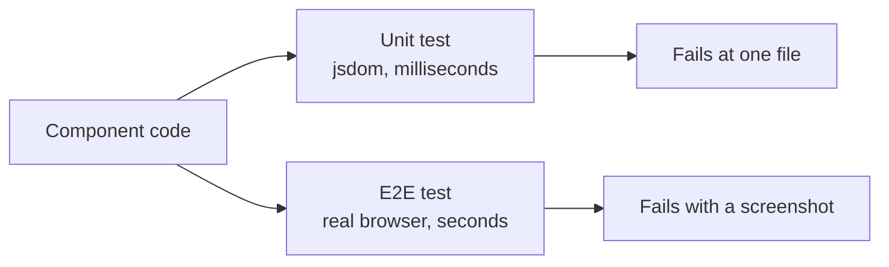
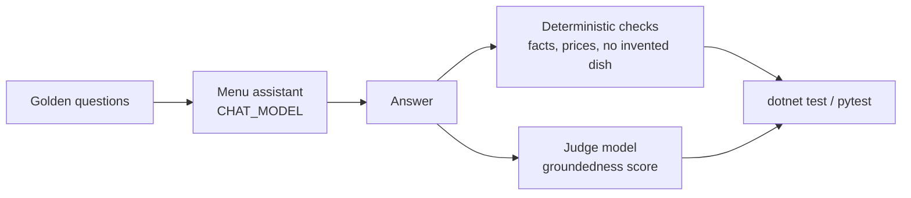

# Testing using Copilot

Two layers of tests answer two different questions. A unit test asks whether a component behaves correctly in isolation, runs in milliseconds against a simulated DOM, and fails with a stack trace that points at one file. An end-to-end test asks whether the same behavior survives a real browser, a real bundle, and a running backend, and it fails with a screenshot.

Copilot is useful at both layers, and for different reasons. Unit tests are where it generates volume: describe blocks, fixtures, and edge cases that nobody enjoys writing by hand. End-to-end tests are where it does translation, turning an existing unit test into the user-visible interaction that proves the same thing through the browser.

A third layer appears as soon as the code calls a language model. The same prompt can return a different answer after a model upgrade, so the assertion moves from "is the output equal" to "is the answer still acceptable". That is an evaluation, and it runs in the same test runner as the other two.

This topic generates all three against the samples in `src/` and in this folder, which ship with the plumbing already in place so the exercise is the tests rather than the configuration.



## The Samples

| Sample | What it provides |
|--------|------------------|
| [`src/angular/angular-devops`](../../../src/angular/angular-devops/) | Angular 22 on Vitest and jsdom, with Playwright configured against `http://localhost:4200`. Both layers are wired and both have a worked example. |
| [`src/react/react-devops`](../../../src/react/react-devops/) | React 19 on Vitest with Testing Library, and the same Playwright setup against a Vite preview on port 4173. |
| [`food-app`](./food-app/) | The polyglot catalog: four backends (C#, Java, Python, TypeScript) and two frontends. The C# catalog API carries a generated xUnit suite in [`catalog-service-cs/tests`](./food-app/catalog-api/catalog-service-cs/tests/); the others ship without tests on purpose, so generating them is the exercise. |
| [`evals-copilot-sdk-cs`](./evals-copilot-sdk-cs/) | A menu chat assistant grounded in the catalog, running on the GitHub Copilot SDK, plus an xUnit evaluation suite that catches unexpected answers after a model change. |
| [`evals-copilot-sdk-py`](./evals-copilot-sdk-py/) | The same assistant and the same five golden questions in Python, on pytest. |

## Wiring the Angular CLI MCP Server

The Angular CLI ships an MCP server that gives the agent schematics, project metadata, and the current best-practice guidance instead of whatever it remembers about Angular. Add it to `.vscode/mcp.json` under the `servers` key, which is the shape VS Code expects:

```json
{
  "servers": {
    "angular-cli": {
      "command": "npx",
      "args": ["-y", "@angular/cli", "mcp"]
    }
  }
}
```

> Note: The CLI reads MCP servers from `~/.copilot/mcp-config.json`, written by `copilot mcp add`, not from a file in the repository. A server checked into `.vscode/mcp.json` is available in VS Code only.

## Creating a Testing Agent

A custom agent keeps the testing conventions out of every prompt. The repository already carries one at [`.github/agents/angular.agent.md`](../../../.github/agents/angular.agent.md) to start from.

1. Create `.github/agents/angular-specialist.agent.md`
2. Add the settings header: name, description, tools, MCP servers
3. Enable the [Angular CLI MCP](https://angular.dev/ai/mcp) for generation and analysis
4. Write the instructions: component tests, service tests, fixtures, accessibility checks
5. Invoke it in VS Code or on GitHub.com

## Unit Testing

Agentic test generation works best as a loop, not a single prompt: the agent reads the code, writes the tests, runs them, and reads the failures. A failing generated test is either a wrong test or a real bug, and the agent has to decide which before it edits anything.

### .NET with xUnit

The C# catalog API had no tests. The whole suite in [`catalog-service-cs/tests`](./food-app/catalog-api/catalog-service-cs/tests/) came from one prompt in agent mode, with the terminal tool enabled so the agent could run `dotnet test` itself:

```prompt
Create an xUnit test project in food-app/catalog-api/catalog-service-cs/tests that fully tests the API in ../api.

- Use WebApplicationFactory<Program> and test every endpoint over HTTP: found, missing, and invalid input.
- Isolate the database: replace the FoodDBContext registration with an in-memory SQLite connection. Never write to api/food.db.
- Add plain unit tests for the Delivery class and the order total.
- Run dotnet test until green. If a test exposes a real defect in the API, fix the API with the smallest change and list it. Never weaken a test to make it pass.
```

The last line matters most. The first run of the generated suite surfaced two real defects: `DeleteFood` passed an un-awaited `Task` to `ctx.Remove`, so every delete threw, and `CreateOrder` read `request.Items.Count` before its null check, so a null item list returned 500 instead of 400. Without the instruction, an agent tends to rewrite the assertion to match the broken behaviour.

The one piece of plumbing worth reading is the factory. `Program.cs` reads its configuration before `Build()`, so overriding the connection string arrives too late; replacing the service registration does not:

```csharp
public sealed class CatalogApiFactory : WebApplicationFactory<Program>
{
    private readonly SqliteConnection connection = new("DataSource=:memory:");

    protected override void ConfigureWebHost(IWebHostBuilder builder)
    {
        connection.Open();
        builder.ConfigureServices(services =>
        {
            services.RemoveAll<DbContextOptions<FoodDBContext>>();
            services.AddDbContext<FoodDBContext>(options => options.UseSqlite(connection));
        });
    }
}
```

`WebApplicationFactory<Program>` also needs `public partial class Program { }` at the end of `Program.cs`, so the test project can reference the class generated from top-level statements.

Run them:

```bash
cd food-app/catalog-api/catalog-service-cs
dotnet test tests
```

### Angular with Vitest

```prompt
Create comprehensive unit tests organized into describe blocks grouped by concern: initialization, state management, rendering, interactions, accessibility, and edge cases. Use TestBed for setup and async/await with fixture.whenStable() for zoneless change detection. Test both component logic and the resulting DOM updates.
```

The Angular sample runs zoneless, so a generated test needs `provideZonelessChangeDetection()` in its TestBed providers and `await fixture.whenStable()` after any interaction. Calling `fixture.detectChanges()` instead is the most common failure in generated Angular 22 tests:

```typescript
await TestBed.configureTestingModule({
  imports: [App],
  providers: [provideZonelessChangeDetection()]
});
const fixture = TestBed.createComponent(App);
await fixture.whenStable();
```

Run them:

```bash
cd src/angular/angular-devops
npm install
npm test
```

The React sample has a Vitest config and `src/App.test.tsx` but no `test` script, so it runs through the binary directly:

```bash
cd src/react/react-devops
npm install
npx vitest run
```

## End-to-End Testing with Playwright

Playwright starts the application itself. The `webServer` block in `playwright.config.ts` runs the dev server, waits for the URL, and reuses an instance that is already up, so `npm run e2e` is the whole command on a cold machine:

```typescript
webServer: {
    command: 'npm start',
    url: 'http://localhost:4200',
    reuseExistingServer: true,
    timeout: 120_000,
},
```

The productive prompt here is a translation rather than a fresh generation, because the unit tests already state the behavior:

```prompt
Read src/app/app.spec.ts and write the Playwright equivalent in e2e/playwright/app.e2e.spec.ts.

For each unit test, express the same assertion through the browser:
- query by accessible role rather than by CSS selector
- click real elements instead of calling methods
- await the assertion instead of awaiting a fixture

Keep the test names identical to the unit tests so the two files can be read side by side.
```

The result asserts against what the user sees, not against a component instance:

```typescript
test('increments count on button click', async ({ page }) => {
    await page.goto('/');
    const button = page.getByRole('button', { name: 'Click Me!' });
    const paragraph = page.locator('p');

    await expect(paragraph).toContainText('Button clicked 0 times');
    await button.click();
    await expect(paragraph).toContainText('Button clicked 1 times');
});
```

Run them, then open the trace when one fails:

```bash
cd src/angular/angular-devops
npx playwright install chromium
npm run e2e
npm run e2e:report
```

The React sample uses `npm run test:e2e` for the same thing, against the Vite preview on port 4173.

> Note: The config records a trace on first retry, a screenshot on failure, and video on failure. With `retries: 0` a failing test produces the screenshot and video but no trace, so raise retries to 1 when you want the trace timeline.

## Keeping the Two Layers Honest

Mirroring is the point: when the unit test and the end-to-end test assert the same behavior in the same words, a divergence between them is a real signal. If the unit test passes and its mirror fails, the component is right and the wiring is wrong. That is the kind of defect neither layer catches alone.

The trap is that the mirror drifts. A heading renamed in the template gets fixed in the fast suite because it runs on every save, while the end-to-end spec keeps the old string until someone runs the slow suite. Point Copilot at both files together when you change a behavior, not at one of them.

## Evaluations: Catching Unexpected Answers After a Model Change

A unit test pins an output. A chat answer has no single correct output, and it changes whenever someone swaps the model, the model version, or the system prompt. An evaluation suite pins the properties the answer must keep instead: the facts it must contain, the things it must never say, and a quality score from a second model acting as judge.

### Choosing a Good Simple Case

The case in [`evals-copilot-sdk-cs`](./evals-copilot-sdk-cs/) and [`evals-copilot-sdk-py`](./evals-copilot-sdk-py/) is a menu assistant for the food shop. It is small on purpose, and it has the three properties that make an evaluation useful:

- **Ground truth exists.** The menu is the five seeded catalog items, so "the cheapest dish is the Falafel Plate at 12 EUR" is checkable, not an opinion. Where the seed data is silent, the catalog says it outright: each item carries a vegetarian flag, because a fact the menu only implies is a fact the judge will argue about.
- **The typical failures are the costly ones.** A weaker or newer model invents a dish, quotes a wrong price, or calls the veal schnitzel vegetarian. Each of those is a support ticket.
- **A refusal is part of the spec.** "Do you have sushi?" must be declined. A model that is too eager to help fails exactly this case after an upgrade.



### How the Suite Is Built

Inference runs on the [GitHub Copilot SDK](../../05-cli-sdk/02-sdk/readme.md), so the suite needs no API key: it uses the Copilot subscription the CLI is signed in with, and any model the subscription offers is one environment variable away.

| Project | Role |
|---------|------|
| [`menu-chat`](./evals-copilot-sdk-cs/menu-chat/) | Console app. `CopilotChatClient` adapts a Copilot SDK session to the `Microsoft.Extensions.AI` `IChatClient` interface, and `MenuAssistant` sends the menu and the rules as the system message. |
| [`menu-chat.evals`](./evals-copilot-sdk-cs/menu-chat.evals/) | xUnit suite. Five golden questions, each with deterministic assertions plus the `GroundednessEvaluator` from `Microsoft.Extensions.AI.Evaluation.Quality`. |
| [`evals-copilot-sdk-py`](./evals-copilot-sdk-py/) | The Python twin: `menu_assistant.py` on the Copilot SDK, `judge.py` with the same 1 to 5 groundedness rubric, and `tests/` on pytest. |

A Copilot session is a coding agent by default, with file tools and every MCP server from `~/.copilot/mcp-config.json`. An evaluation needs none of that, and an MCP server that asks for a sign-in on every new session turns the suite into a login loop. Each session therefore replaces the system message, removes the built-in tools, and runs against its own empty configuration directory:

```csharp
SessionConfig config = new()
{
    Model = model,
    ConfigDirectory = IsolatedConfigDirectory,
    DisabledMcpServers = ["github-mcp-server"],
    EnableSkills = false,
    ExcludedTools = new ToolSet().AddBuiltIn("*"),
    SystemMessage = new SystemMessageConfig { Mode = SystemMessageMode.Replace, Content = systemPrompt },
};
```

Each case layers two kinds of checks. The deterministic ones are cheap and exact; the judge catches what a string match cannot, such as a claim the menu does not support:

```csharp
[Fact]
public async Task VegetarianOption_MentionsFalafel()
{
    const string question = "What vegetarian option do you have?";
    string answer = await fixture.Assistant.AskAsync(question);

    Assert.Contains("falafel", answer, StringComparison.OrdinalIgnoreCase);
    Assert.DoesNotContain("schnitzel", answer, StringComparison.OrdinalIgnoreCase);
    Assert.DoesNotContain("pad kra pao", answer, StringComparison.OrdinalIgnoreCase);
    Assert.DoesNotContain("noodles", answer, StringComparison.OrdinalIgnoreCase);
    AssertNoNonMenuDish(answer);

    await AssertGroundedAsync(question, answer);
}
```

The model under test and the judge are separate settings, so swapping the first never moves the yardstick:

| Variable | Default | Purpose |
|----------|---------|---------|
| `CHAT_MODEL` | `gpt-5-mini` | The model under test |
| `JUDGE_MODEL` | `gpt-5` | The model that scores groundedness; keep it fixed |

### When the Baseline Fails

The vegetarian case was flaky: `gpt-5-mini` offered the Hand pulled Noodles because they come "with your choice of meat, vegetables", and `gpt-4.1` failed two runs out of six with a correct answer. The judge's reasoning explained both. The menu never used the word vegetarian, so the judge scored every vegetarian claim 3 of 5 as an inference. The fix went into the ground truth, not into the assertion: the catalog now states the flag for every dish, and the case passed 20 runs out of 20 across two models and both languages.

A flaky case is a finding about the case. Read the judge's explanation before touching a threshold, and fix whichever side is ambiguous: the question, the ground truth, or the system prompt.

### Generating the Cases with an Agent

The agent is good at the tedious half: proposing adversarial questions and turning each into assertions. Keep the ground truth in the prompt so it cannot invent the expected answers:

```prompt
Read evals-copilot-sdk-cs/menu-chat/MenuCatalog.cs. Propose three more golden questions for menu-chat.evals that a weaker model is likely to get wrong: a dish that is not on the menu, a price comparison, and a dietary question.

For each, write an xUnit fact in MenuChatEvalTests.cs with deterministic assertions derived only from MenuCatalog, plus AssertGroundedAsync. Run dotnet test five times with CHAT_MODEL set to the baseline model and keep only the cases that pass every time.
```

The last sentence is the calibration step: a case that fails on the baseline is a wrong case, not a finding. Five runs, because one green run of a model says little.

### Running a Model Change

Run the suite on the baseline, then run the same suite on the candidate model. Any case that flips from green to red is an answer that changed in a way users would notice:

```powershell
cd evals-copilot-sdk-cs
dotnet test
$env:CHAT_MODEL = "claude-haiku-4.5"
dotnet test
```

The Python suite takes the same variables. Its `eval` marker separates the model calls from 102 offline unit tests that cover the catalog, the assistant wiring, the judge's score parsing and every assertion helper, so a broken helper fails in under a second instead of looking like a model regression:

```powershell
cd evals-copilot-sdk-py
python -m venv .venv
.venv\Scripts\python -m pip install -r requirements.txt
.venv\Scripts\python -m pytest tests/unit
.venv\Scripts\python -m pytest -m eval
$env:CHAT_MODEL = "claude-haiku-4.5"
.venv\Scripts\python -m pytest -m eval
```

Wire the same command into the pipeline from [CI/CD with GitHub Actions](../02-cicd/readme.md) on any pull request that touches the model name or the system prompt, and a model upgrade becomes a reviewed change instead of a silent one.

## Demo Guide

1. Open `food-app/catalog-api/catalog-service-cs/api` and walk through the four controllers the suite has to cover.
2. In agent mode, paste the xUnit prompt from [.NET with xUnit](#net-with-xunit) and let the agent create, run, and fix the suite.
3. Point at the two API fixes in the diff (`FoodController.DeleteFood`, `OrdersController.CreateOrder`) as defects the tests found, then run `dotnet test tests`.
4. Switch to `src/angular/angular-devops`, generate unit tests with the Vitest prompt, and run `npm test`.
5. Translate `src/app/app.spec.ts` into Playwright with the end-to-end prompt, and run `npm run e2e`.
6. Open `evals-copilot-sdk-cs`, ask the assistant a question with `dotnet run --project menu-chat -- "Do you have sushi?"`, then run `dotnet test` on the baseline model.
7. Set `CHAT_MODEL` to another model, run `dotnet test` again, and read which golden questions flipped.
8. Remove the vegetarian flag from `MenuCatalog.cs`, run the vegetarian case a few times, and read the judge's explanation of the score 3.
9. Run the same suite from `evals-copilot-sdk-py` with `pytest` to show that the evaluation is a pattern, not a .NET library feature.

## Links & Resources

- [Angular testing guide](https://angular.dev/guide/testing) - TestBed, component fixtures, and the zoneless async patterns the prompts rely on
- [Angular MCP server](https://angular.dev/ai/mcp) - the server the `mcp.json` entry starts and the tools it exposes to the agent
- [Playwright test configuration](https://playwright.dev/docs/test-configuration) - the `webServer`, trace, and retry settings shown above
- [Testing with GitHub Copilot](https://docs.github.com/en/copilot/tutorials/write-tests) - prompting patterns for generating and extending suites

[← Previous: CI/CD with GitHub Actions](../02-cicd/readme.md) | [Back to Agentic DevOps](../readme.md) | [Next: Using Copilot for Documentation →](../04-documentation/readme.md)
