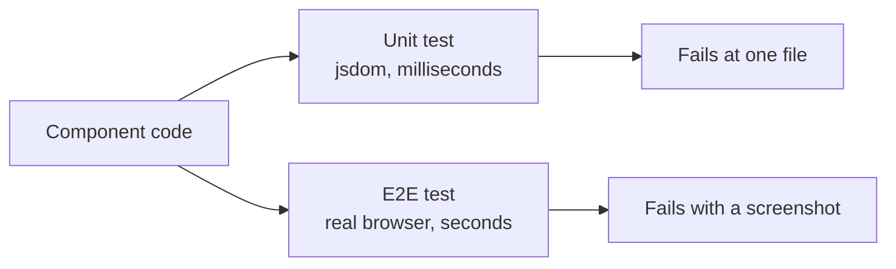

# Testing using Copilot

Two layers of tests answer two different questions. A unit test asks whether a component behaves correctly in isolation, runs in milliseconds against a simulated DOM, and fails with a stack trace that points at one file. An end-to-end test asks whether the same behavior survives a real browser, a real bundle, and a running backend, and it fails with a screenshot.

Copilot is useful at both layers, and for different reasons. Unit tests are where it generates volume: describe blocks, fixtures, and edge cases that nobody enjoys writing by hand. End-to-end tests are where it does translation, turning an existing unit test into the user-visible interaction that proves the same thing through the browser.

This topic generates both against the samples in `src/`, which ship with the plumbing already in place so the exercise is the tests rather than the configuration.



## The Samples

| Sample | What it provides |
|--------|------------------|
| [`src/angular/angular-devops`](../../../src/angular/angular-devops/) | Angular 22 on Vitest and jsdom, with Playwright configured against `http://localhost:4200`. Both layers are wired and both have a worked example. |
| [`src/react/react-devops`](../../../src/react/react-devops/) | React 19 on Vitest with Testing Library, and the same Playwright setup against a Vite preview on port 4173. |
| [`food-app`](./food-app/) | The polyglot catalog: four backends (C#, Java, Python, TypeScript) and two frontends. It ships without test suites on purpose, so generating them is the exercise. |

## Wiring the Angular CLI MCP Server

The Angular CLI ships an MCP server that gives the agent schematics, project metadata, and the current best-practice guidance instead of whatever it remembers about Angular. Add it to `.vscode/mcp.json` under the `servers` key, which is the shape VS Code expects:

```json
{
  "servers": {
    "angular-cli": {
      "command": "npx",
      "args": ["-y", "@angular/cli", "mcp"]
    }
  }
}
```

> Note: The CLI reads MCP servers from `~/.copilot/mcp-config.json`, written by `copilot mcp add`, not from a file in the repository. A server checked into `.vscode/mcp.json` is available in VS Code only.

## Creating a Testing Agent

A custom agent keeps the testing conventions out of every prompt. The repository already carries one at [`.github/agents/angular.agent.md`](../../../.github/agents/angular.agent.md) to start from.

1. Create `.github/agents/angular-specialist.agent.md`
2. Add the settings header: name, description, tools, MCP servers
3. Enable the [Angular CLI MCP](https://angular.dev/ai/mcp) for generation and analysis
4. Write the instructions: component tests, service tests, fixtures, accessibility checks
5. Invoke it in VS Code or on GitHub.com

## Generating Unit Tests

```prompt
Create comprehensive unit tests organized into describe blocks grouped by concern: initialization, state management, rendering, interactions, accessibility, and edge cases. Use TestBed for setup and async/await with fixture.whenStable() for zoneless change detection. Test both component logic and the resulting DOM updates.
```

The Angular sample runs zoneless, so a generated test needs `provideZonelessChangeDetection()` in its TestBed providers and `await fixture.whenStable()` after any interaction. Calling `fixture.detectChanges()` instead is the most common failure in generated Angular 22 tests:

```typescript
await TestBed.configureTestingModule({
  imports: [App],
  providers: [provideZonelessChangeDetection()]
});
const fixture = TestBed.createComponent(App);
await fixture.whenStable();
```

Run them:

```bash
cd src/angular/angular-devops
npm install
npm test
```

The React sample has a Vitest config and `src/App.test.tsx` but no `test` script, so it runs through the binary directly:

```bash
cd src/react/react-devops
npm install
npx vitest run
```

## Generating End-to-End Tests with Playwright

Playwright starts the application itself. The `webServer` block in `playwright.config.ts` runs the dev server, waits for the URL, and reuses an instance that is already up, so `npm run e2e` is the whole command on a cold machine:

```typescript
webServer: {
    command: 'npm start',
    url: 'http://localhost:4200',
    reuseExistingServer: true,
    timeout: 120_000,
},
```

The productive prompt here is a translation rather than a fresh generation, because the unit tests already state the behavior:

```prompt
Read src/app/app.spec.ts and write the Playwright equivalent in e2e/playwright/app.e2e.spec.ts.

For each unit test, express the same assertion through the browser:
- query by accessible role rather than by CSS selector
- click real elements instead of calling methods
- await the assertion instead of awaiting a fixture

Keep the test names identical to the unit tests so the two files can be read side by side.
```

The result asserts against what the user sees, not against a component instance:

```typescript
test('increments count on button click', async ({ page }) => {
    await page.goto('/');
    const button = page.getByRole('button', { name: 'Click Me!' });
    const paragraph = page.locator('p');

    await expect(paragraph).toContainText('Button clicked 0 times');
    await button.click();
    await expect(paragraph).toContainText('Button clicked 1 times');
});
```

Run them, then open the trace when one fails:

```bash
cd src/angular/angular-devops
npx playwright install chromium
npm run e2e
npm run e2e:report
```

The React sample uses `npm run test:e2e` for the same thing, against the Vite preview on port 4173.

> Note: The config records a trace on first retry, a screenshot on failure, and video on failure. With `retries: 0` a failing test produces the screenshot and video but no trace, so raise retries to 1 when you want the trace timeline.

## Keeping the Two Layers Honest

Mirroring is the point: when the unit test and the end-to-end test assert the same behavior in the same words, a divergence between them is a real signal. If the unit test passes and its mirror fails, the component is right and the wiring is wrong. That is the kind of defect neither layer catches alone.

The trap is that the mirror drifts. A heading renamed in the template gets fixed in the fast suite because it runs on every save, while the end-to-end spec keeps the old string until someone runs the slow suite. Point Copilot at both files together when you change a behavior, not at one of them.

## Links & Resources

- [Angular testing guide](https://angular.dev/guide/testing) - TestBed, component fixtures, and the zoneless async patterns the prompts rely on
- [Angular MCP server](https://angular.dev/ai/mcp) - the server the `mcp.json` entry starts and the tools it exposes to the agent
- [Playwright test configuration](https://playwright.dev/docs/test-configuration) - the `webServer`, trace, and retry settings shown above
- [Testing with GitHub Copilot](https://docs.github.com/en/copilot/tutorials/write-tests) - prompting patterns for generating and extending suites

[← Previous: CI/CD with GitHub Actions](../02-cicd/readme.md) | [Back to Agentic DevOps](../readme.md) | [Next: Using Copilot for Documentation →](../04-documentation/readme.md)
