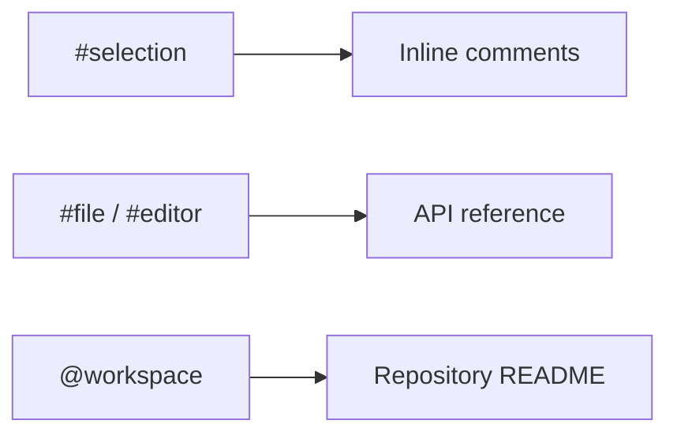

# Using Copilot for Documentation

Documentation goes stale because it lives somewhere the compiler never looks. A renamed endpoint breaks a build immediately and breaks its README silently, so the README keeps describing a system that no longer exists. Generating docs from the code itself closes that gap, but only if the agent is pointed at the right code.

That last condition is the whole topic. The same request produces a comment block, a reference page, or a repository overview depending on how much of the workspace the agent was given, so scoping the request is the skill being taught here, not the wording of the prompt.

Three artifacts come out of it, each at a different scope: inline documentation inside a file, API reference for a public surface, and a repository-level README that explains a project to someone who has never opened it.



## The Samples

Three undocumented projects, deliberately left without docs so generating them is the exercise.

| Project | What it is |
|---------|------------|
| [blob-console-spring](./blob-console-spring/) | Spring Boot 3.2 console application on Java 17 that drives Azure Blob Storage through `azure-storage-blob` 12.25. Gradle build, no README worth the name. |
| [food-ui](./food-ui/) | Angular 22 frontend for the food shop, served against a `db.json` mock. The target for component and service documentation. |
| [net-api](./net-api/) | ASP.NET Core catalog service on net8.0 with Dapr 1.12 sidecar components, App Configuration, and Key Vault. The richest surface, and the one where a generated API reference earns its place. |

## Scoping the Request

Copilot Chat takes context variables that decide what the agent reads before it answers. Getting this wrong is the usual reason a generated document is vague: an agent asked to document an API while holding only one open file will describe that file and invent the rest.

| Scope | Reads | Use it for |
|-------|-------|------------|
| `#selection` | The highlighted lines only | A single method, a regex, a block nobody can read |
| `#file:` | One named file | One class, one controller, one component |
| `#editor` | The files currently open | A public surface that spans a few files |
| `@workspace` | The whole repository, indexed | Architecture, onboarding, a repository README |

Start narrow and widen only when the answer is thin. A `@workspace` question costs more and returns a summary; a `#file:` question returns something specific enough to paste into a doc.

## Documenting Code in Place

The smallest useful artifact is documentation that ships inside the source file, where the next reader is already looking.

```prompt
@workspace #selection generate inline code documentation for the selected code
```

```prompt
Add documentation and code comments to my code
```

Run the second one against [`net-api/catalog-service/Controllers/FoodController.cs`](./net-api/catalog-service/Controllers/FoodController.cs) and the output is XML doc comments on each action, which Swagger then picks up. That is the payoff of this layer: the comment is not just for humans, it feeds the generated API surface further down.

## Generating an API Reference

This is the one that saves real time. Name both the controller and the model it returns, because an agent that sees only the controller will describe `CatalogItem` as an opaque type:

```prompt
Create an API documentation aligned to Swagger documentation for the APIs defined in #file:FoodController.cs use #file:CatalogItem.cs
```

The controller exposes five actions over `FoodDBContext`, so a correct answer names all five and gets their verbs right:

```text
GetFood      GET    /Food        returns all catalog items
GetById      GET    /Food/{id}   returns a single item
CreateFood   POST   /Food        adds an item
UpdateFood   PUT    /Food        updates an existing item
DeleteFood   DELETE /Food/{id}   removes an item
```

> Note: Check the verbs against the attributes in the file before you trust the output. A generated reference that transposes PUT and POST reads perfectly and is wrong in the one place a reader will rely on it.

## Writing the Repository README

At repository scope the request is no longer about code, it is about orientation: what this is, why it exists, and how to run it.

```prompt
@workspace generate a readme document that can be used as a repo description
```

```prompt
@workspace Explain this project
```

The first produces the artifact and the second produces the understanding, which is why they are separate prompts. Ask for the explanation when you inherit a codebase, and ask for the README when you already know what the project does and need it written down.

## Making the Conventions Stick

A one-off prompt produces a one-off document. The repository's own harness carries two mechanisms that make documentation repeatable, and both are worth reading as reference implementations.

Instructions files apply automatically to every request. [`.github/instructions/documentation.instructions.md`](../../../.github/instructions/documentation.instructions.md) currently holds frontmatter and nothing else, which is the exercise: fill the body with the conventions this repository actually enforces, the way [`dotnet.instructions.md`](../../../.github/instructions/dotnet.instructions.md) does for C#.

```markdown
---
name: Documentation Guidelines
description: General documentation instructions for the repository
---

Every code fence declares a language.

Internal links are relative paths; anchors are lowercase heading names.

No em dashes in prose; use a comma, colon, semicolon, or parentheses.
```

Prompt files cover the jobs you run repeatedly. This repository ships [`describe-module.prompt.md`](../../../.github/prompts/describe-module.prompt.md) for enriching a module readme and [`update-toc.prompt.md`](../../../.github/prompts/update-toc.prompt.md) for resynchronizing tables of contents against the filesystem, both invoked from the chat input as slash commands in VS Code.

> Note: VS Code reads prompt files from `.github/prompts/`; the Copilot CLI does not. Instructions files are read by both.

## Links & Resources

- [Chat with Copilot in your IDE](https://docs.github.com/en/copilot/how-tos/chat-with-copilot/chat-in-ide) - the chat participants and the `#file`, `#selection`, and `#editor` variables the prompts above use
- [Add repository custom instructions](https://docs.github.com/en/copilot/how-tos/configure-custom-instructions/add-repository-instructions) - the instructions file format and where Copilot looks for it
- [Copilot Chat cheat sheet](https://docs.github.com/en/copilot/reference/chat-cheat-sheet) - the full list of slash commands and participants
- [Include diagrams in Markdown with Mermaid](https://docs.github.com/en/get-started/writing-on-github/working-with-advanced-formatting/creating-diagrams) - how the diagrams a generated doc contains render on GitHub

[← Previous: Testing using Copilot](../03-testing/readme.md) | [Back to Agentic DevOps](../readme.md)
