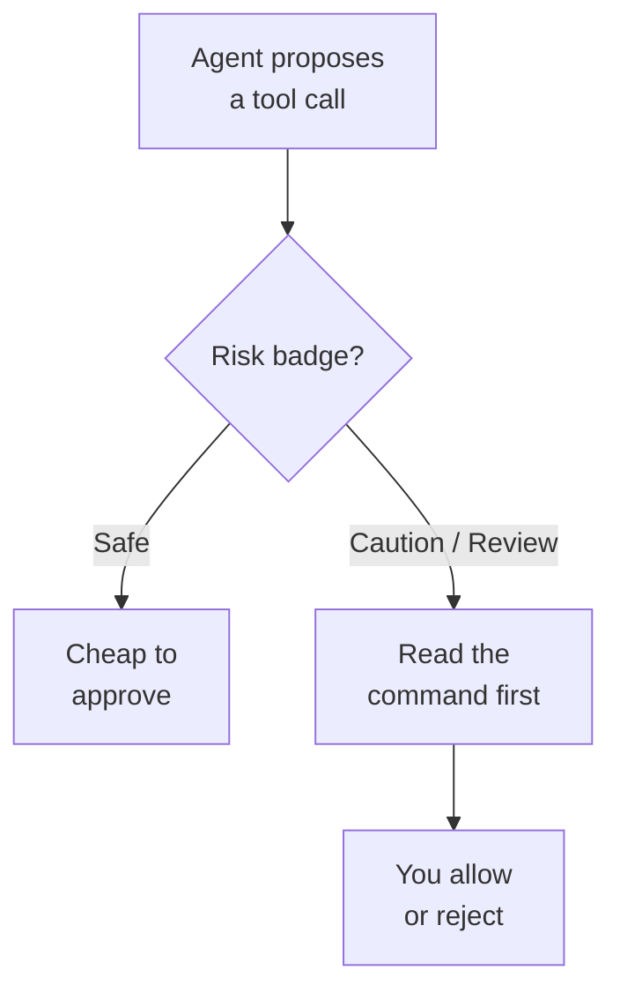

# Trust, Safety & the Permission Model

Auto-approval is not a slash command you remember to type; it is a permission level the agent respects on every action, so the safety posture is a setting you govern. A session starts at Default Permissions, which asks whenever the configured approval settings do not already cover a tool call. Two settings anchor the model: `chat.permissions.default` picks the level new local sessions start in, and the policy-controlled `chat.tools.global.autoApprove` decides whether unrestricted auto-approval is available to the user at all.

The permission level answers one question: when does the agent act on its own, and when does it stop and ask. Workspace trust is a separate and earlier gate, because an untrusted folder opens in Restricted Mode and the agent does nothing until you grant trust. Once the folder is trusted, the permissions picker in the chat input is where the level is chosen, and each session remembers the level it was used with. If enterprise policy disables auto approval, new sessions fall back to Default Permissions regardless of what the workspace default says.

## Permission levels

| Level | Value of `chat.permissions.default` | Behavior |
|-------|-------------------------------------|----------|
| Default Permissions | `default` | Uses the configured approval settings and asks when they do not apply; this is the shipped default |
| Assisted permissions | not selectable as a startup default | An LLM judge rates each tool call; tools it does not approve still need you |
| Bypass Approvals | `autoApprove` | Runs every tool call without asking and retries on errors |
| Autopilot (Preview) | `autopilot` | Auto-approves every tool call and keeps going until the task is done |

Assisted permissions appears in the picker only when `chat.assistedPermissions.enabled` is on, and that setting is experimental and off in stable builds. In the Agents window the level is also switchable mid-session with `/autopilot`, which sets permissions to autopilot mode, and `/yolo`, which sets permissions to bypass approvals.

## Governing settings

| Setting or policy | Purpose |
|-------------------|---------|
| `chat.permissions.default` | Level new local chat sessions start in; default `default` |
| `chat.assistedPermissions.enabled` | Shows the Assisted permissions option in the approval picker |
| `chat.tools.global.autoApprove` | Off by default; the product calls it YOLO mode and never recommends it |
| `ChatToolsAutoApprove` | The enterprise policy behind that setting, delivered through managed settings |
| `permissions.disableBypassPermissionsMode` | The managed-settings key that removes the ability to bypass approvals |

> Note: `chat.tools.global.autoApprove` is a workspace-independent kill switch for manual approval. Its own setting description calls it extremely dangerous and advises against it even inside Codespaces and Dev Containers, because forwarded user keys stay reachable from the container.

## Risk badges and how a command is judged

Before a tool confirmation is shown, a small model rates the action and attaches a risk badge with a short explanation, so a human and the auto-approval logic share the same read on danger. `chat.tools.riskAssessment.enabled` controls this and is on by default, and `chat.tools.riskAssessment.model` picks the rating model, defaulting to `copilot-utility-small`. A Safe badge is the cheap case to wave through, while Caution and Review carefully are the ones to read before you allow them.

| Risk badge | Meaning |
|------------|---------|
| Safe | Low-impact, reversible action |
| Caution | Potentially impactful; read before approving |
| Review carefully | High-impact or hard to undo |

## Assisted permissions

A risk badge rates a command in isolation. Assisted permissions adds a judge that evaluates each tool call in its actual context and auto-approves the ones it is confident about, which cuts approval interruptions during a long agent task. Tools the judge does not approve still stop and wait for you, so it narrows the prompts rather than removing them.

Judge it the way you judge Bypass Approvals rather than as a pure convenience. It widens what runs unattended, so turn it on deliberately and review what it let through before you roll it out across a team.

## Sandboxing and sensitive-prompt interception

Terminal sandboxing narrows what an approved command can reach by running it under a filesystem policy with outbound network blocked. It is off by default on every platform and is configured per platform: `chat.agent.sandbox.enabled` covers macOS and Linux, and `chat.agent.sandbox.enabledWindows` covers Windows. Two companion settings matter as much as the switch itself, because `chat.agent.sandbox.allowNetwork` defaults to `true` and relaxes all network restrictions, and `chat.agent.sandbox.allowUnsandboxedCommands` defaults to `true` and lets commands run outside the sandbox. Allow and deny paths live in `chat.agent.sandbox.fileSystem.mac`, `chat.agent.sandbox.fileSystem.linux`, and `chat.agent.sandbox.fileSystem.windows`.

Agent Host sessions that use the Copilot SDK's built-in shell tool are sandboxed by a second pair, `chat.agentHost.sdkSandbox.enabled` and `chat.agentHost.sdkSandbox.enabledWindows`, and those apply only while `chat.agentHost.customTerminalTool.enabled` is `false`. The permissions picker also carries a per-session Sandboxing for terminal toggle, shown when `chat.experimental.permissionsSandboxToggle.enabled` is on.

Sensitive-prompt interception is the second guard. When a terminal command prompts for a password or another secret, the agent cancels it rather than letting auto-approval or autopilot answer, and tells you to run it interactively instead.

> Note: Read the sandbox as three settings, not one. Turning `chat.agent.sandbox.enabled` to `on` while leaving `allowNetwork` and `allowUnsandboxedCommands` at their defaults gives you filesystem confinement and nothing else.

## Demo

Set and observe the permission model in a trusted workspace.

1. In VS Code, open a fresh copy of a repo. Confirm it opens in Restricted Mode and grant workspace trust when prompted.
2. Open Settings (`Ctrl+,`), search for `chat.permissions.default`, and confirm it reads Default Permissions.
3. Start an agent session and ask it to run a read-only command such as listing files. Note the Safe badge on the confirmation.
4. Ask the agent to run a state-changing command such as deleting a file. Confirm the badge moves to Caution or Review carefully.
5. Open the permissions picker in the chat input and switch the session to Autopilot (Preview). Repeat steps 3 and 4 and note which approvals disappeared.
6. Search settings for `chat.tools.global.autoApprove`, read its description in full, and leave it off.
7. Set `chat.agent.sandbox.enabledWindows` to `on`, then inspect `chat.agent.sandbox.allowNetwork` and `chat.agent.sandbox.allowUnsandboxedCommands` and decide whether your threat model tolerates their defaults.
8. Ask the agent to run a command that prompts for a password, and confirm it cancels the command instead of answering the prompt.

## Links & Resources

- [Secure AI-assisted development in VS Code](https://code.visualstudio.com/docs/copilot/security) - trust boundaries, tool approvals, sandboxing, and the enterprise policy surface
- [Use agent mode in VS Code](https://code.visualstudio.com/docs/copilot/chat/chat-agent-mode) - how tool confirmations, auto-approval, and the permissions picker behave in a session
- [AI settings reference](https://code.visualstudio.com/docs/copilot/reference/copilot-settings) - the authoritative list of `chat.*` settings and their defaults
- [Manage policies for Copilot in your organization](https://docs.github.com/en/copilot/how-tos/administer-copilot/manage-for-organization/manage-policies) - the org-level switches that gate what a user may enable

[← Back to Governance](../readme.md) | [Next: Cost, AI Credits & Bring Your Own Key →](../02-cost-byok/readme.md)
