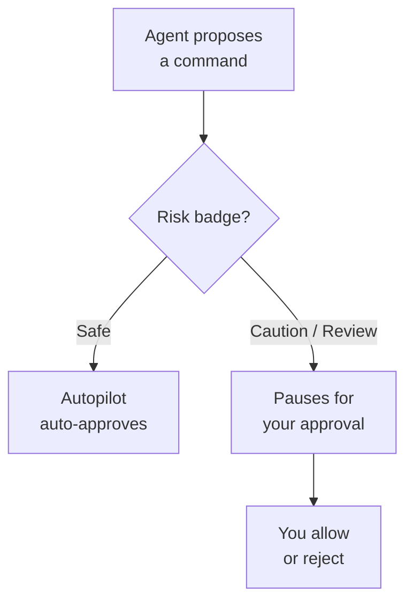

# Trust, Safety & the Permission Model

Auto-approval used to be something you triggered with a slash command. It is now a permission level that the agent respects on every action, which makes the safety posture a setting you govern rather than a habit each user remembers. Autopilot has been the default level since VS Code 1.124, so labs in this course assume the agent already runs most safe actions without prompting. Two settings anchor the model: `chat.permissions.default` picks the level for a workspace, and the org-controlled `chat.tools.global.autoApprove` decides whether that autonomy is even available to the user.

The permission level answers one question: when does the agent act on its own, and when does it stop and ask. Restricted Mode is the default for any newly opened folder, so an untrusted checkout starts locked down until you grant trust. Once trusted, Autopilot runs actions the model rates as safe and pauses on the rest, while Advanced Autopilot is the escalated tier for teams that want broader hands-off execution. Claude Auto mode maps the same idea onto the Claude harness, and the `allowDangerouslySkipPermissions` escape hatch exists but should be treated as a break-glass option, not a daily setting.

## Permission levels

| Level | Purpose |
|-------|---------|
| Restricted Mode | Default for a newly opened, untrusted folder; the agent acts only after you grant workspace trust |
| Autopilot | Default since 1.124; auto-approves actions rated Safe and pauses on riskier ones |
| Advanced Autopilot | Escalated tier for broader hands-off execution when the team accepts the added autonomy |
| Claude Auto mode | The equivalent auto-approval behavior when the Claude harness is selected |

## Governing settings

| Setting | Purpose |
|---------|---------|
| `chat.permissions.default` | Sets the default permission level for the workspace |
| `chat.tools.global.autoApprove` | Org-controlled switch that decides whether auto-approval is available at all |
| `disableBypassPermissionsMode` | Policy that removes the ability to bypass the permission model |
| `allowDangerouslySkipPermissions` | Break-glass flag that skips approval prompts; keep off outside deliberate, supervised runs |

## Risk badges and how a command is judged

Before the agent runs a terminal command, it attaches an AI risk badge so a human and the Autopilot logic share the same read on danger. A Safe badge means Autopilot can proceed, while Caution and Review carefully force a pause so you approve deliberately. The badges are the bridge between the abstract permission level and the concrete command in front of you.

| Risk badge | Meaning |
|------------|---------|
| Safe | Low-impact, reversible action; Autopilot may run it without prompting |
| Caution | Potentially impactful; the agent pauses for your approval |
| Review carefully | High-impact or hard to undo; read the command before you allow it |

## Sandboxing and sensitive-prompt interception

Terminal sandboxing narrows what an approved command can reach: on macOS and Linux it blocks network access and restricts the filesystem, so a command that slips through still cannot exfiltrate data or touch paths outside the workspace. Sensitive-prompt interception is the second guard: when a command would surface a password or a verification code, the agent keeps that value out of the chat context instead of logging it into the transcript. For organizations that need a hard floor, `disableBypassPermissionsMode` removes the option to bypass the model, so no user can quietly opt out of the guardrails.

> Note: Terminal sandboxing enforces network and filesystem limits on macOS and Linux. On Windows, lean on the permission level and risk badges as the primary controls for terminal actions.

## Exercise

Set and observe the permission model in a trusted workspace.

1. In VS Code, open a fresh copy of a repo. Confirm it starts in Restricted Mode and grant workspace trust when prompted.
2. Open Settings (`Ctrl+,`), search for `chat.permissions.default`, and confirm it is set to Autopilot.
3. Start an agent session and ask it to run a read-only command such as listing files. Watch it proceed under the Safe badge without a prompt.
4. Ask the agent to run a state-changing command such as deleting a file. Confirm it pauses with a Caution or Review carefully badge and waits for your approval.
5. Search settings for `chat.tools.global.autoApprove` and read its scope. Note that when an admin disables it, the Autopilot level is unavailable regardless of the workspace default.
6. Leave `allowDangerouslySkipPermissions` off and confirm you understand it as a break-glass flag, not a convenience setting.

## Links & Resources

- [VS Code 1.124 release notes](https://code.visualstudio.com/updates/v1_124) - Autopilot as the default permission level and the permission model settings
- [VS Code 1.126 release notes](https://code.visualstudio.com/updates/v1_126) - risk badges, terminal sandboxing, and sensitive-prompt interception
- [GitHub Copilot documentation](https://docs.github.com/en/copilot) - full product documentation for agent behavior and organization policy
