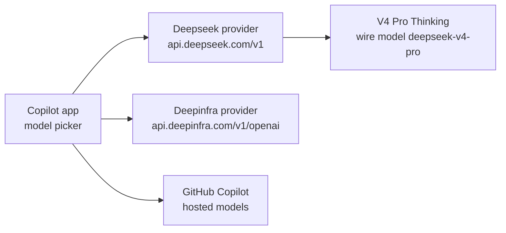

# Bring Your Own Key in the GitHub Copilot App

The GitHub Copilot app treats your own model endpoints as first-class providers. Each provider you add sits in the model picker beside the Copilot-hosted models, and its tokens are billed by that provider instead of drawing on AI credits. The app needs no Copilot plan for a BYOK model, and it shares no configuration with the VS Code extension or the CLI variables. The setup below is taken from a working machine: DeepSeek for its own models and DeepInfra for hosted open models.

## How a provider is defined

A provider is a name, a base URL, an API key, and the wire API the endpoint speaks. Models are registered under the provider, each with the model id the endpoint expects, a display name for the picker, and the prompt and output token limits. The app keeps the key out of its settings files, so the definition below is safe to share while the key is not.

| Field | DeepSeek | DeepInfra |
|-------|----------|-----------|
| Name | `Deepseek` | `Deepinfra` |
| Base URL | `https://api.deepseek.com/v1` | `https://api.deepinfra.com/v1/openai` |
| Authentication | API key | API key |
| Wire API | Chat Completions | Chat Completions |
| Headers | none | none |

## Models on each provider

| Provider | Model id | Display name | Max prompt tokens | Max output tokens |
|----------|----------|--------------|-------------------|-------------------|
| Deepseek | `deepseek-v4-flash` | DeepSeek V4 Flash | 1000000 | 32768 |
| Deepseek | `deepseek-v4-pro` | DeepSeek V4 Pro | 1000000 | 8192 |
| Deepseek | `deepseek-v4-pro-thinking` | DeepSeek V4 Pro (Thinking) | 1000000 | 32768 |
| Deepinfra | `deepseek-ai/DeepSeek-V4.1-Flash` | DeepSeek V4.1 Flash | 1000000 | 32768 |
| Deepinfra | `moonshotai/Kimi-K3` | Kimi K3 | 262144 | 32768 |
| Deepinfra | `Qwen/Qwen3.6-35B-A3B` | Qwen3.6 35B A3B | 131072 | 8192 |

The thinking entry shows the one advanced field worth knowing. Its model id `deepseek-v4-pro-thinking` exists only in the app, and its **wire model** is set to `deepseek-v4-pro`, so the request goes to the real model while the picker lists a second entry with a larger output budget. That is how two variants of one model sit side by side.

> Note: The DeepSeek base URL here is the OpenAI-compatible `/v1` path, while the Copilot CLI guide uses DeepSeek's `/anthropic` path. Each surface calls the endpoint its own way, so copy the values for the surface you configure.

## Demo

Register two providers and route a session to a cheap model.

1. In the GitHub Copilot app, open Settings, then **Model providers**, then **Add provider**.
2. Add the DeepSeek provider from the first table: name, base URL `https://api.deepseek.com/v1`, your API key, and Chat Completions as the wire API.
3. Add `deepseek-v4-flash` and `deepseek-v4-pro` with the token limits from the second table.
4. Add `deepseek-v4-pro-thinking` with the wire model `deepseek-v4-pro`, and confirm both Pro entries appear in the picker.
5. Add the DeepInfra provider with base URL `https://api.deepinfra.com/v1/openai`, then add `deepseek-ai/DeepSeek-V4.1-Flash` and `Qwen/Qwen3.6-35B-A3B`.
6. Start a session on DeepSeek V4.1 Flash and ask it to explain one file in a repository.
7. Open the Copilot status menu and confirm the credits used did not move for that session.

## Links & Resources

- [Using your own LLM models in the GitHub Copilot app](https://docs.github.com/en/copilot/how-tos/github-copilot-app/use-byok-models) - the Model providers settings and supported provider types
- [About bring your own key](https://docs.github.com/en/copilot/concepts/models/bring-your-own-key) - local versus enterprise BYOK and how each is billed
- [DeepSeek API documentation](https://api-docs.deepseek.com/) - base URLs, model ids, and pricing for the DeepSeek endpoint
- [DeepInfra documentation](https://deepinfra.com/docs) - the OpenAI-compatible endpoint and the catalog of hosted open models
