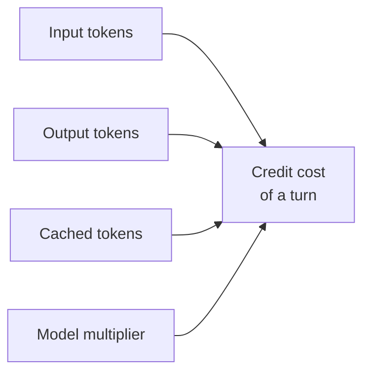

# Cost Model & AI Credits

GitHub Copilot has moved to usage-based billing, so every interaction draws down AI credits rather than sitting inside a flat monthly allowance. The credit cost of a turn is a function of four things: the input tokens you send, the output tokens the model returns, the cached tokens it can reuse, and the model you picked. The first three grow with the size of your context and the length of the answer, which is why a tight prompt against a focused workspace is cheaper than a sprawling one. The fourth, model choice, is now the largest lever an architect controls, because a premium model can cost several times what a lighter model costs for the same task.

The tooling makes cost visible at the exact moment you make a decision. The model picker now shows cost next to each model, so choosing a model is a budget decision at the point of choice, not a surprise on the invoice. The session dashboard surfaces session-level cost and an additional-spend percentage as work proceeds, and per-subagent credit cost appears on hover so a fan-out of subagents does not hide where the credits went. Read this topic alongside the [Models topic in Fundamentals](../../01-fundamentals/02-models/), where model capabilities and context sizes are covered in depth.

## What consumes credits

| Cost driver | What it is |
|-------------|------------|
| Input tokens | The prompt and context you send to the model |
| Output tokens | The tokens the model generates in its response |
| Cached tokens | Reused context that bills at a reduced rate |
| Model choice | The per-model multiplier; a premium model costs more per token |

## Where cost surfaces

| Surface | What it shows |
|---------|---------------|
| Model picker | Cost shown next to each model at the moment of selection |
| Session dashboard | Session-level cost and the additional-spend percentage as work runs |
| Subagent hover | Per-subagent credit cost, so a delegated fan-out stays attributable |

## Model choice as a budget decision

Because cost scales with the model multiplier, the cheapest way to control spend is to match the model to the task rather than reaching for the strongest model by reflex. A routine refactor, a doc pass, or a read-only research query rarely needs a premium model, while a hard architecture problem may justify one. Making that call once, at the model picker, is far cheaper than discovering the pattern later in the session dashboard. When you delegate to subagents, the per-subagent hover lets you see whether a specialist is doing cheap or expensive work before you scale the pattern up.

## Exercise

Compare model cost and track spend inside one session.

1. In VS Code, open the model picker in Copilot Chat and read the cost shown next to two or three models. Note the relative difference between a lighter model and a premium one.
2. Pick a lighter model and ask the agent to complete a small, well-scoped task such as documenting one function.
3. Open the session dashboard and read the session-level cost and the additional-spend percentage the turn produced.
4. Repeat the same task in a new session with a premium model. Compare the two dashboard readings to see the multiplier in practice.
5. Delegate a follow-up to a subagent and hover over it to read its per-subagent credit cost. Confirm the delegated work is attributed separately.
6. Decide which model you would set as the team default for routine work, and record the reasoning as a cost policy.

## Links & Resources

- [VS Code 1.124 release notes](https://code.visualstudio.com/updates/v1_124) - cost shown in the model picker and session-level cost reporting
- [GitHub Copilot documentation](https://docs.github.com/en/copilot) - billing, AI credits, and usage-based pricing reference
- [Models in Fundamentals](../../01-fundamentals/02-models/) - model capabilities, context sizes, and how they pair with cost
