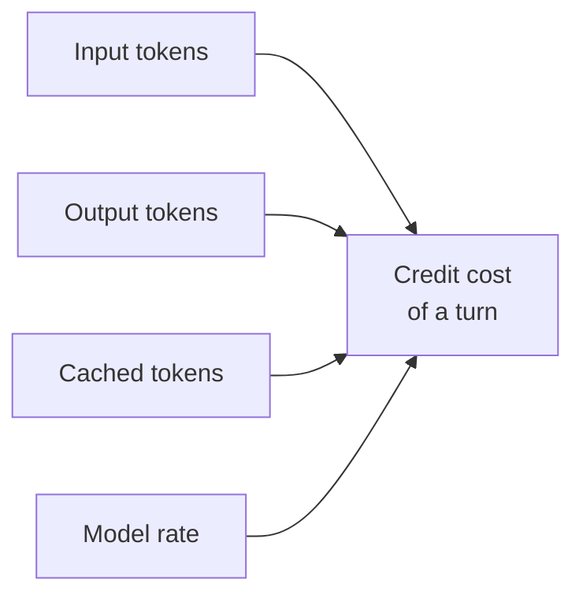

# Cost Model & AI Credits

GitHub Copilot bills usage as AI credits, so every interaction draws down a credit balance rather than sitting inside a flat monthly allowance. The credit cost of a turn is a function of four things: the input tokens you send, the output tokens the model returns, the cached tokens it can reuse, and the model you picked. The first three grow with the size of your context and the length of the answer, which is why a tight prompt against a focused workspace is cheaper than a sprawling one. The fourth, model choice, is the largest lever an architect controls, because a premium model can cost several times what a lighter model costs for the same task.

The tooling makes cost visible at the moment you make a decision. The model picker lists a per-model Cost (Credits per 1M Tokens) block broken out into input, output, cache read, and cache write, so choosing a model is a budget decision at the point of choice. Read this topic alongside the [Models topic in Fundamentals](../../01-fundamentals/02-models/), where model capabilities and context sizes are covered in depth.

Three readouts close the loop while and after the work runs. Session Info shows the running Session Cost next to a context-window breakdown, the Response details hover on a chat response shows that turn's model with its input, cached input, and output token counts, and the Copilot status menu shows credits used against your allowance for the billing cycle. Subagent credit cost is the one number that is off until you ask for it, because `chat.subagents.showCreditUsage` defaults to `false`.

## What consumes credits

| Cost driver | What it is |
|-------------|------------|
| Input tokens | The prompt and context you send to the model |
| Output tokens | The tokens the model generates in its response |
| Cache read tokens | Reused context, billed at the model's cache-read rate |
| Cache write tokens | Context written into the cache for the next request |
| Model choice | The per-model rate; a premium model costs more per token |

## Where cost surfaces

| Surface | What it shows |
|---------|---------------|
| Model picker | Cost (Credits per 1M Tokens) per model: input, output, cache read, cache write |
| Session Info | Session Cost and the context-window breakdown for the running session |
| Response details hover | Model, input tokens, cached input tokens, and output tokens for one response |
| Copilot status menu | Credits used against the allowance for the current billing cycle |
| Subagent duration label | Per-subagent credit usage, once `chat.subagents.showCreditUsage` is `true` |

## Model choice as a budget decision

Because cost scales with the model's per-token rate, the cheapest way to control spend is to match the model to the task rather than reaching for the strongest model by reflex. A routine refactor, a doc pass, or a read-only research query rarely needs a premium model, while a hard architecture problem may justify one. Making that call once, at the model picker, is far cheaper than discovering the pattern later in Session Info. When you delegate to subagents, turn on `chat.subagents.showCreditUsage` first, so a fan-out of specialists stays attributable instead of disappearing into the session total.

> Note: Caching is the driver you can influence without changing models. A stable prefix, meaning the same instructions and the same early context reused turn after turn, keeps cache reads high; reordering or rewriting earlier turns invalidates the cache and pushes those tokens back to full input rate.

## Demo

Compare model cost and track spend inside one session.

1. In VS Code, open the model picker in Copilot Chat and read the Cost (Credits per 1M Tokens) block for two or three models. Note the gap between a lighter model and a premium one.
2. Pick a lighter model and ask the agent to complete a small, well-scoped task such as documenting one function.
3. Open Session Info and read the Session Cost and the context-window breakdown the turn produced.
4. Repeat the same task in a new session with a premium model. Compare the two Session Cost readings to see the rate difference in practice.
5. Set `chat.subagents.showCreditUsage` to `true`, delegate a follow-up to a subagent, and read the credit usage now shown next to its duration.
6. Hover a response and open Response details. Compare a first turn against a follow-up in the same session to see cached input tokens take effect.
7. Open the Copilot status menu and read credits used for the current billing cycle.
8. Decide which model you would set as the team default for routine work, and record the reasoning as a cost policy.

## Links & Resources

- [GitHub Copilot billing and usage](https://docs.github.com/en/copilot/concepts/billing) - how Copilot usage is metered and billed across plans
- [Manage and monitor spending for GitHub Copilot](https://docs.github.com/en/copilot/how-tos/manage-and-track-spending) - budgets, spending limits, and usage reports for admins
- [AI language models in VS Code](https://code.visualstudio.com/docs/copilot/customization/language-models) - the model picker, auto model selection, and per-model configuration
- [AI settings reference](https://code.visualstudio.com/docs/copilot/reference/copilot-settings) - the `chat.*` settings named above, including `chat.subagents.showCreditUsage`

[← Previous: Trust, Safety & the Permission Model](../01-permissions/readme.md) | [Back to Governance](../readme.md) | [Next: Enterprise Policy & Managed Settings →](../03-enterprise-policy/readme.md)
