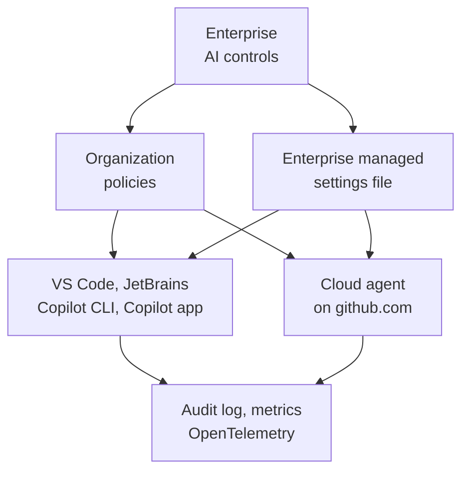
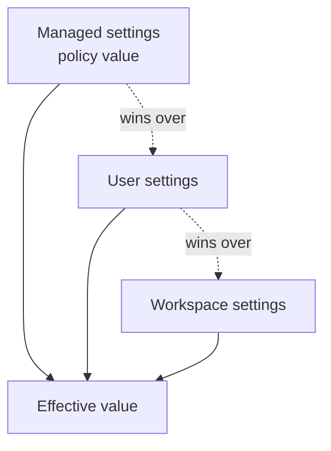

# Enterprise Control of the Harness

Every earlier module built a harness for one developer or one repository: instructions, skills, agents, MCP servers, permissions, and a model choice. At the scale of an engineering organization, that harness has to be the same everywhere, set from one place, and impossible to switch off quietly. Copilot Business and Copilot Enterprise add that layer. This topic looks at it from an architect's seat: which parts of the harness the organization can control centrally, and what that control buys the delivery process.

## Business and Enterprise at a glance

Both plans put Copilot under the organization's control rather than the individual's. Business costs $19 per user per month with 1,900 AI credits per user, and Enterprise costs $39 with 3,900 credits, requires GitHub Enterprise Cloud, and gets earlier access to new models and features. The governance controls below are documented for Business and Enterprise alike, so the plan decision is mostly about credits and access to new features, not about control. An enterprise can pick the plan per organization.

## One control plane for the whole harness

An enterprise owner manages the harness under **Enterprise settings**, then **AI controls**, which groups agents, Copilot features and clients, and MCP in one workspace. A dedicated AI manager role can own that workspace without full enterprise owner rights. Each policy is set to enabled, disabled, or delegated to the organizations, and it applies wherever a user signs in to Copilot: the IDEs, github.com, the CLI, and the Copilot app.



## What the organization controls

| Harness layer | Central control | What it gives the process |
|---------------|-----------------|---------------------------|
| Models | Per-model policies, default enablement of new models, enterprise bring your own key | One approved model catalogue; open-weight models and models without a data-retention agreement stay off until someone decides |
| Agents | Cloud agent and third-party agent policies, enterprise custom agents in `.github-private`, organization custom instructions | Shared specialist agents and house rules every repository inherits instead of copying |
| Plugins and skills | Enterprise-managed plugins that bundle agents, skills, hooks, and MCP configuration (public preview) | A golden-path toolkit installed for every member |
| MCP | The MCP servers policy plus allow and deny lists in managed settings | Only vetted tool servers reach company code |
| Permissions | Enterprise-managed deny, ask, and allow rules for shell, file, and network operations, and removal of bypass mode | Guardrails that user and workspace settings cannot weaken |
| Network | Cloud agent firewall with a recommended allowlist, set per organization | Agents running in Actions reach registries, not the whole internet |
| Context | Content exclusion at repository, organization, and enterprise level | Secrets and regulated files never become prompt context |
| Cost | AI credits pooled across the enterprise, budgets per user, cost center, organization, and enterprise | Spend is attributable and capped before it surprises anyone |
| Identity | License assignment through organizations or IdP-synced enterprise teams with Enterprise Managed Users | Access follows the joiner, mover, and leaver process of the identity provider |
| Visibility | Agentic audit log events, usage metrics dashboards and API, a mandated OpenTelemetry endpoint | Evidence of what agents did, and adoption numbers to steer by |
| Data | No training on Business or Enterprise data, and a Data Protection Agreement | A contractual basis the privacy review can sign off |

## Why it matters to the architect

Central control turns the harness from a personal setup into part of the platform. The same agents, skills, and instructions reach every team, so a better review agent or a new security skill ships once and applies everywhere. Guardrails move from code review to policy: a denied command or an unlisted MCP server is blocked before it runs rather than caught afterwards. The audit log and metrics close the loop, giving the evidence that compliance asks for and the adoption and cost numbers that decide where to invest next.

## Managed settings: one file, every client

The enterprise managed settings file is the most direct form of that control. It lives at `copilot/managed-settings.json` in the `.github-private` repository of a designated organization, and the CLI, VS Code, the Copilot app, JetBrains, and the cloud agent pick up changes within about an hour. It carries permissions, the default model, plugins and marketplaces, MCP allow and deny lists, sandboxing, and the telemetry block. A managed value wins over user and workspace settings when the effective value is resolved.



The same file format also has device-level channels, for fleets that manage machines rather than GitHub organizations. A device-management platform writes the native MDM channel, and a provisioning tool drops the file at a per-OS path.

| Channel | Location |
|---------|----------|
| Enterprise (server) | `copilot/managed-settings.json` in the designated organization's `.github-private` repository |
| Native MDM, Windows | Registry key `HKLM\SOFTWARE\Policies\GitHubCopilot` |
| Native MDM, macOS | Preferences domain `com.github.copilot` |
| File, Windows | `%ProgramFiles%\GitHubCopilot\managed-settings.json` |
| File, macOS | `/Library/Application Support/GitHubCopilot/managed-settings.json` |
| File, Linux | `/etc/github-copilot/managed-settings.json` |

## Topics

| Topic | Description |
|-------|-------------|
| [Observability with OpenTelemetry](./01-observability/) | GenAI-semantic-convention span trees, the local trace database, and a mandated OTLP endpoint. |

## Demo

Map the harness to central controls, then feel one of them from the developer's side.

1. List the harness pieces your teams use today: models, custom agents, skills, MCP servers, permission modes, and plugins.
2. For each piece, pick its central control from the table above and decide: enforce, delegate to organizations, or leave to the developer.
3. Open [managed-settings.json](managed-settings.json) in this folder. It allow-lists two plugins, restricts installs to one internal marketplace, and removes bypass mode.
4. Apply it on one Windows machine from an elevated PowerShell in this folder. At enterprise scale the same content goes into `copilot/managed-settings.json` in `.github-private` instead.

   ```powershell
   New-Item -ItemType Directory -Force "$env:ProgramFiles\GitHubCopilot" | Out-Null
   Copy-Item .\managed-settings.json "$env:ProgramFiles\GitHubCopilot\managed-settings.json"
   ```

5. Restart VS Code, open the permissions picker, and confirm Bypass Approvals is gone.
6. Try to install a plugin from a marketplace outside the allow-list and confirm it is blocked.
7. Delete the copied file to lift the policy, and record which channel your organization will use at scale.

## Links & Resources

- [Plans for GitHub Copilot](https://docs.github.com/en/copilot/get-started/plans) - Business and Enterprise pricing, included AI credits, and feature access
- [Enterprise management of agents](https://docs.github.com/en/copilot/concepts/agents/enterprise-management) - AI controls, the agent control plane, and the AI manager role
- [Get started with enterprise managed settings](https://docs.github.com/en/copilot/how-tos/administer-copilot/manage-for-enterprise/use-managed-settings/get-started) - the `.github-private` file and the clients that honour it
- [Enterprise managed settings reference](https://docs.github.com/en/enterprise-cloud@latest/copilot/reference/enterprise-administrators/enterprise-managed-settings) - every supported property

[← Previous: Cost, AI Credits & Bring Your Own Key](../02-cost-byok/readme.md) | [Back to Governance](../readme.md) | [Next: EU AI Act, GDPR & Accessibility Compliance →](../04-compliance/readme.md)
