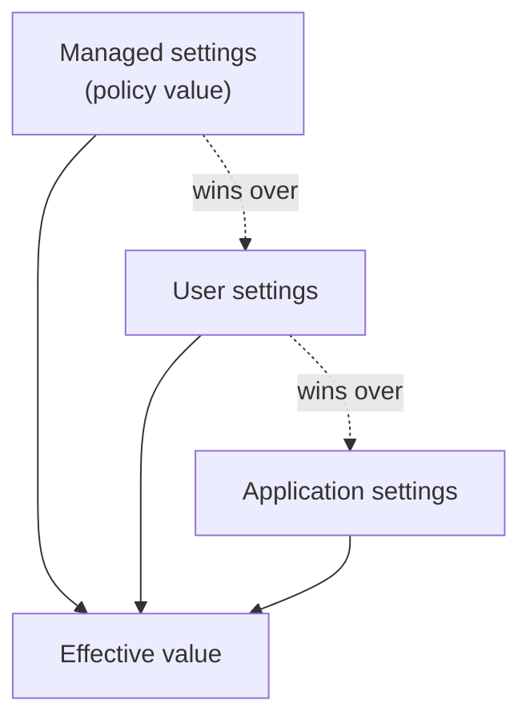

# Enterprise Policy & Managed Settings


Once agents run across a whole engineering org, per-user settings stop being enough; the posture has to be delivered from above and be hard to override. Copilot reads managed settings from three channels, and the Copilot diagnostics output names which one is active: Server (the GitHub Server API), Native MDM, and File (`managed-settings.json`). A device-management platform uses the native channel, while teams that provision machines with configuration files drop the JSON file at the well-known per-OS path.

Managed values arrive as policy values, and a policy value wins over user and application settings when the effective value is resolved. That precedence is the entire point: a value an admin sets cannot be edited away by an individual developer. Plugin governance, MCP allow-listing, network access, and telemetry are the four surfaces most teams lock down first, because they define what third-party code the agent can load, where it may reach, and what you can see afterwards.



## Where the managed settings live

| Channel | Location |
|---------|----------|
| Native MDM, Windows | Registry key `HKLM\SOFTWARE\Policies\GitHubCopilot` |
| Native MDM, macOS | Preferences domain `com.github.copilot` |
| File, Windows | `%ProgramFiles%\GitHubCopilot\managed-settings.json` |
| File, macOS | `/Library/Application Support/GitHubCopilot/managed-settings.json` |
| File, Linux | `/etc/github-copilot/managed-settings.json` |

The file is ordinary nested JSON. Nested objects are flattened to dotted keys internally, so `{"telemetry": {"endpoint": "..."}}` and a literal `"telemetry.endpoint"` key mean the same thing.

## Plugin governance

Plugins extend the agent, so an org needs to say which plugins are allowed and which marketplaces they may come from. Three VS Code settings carry that policy, and each has a matching key in `managed-settings.json`. Note the shapes: the enabled list is an object keyed by `<plugin>@<marketplace>`, the extra marketplaces are an object keyed by marketplace name, and the strict allow-list is an array of source objects.

| Setting | Managed-settings key | Shape |
|---------|----------------------|-------|
| `chat.plugins.enabledPlugins` | `enabledPlugins` | Object mapping `<plugin>@<marketplace>` to `true` or `false` |
| `chat.plugins.extraMarketplaces` | `extraKnownMarketplaces` | Object mapping a marketplace name to a `source` descriptor |
| `chat.plugins.strictMarketplaces` | `strictKnownMarketplaces` | Array of `{ "source": ... }` entries; an empty array blocks every marketplace |
| `chat.plugins.enabled` | delivered as the `ChatPluginsEnabled` policy | Boolean master switch for plugin integration |

> Note: A strict allow-list does not retroactively disable plugins that are already installed. It gates new installs, so pair it with `enabledPlugins` if you need to switch off something already on the machine.

## Network, browser, and agent policies

Some controls are policy-only: they are delivered through MDM or the server channel and have no `managed-settings.json` key. Network reach is one. `chat.agent.networkFilter` is off by default and, when the `ChatAgentNetworkFilter` policy turns it on, restricts agent network access to what `chat.agent.allowedNetworkDomains` and `chat.agent.deniedNetworkDomains` permit. Browser tooling is the other: `workbench.browser.enableChatTools` is on by default and is governed centrally by the `BrowserChatTools` policy.

There is no single switch that turns the agent host off. Availability is governed per agent instead, so `chat.agentHost.claudeAgent.enabled` (policy `Claude3PIntegration`, on by default) and `chat.agentHost.codexAgent.enabled` (policy `Codex3PIntegration`, off in stable builds) are the levers, alongside the permission and plugin policies from the previous topics.

| Policy | Governs |
|--------|---------|
| `ChatAgentNetworkFilter` | Whether domain allow and deny lists constrain agent network access |
| `BrowserChatTools` | Availability of the built-in browser tools in chat |
| `Claude3PIntegration` | Whether Claude Agent sessions may run in the Agents window |
| `Codex3PIntegration` | Whether the Codex provider is registered with the agent host |
| `ChatToolsAutoApprove` | Whether unrestricted auto-approval is available at all |

## Demo

Draft a managed policy that survives a user's attempt to override it.

1. Create `managed-settings.json` at the path for your OS from the table above. On Windows that is `%ProgramFiles%\GitHubCopilot\managed-settings.json`, which needs an elevated editor.
2. Allow-list two plugins, declare the internal marketplace they come from, restrict installs to it, and remove the ability to bypass approvals.

   ```json
   {
     "enabledPlugins": {
       "team-lint@internal": true,
       "team-security@internal": true
     },
     "extraKnownMarketplaces": {
       "internal": {
         "source": { "source": "github", "repo": "acme/copilot-plugins" }
       }
     },
     "strictKnownMarketplaces": [
       { "source": "github", "repo": "acme/copilot-plugins" }
     ],
     "permissions": {
       "disableBypassPermissionsMode": true
     }
   }
   ```

   The policy ships in this folder as [managed-settings.json](managed-settings.json). Nothing reads it here: Copilot only honours the file at the per-OS path, and that path sits in a machine-wide folder only an administrator can write. To apply it on Windows, copy it from an elevated PowerShell in this folder:

   ```powershell
   New-Item -ItemType Directory -Force "$env:ProgramFiles\GitHubCopilot" | Out-Null
   Copy-Item .\managed-settings.json "$env:ProgramFiles\GitHubCopilot\managed-settings.json"
   ```

   At fleet scale the same file is pushed by the provisioning tool (Intune, Group Policy, a configuration management script) to that path on every machine. Delete the copied file to lift the policy again.

3. Restart VS Code and open user settings. Confirm `chat.plugins.enabledPlugins` and `chat.plugins.strictMarketplaces` show as managed and cannot be edited.
4. Open the permissions picker and confirm Bypass Approvals is gone.
5. Try to install a plugin from a marketplace outside the allow-list and confirm it is blocked.
6. Decide how `ChatAgentNetworkFilter` and `BrowserChatTools` reach your fleet, since neither has a `managed-settings.json` key and both need the MDM or server channel.
7. Record which channel your org will use at scale, and where the file or the registry key is provisioned from.

## Links & Resources

- [VS Code for enterprise](https://code.visualstudio.com/docs/setup/enterprise) - enterprise policies, extension management, and network configuration
- [Secure AI-assisted development in VS Code](https://code.visualstudio.com/docs/copilot/security) - the enterprise policy surface and what each control protects
- [AI settings reference](https://code.visualstudio.com/docs/copilot/reference/copilot-settings) - the `chat.plugins.*` and `chat.agent.*` settings named above
- [Manage policies for Copilot in your organization](https://docs.github.com/en/copilot/how-tos/administer-copilot/manage-for-organization/manage-policies) - the server-side switches an org admin controls

[← Previous: Cost Model & AI Credits](../02-cost/readme.md) | [Back to Governance](../readme.md) | [Next: Observability with OpenTelemetry →](../04-observability/readme.md)
