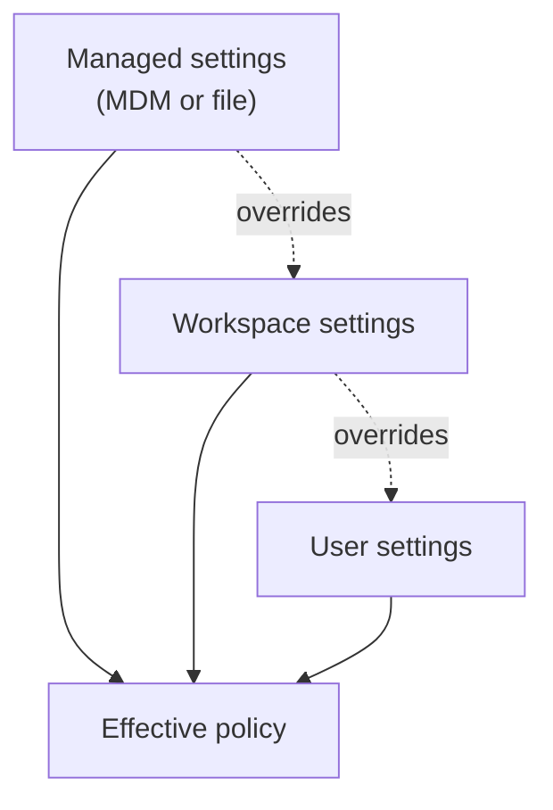

# Enterprise Policy & Managed Settings

Once agents run across a whole engineering org, per-user settings stop being enough; the posture has to be delivered from the top and made hard to override. Copilot supports two delivery channels for managed settings. Since VS Code 1.125 they can be pushed natively through MDM, so a device-management platform applies them the same way it applies any other managed configuration. Since 1.127 they can also be delivered as a file-based `managed-settings.json` at a well-known per-OS path, which suits teams that provision machines with configuration files rather than an MDM stack.

Managed settings sit above user and workspace settings in precedence, which is the entire point: a value an admin sets there cannot be edited away by an individual developer. That precedence is what turns the governance topics in this module into enforceable policy rather than advice. Plugin governance and network access are the two surfaces most teams lock down first, because they define what third-party code the agent can load and where the agent is allowed to reach.



## Plugin governance

Plugins extend the agent, so an org needs to say which plugins are allowed and which marketplaces they may come from. Three settings carry that policy, and they are shared with the Copilot CLI policy file so the rule holds whether the developer is in the editor or the terminal.

| Setting | Purpose |
|---------|---------|
| `chat.plugins.enabledPlugins` | Allow-lists the plugins that users are permitted to run |
| `chat.plugins.extraMarketplaces` | Declares additional marketplaces the org trusts as plugin sources |
| `chat.plugins.strictMarketplaces` | Restricts plugin installation to the declared marketplaces only |

## Network and browser policy

Agents can reach the network and drive a browser, so both need boundaries an admin can set centrally. `ChatAgentNetworkFilter` applies domain allow and deny lists to what the agent may contact, and `BrowserChatTools` governs whether the built-in browser tools are available at all. Together they decide the agent's reach into the outside world.

| Policy | Purpose |
|--------|---------|
| `ChatAgentNetworkFilter` | Domain allow and deny lists that constrain the agent's network access |
| `BrowserChatTools` | Governs availability of the built-in browser tools |

One policy went away, and it is worth knowing which. `ChatAgentHostEnabled` was removed in VS Code 1.132, so an administrator can no longer centrally disable the agent host; the `chat.agentHost.enabled` setting is now the only control point. Because the agent host is the runtime behind Copilot, Claude, and Codex sessions, that narrows what a central policy can switch off and moves the enforcement weight onto the plugin, network, and permission settings instead.

## Exercise

Draft a managed policy that survives a user's attempt to override it.

1. Locate the well-known `managed-settings.json` path for your OS as documented in the 1.127 release notes.
2. Create a `managed-settings.json` that allow-lists two plugins with `chat.plugins.enabledPlugins` and sets `chat.plugins.strictMarketplaces` to restrict installation to trusted marketplaces.

   ```json
   {
     "chat.plugins.enabledPlugins": ["team-lint", "team-security"],
     "chat.plugins.strictMarketplaces": true,
     "chat.plugins.extraMarketplaces": ["https://marketplace.internal.example"]
   }
   ```

3. Add a `ChatAgentNetworkFilter` block that denies a domain you want off-limits, and set `BrowserChatTools` according to whether your team allows in-editor browsing.
4. Restart VS Code and open user settings. Confirm the managed values appear as locked and cannot be edited by the user.
5. Try to install a plugin from outside the declared marketplaces and confirm the strict policy blocks it.
6. Confirm your policy set does not depend on `ChatAgentHostEnabled`, removed in 1.132, and note which of the remaining settings carry that weight now.
7. Record which channel, MDM or the file-based path, your org will use to distribute this policy at scale.

## Links & Resources

- [VS Code 1.125 release notes](https://code.visualstudio.com/updates/v1_125) - managed settings delivered natively through MDM
- [VS Code 1.127 release notes](https://code.visualstudio.com/updates/v1_127) - file-based managed-settings.json and plugin and network policies
- [VS Code 1.132 release notes](https://code.visualstudio.com/updates/v1_132) - removal of the `ChatAgentHostEnabled` policy
- [GitHub Copilot documentation](https://docs.github.com/en/copilot) - organization policy and enterprise administration reference
