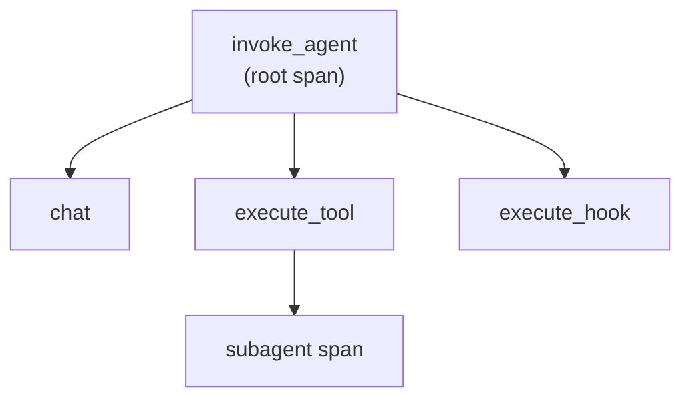

# Observability with OpenTelemetry

You cannot govern what you cannot see, so the final governance surface is telemetry. Since VS Code 1.119, GitHub Copilot emits OpenTelemetry traces that follow the GenAI semantic conventions, which means the spans use standard names and attributes rather than a Copilot-only format. That standardization is what lets the same traces flow into whatever OTel-aware backend your org already runs. For teams on Azure, a prebuilt Azure Managed Grafana dashboard, available since 1.121, turns those signals into charts without you building the visualization from scratch.

A session shows up as a span tree, and reading that tree is how you reconstruct what an agent actually did. The root is an `invoke_agent` span, and nested under it are `chat` spans for model turns, `execute_tool` spans for tool calls, and `execute_hook` spans for hook runs. When the agent delegates, each subagent's spans are parented to the `execute_tool` span that spawned it, so a fan-out stays attributable to the exact call that triggered it. The result is a trace where cost, latency, and failures all line up against the specific action that caused them.

## Span types in a session trace

| Span | What it records |
|------|-----------------|
| `invoke_agent` | The root span for the whole agent session |
| `chat` | A model turn nested under the root |
| `execute_tool` | A tool call; subagent spans are parented here |
| `execute_hook` | A hook run at a lifecycle event |



## Mandating the OTLP endpoint

Visibility only counts if every agent reports to the same place, which is why the endpoint is a policy, not a preference. Since 1.128, an admin can set the OTLP endpoint in the managed-settings `telemetry` block, and that value overrides both environment variables and user settings. This closes the loophole where a developer could point telemetry elsewhere or turn it off, so the org gets a complete trace of agent activity. Paired with the Azure Managed Grafana dashboard, the mandated endpoint gives architects one authoritative view across every session.

> Note: The managed-settings `telemetry` block wins over `OTEL_*` environment variables and any user-level setting, so the admin-set endpoint is the one that takes effect.

## Exercise

Route agent telemetry to a mandated OTLP endpoint and read the span tree.

1. Stand up an OTLP-compatible collector, or provision an Azure Managed Grafana workspace to receive the traces.
2. In your `managed-settings.json`, add a `telemetry` block that sets the OTLP endpoint to your collector.

   ```json
   {
     "telemetry": {
       "otlpEndpoint": "https://otel-collector.internal.example:4317"
     }
   }
   ```

3. Restart VS Code and confirm that a `OTEL_EXPORTER_OTLP_ENDPOINT` environment variable pointing elsewhere is ignored in favor of the managed value.
4. Run an agent session that calls at least one tool and delegates to one subagent.
5. Open the trace and confirm the `invoke_agent` root, the nested `chat`, `execute_tool`, and `execute_hook` spans, and the subagent span parented under `execute_tool`.
6. In the Azure Managed Grafana dashboard, locate the session and read its latency and cost against the individual spans.

## Links & Resources

- [VS Code 1.121 release notes](https://code.visualstudio.com/updates/v1_121) - the prebuilt Azure Managed Grafana dashboard for Copilot telemetry
- [VS Code 1.128 release notes](https://code.visualstudio.com/updates/v1_128) - the managed-settings telemetry block that mandates the OTLP endpoint
- [Azure Managed Grafana overview](https://learn.microsoft.com/en-us/azure/managed-grafana/overview) - hosting Grafana dashboards for OpenTelemetry signals on Azure
