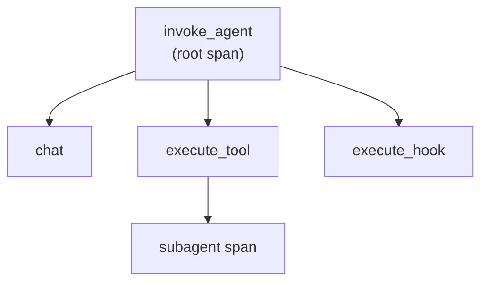

# Observability with OpenTelemetry


You cannot govern what you cannot see, so the final governance surface is telemetry. The Copilot agent host emits OpenTelemetry traces that follow the GenAI semantic conventions, which means the spans carry standard operation names and attributes rather than a Copilot-only format. That standardization is what lets the same traces flow into whatever OTel-aware backend your org already runs, from a self-hosted collector to Azure Managed Grafana. Export is off until you ask for it: `chat.agentHost.otel.enabled` defaults to `false`.

A session shows up as a span tree, and reading that tree is how you reconstruct what an agent actually did. The root is an `invoke_agent` span, and nested under it are `chat` spans for model turns, `execute_tool` spans for tool calls, and `execute_hook` spans for hook runs. `embeddings` and `content_event` complete the set. When the agent delegates, the subagent's spans hang off the `execute_tool` span that spawned it, so a fan-out stays attributable to the exact call that triggered it.

## Span types in a session trace

| Span | What it records |
|------|-----------------|
| `invoke_agent` | The root span for an agent invocation, named `invoke_agent <agent>` |
| `chat` | A model turn nested under the root |
| `execute_tool` | A tool call; subagent spans are parented here |
| `execute_hook` | A hook run at a lifecycle event |
| `embeddings` | An embedding request |



## Turning export on

Five user settings carry the whole configuration, and each one maps onto a standard OTel environment variable inside the agent host process. Set the exporter type first, because it decides which of the other settings matter: `otlp-http` and `otlp-grpc` need an endpoint, `file` needs an output path, and `console` needs neither.

| Setting | Default | Effect |
|---------|---------|--------|
| `chat.agentHost.otel.enabled` | `false` | Emits OpenTelemetry traces from the Copilot SDK |
| `chat.agentHost.otel.exporterType` | `otlp-http` | One of `otlp-http`, `otlp-grpc`, `console`, `file` |
| `chat.agentHost.otel.otlpEndpoint` | empty | Sets `OTEL_EXPORTER_OTLP_ENDPOINT` for the agent host |
| `chat.agentHost.otel.outfile` | empty | Sets `COPILOT_OTEL_FILE_EXPORTER_PATH` when the exporter is `file` |
| `chat.agentHost.otel.captureContent` | `false` | Includes prompt and response content in span attributes |

> Note: `captureContent` puts prompts and responses into span attributes. Leave it off for any sink more than one team can read, and remember that an admin can pin it with the `telemetry.lockCaptureContent` managed key.

## Keeping the traces local

You do not need a collector to start. Turn on `chat.agentHost.otel.dbSpanExporter.enabled` and the agent host persists every emitted span to a local SQLite database, which you pull out with the `Export Agent Host Traces Database...` command. It composes with an external exporter rather than replacing it, so spans go to SQLite and to your configured sink at the same time. This is the cheapest way to see the span tree of your own session before you argue for a fleet-wide collector.

## Mandating the endpoint

Visibility only counts if every agent reports to the same place, which is why the endpoint belongs in policy rather than in each developer's settings. The managed-settings `telemetry` block carries the whole set, and the values arrive as policy values, which win over the user's own settings when the effective value is resolved. Two of the keys are policy-only and have no user-facing setting at all: `telemetry.protocol` and `telemetry.resourceAttributes`.

| Managed-settings key | Policy | Governs |
|----------------------|--------|---------|
| `telemetry.enabled` | `CopilotOtelEnabled` | Whether export runs at all |
| `telemetry.endpoint` | `CopilotOtelEndpoint` | The OTLP collector URL |
| `telemetry.protocol` | `CopilotOtelProtocol` | The OTLP wire protocol; policy-only |
| `telemetry.captureContent` | `CopilotOtelCaptureContent` | Whether prompt and response content is captured |
| `telemetry.headers` | `CopilotOtelHeaders` | Exporter auth headers; policy-only |

## Demo

Route agent telemetry to an OTLP endpoint and read the span tree.

1. Turn on `chat.agentHost.otel.enabled` and `chat.agentHost.otel.dbSpanExporter.enabled` in user settings, leaving the exporter type at its default.
2. Run an agent session in the Agents window that calls at least one tool and delegates to one subagent.
3. Run `Export Agent Host Traces Database...` from the Command Palette and open the exported file. Confirm the `invoke_agent` root and the nested `chat`, `execute_tool`, and `execute_hook` spans.
4. Stand up an OTLP-compatible collector, or provision an Azure Managed Grafana workspace with an OTLP ingest path.
5. Set `chat.agentHost.otel.otlpEndpoint` to that collector, rerun the session, and confirm the same spans arrive there.
6. Add the managed block below to `managed-settings.json`, restart VS Code, and confirm `chat.agentHost.otel.otlpEndpoint` now shows as managed and is no longer editable.

   ```json
   {
     "telemetry": {
       "enabled": true,
       "endpoint": "https://otel-collector.internal.example:4317",
       "protocol": "grpc",
       "lockCaptureContent": true
     }
   }
   ```

7. In your backend, locate the session and read its latency against the individual spans.

## Links & Resources

- [Semantic conventions for generative AI](https://opentelemetry.io/docs/specs/semconv/gen-ai/) - the span names and attributes these traces follow
- [AI settings reference](https://code.visualstudio.com/docs/copilot/reference/copilot-settings) - the `chat.agentHost.otel.*` settings and their defaults
- [VS Code for enterprise](https://code.visualstudio.com/docs/setup/enterprise) - how managed settings and policies reach a fleet
- [Azure Managed Grafana overview](https://learn.microsoft.com/en-us/azure/managed-grafana/overview) - hosting Grafana dashboards for OpenTelemetry signals on Azure

[← Previous: Enterprise Policy & Managed Settings](../03-enterprise-policy/readme.md) | [Back to Governance](../readme.md) | [Next: Cutting Token Cost with Open-Source Models →](../05-open-source-models/readme.md)
