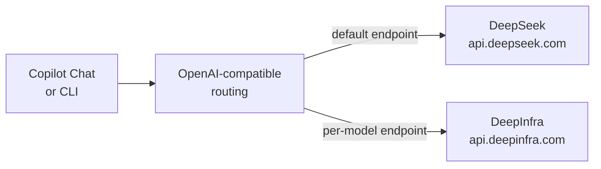

# Cutting Token Cost with Open-Source Models

Usage-based AI credits make model choice a spending decision, and the frontier models are the expensive line item. A large share of everyday agent work (routine edits, explanations, test scaffolding, commit messages) does not need a frontier model, and open-source or third-party models priced a fraction as much handle it well. This topic shows how to route GitHub Copilot to OpenAI-compatible endpoints such as DeepSeek and DeepInfra-hosted open models, keeping the frontier models for the hard problems. It sits next to the cost model because it is the most direct lever you have on per-token spend.

You can do this on two surfaces, each with its own guide below. In VS Code the OAI Compatible Copilot extension adds your models to the Chat model picker, and in the terminal the GitHub Copilot CLI reads its own bring-your-own-key environment variables. The two are configured differently and do not share settings, so pick the guide for the surface you are on.

## How the routing works

## Benefits and trade-offs

- Cost: open and third-party models are priced far below the frontier tier, which is the single largest saving on usage-based credits.
- Context: several of these models carry very large context windows, useful for whole-repository questions.
- Diversity: keep a fast cheap model, a reasoning model, and a frontier model side by side and switch per task.
- Data control: a DeepInfra call is a third-country transfer, so read [EU AI Act, GDPR & Accessibility Compliance](../06-compliance/) before sending personal data.

This is a direct companion to the [Cost Model & AI Credits](../02-cost/) topic: that topic makes spend visible, and this one gives you the lever to reduce it.

## Topics

| Topic | Description |
|-------|-------------|
| [Using Open-Source Models in VS Code](./01-vscode/) | Add DeepSeek and DeepInfra models to the Copilot Chat model picker with the OAI Compatible Copilot extension. |
| [Using Open-Source Models in the Copilot CLI](./02-copilot-cli/) | Point the GitHub Copilot CLI at DeepSeek or DeepInfra with the native `COPILOT_PROVIDER_*` environment variables. |

## Links & Resources

- [OAI Compatible Copilot on the Marketplace](https://marketplace.visualstudio.com/items?itemName=johnny-zhao.oai-compatible-copilot) - the VS Code extension, its settings keys, and the model picker flow
- [Use BYOK models in the Copilot CLI](https://docs.github.com/en/copilot/how-tos/copilot-cli/customize-copilot/use-byok-models) - the native `COPILOT_PROVIDER_*` variables for the terminal
- [DeepSeek API documentation](https://api-docs.deepseek.com/) - base URLs, model ids, and pricing for the DeepSeek endpoint
- [DeepInfra documentation](https://deepinfra.com/docs) - the OpenAI-compatible endpoint and the catalog of hosted open models
