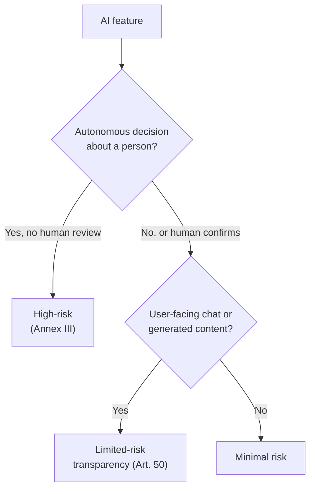

# EU AI Act, GDPR & Accessibility Compliance

Governance is not only about what an agent may do inside your tools; it is also about what the law requires of the software your agents help you ship. Three regimes matter for most teams building with Copilot: the EU AI Act for AI features, the DSGVO/GDPR for personal data, and accessibility law for user-facing surfaces. This topic gives engineers a working orientation on each so you can classify a feature, disclose it correctly, and know when to bring in counsel. None of this is legal advice: it is engineering-team orientation, and any external compliance claim needs sign-off from counsel or your data protection officer first.

## Three regimes to check

| Regime | Applies when | Core obligation |
|--------|--------------|-----------------|
| EU AI Act | A feature uses AI that a person interacts with or that decides something about a person | Classify the risk tier, then disclose AI use (Article 50) |
| DSGVO / GDPR | A feature collects, stores, transmits, or displays personal data of people in the EU/EEA | Lawful basis, data-subject rights, privacy notice, processor agreements |
| Accessibility (EAA / WCAG) | You ship a customer-facing website or app | Meet WCAG 2.1 AA as the defensible baseline |

## EU AI Act: classify the AI use first

Every other AI Act step depends on which tier a feature falls into. Walk the tiers in order and stop at the first that matches. Most typical business apps land in limited-risk transparency, because a human reviews the AI output before it takes effect.

| Tier | Definition | Typical triggers |
|------|------------|------------------|
| Prohibited (Art. 5) | Banned outright | Social scoring, manipulative techniques, untargeted face scraping, workplace emotion inference |
| High-risk (Annex III) | Heavy provider obligations | Autonomous decisions on employment, credit, essential services, biometrics |
| Limited-risk / transparency (Art. 50) | Must disclose AI to the user | Chatbots, AI-generated or AI-modified content |
| Minimal risk | Unregulated | Everything else, such as spam filters and most internal tooling |

Two questions usually settle the tier for a business app. First, does the AI decide something about a person with legal or similarly significant effect, autonomously? Second, does a human review and confirm the output before it is acted on or stored? If a human always reviews, and that is enforced as a product invariant rather than a skippable prompt, you are almost always out of high-risk and in limited-risk transparency.



## Article 50: the disclosure pattern

Article 50 transparency obligations apply from 2 August 2026: you must tell users when they interact with an AI system or with AI-generated content. The failure mode to avoid is over-disclosing, burying the essential consent under a wall of legal text. Use a two-tier pattern: one short always-visible sentence, and a collapsed section for the full detail.

```html
<div class="card">
  <p><!-- essential purpose and data captured --></p>
  <p><!-- one sentence: AI assists this; a human reviews before anything is stored --></p>
  <details>
    <summary>Weitere Informationen / Further information</summary>
    <div><!-- full processing definition, what the AI does and does not do, links --></div>
  </details>
</div>
```

> Note: The "grace period until December 2026" you may hear about is narrow. It covers only the machine-readable-marking sub-duty for legacy generative systems, not the core Article 50 disclosure, which still applies from 2 August 2026.

## DSGVO / GDPR: the personal-data check

If a feature touches personal data of people in the EU/EEA, run this check. Each item is verifiable: document the evidence, not just a tick.

- Every personal-data field has a documented purpose and a single lawful basis (Art. 6).
- Data minimization is applied: no field is collected that is not used.
- A retention period and a real deletion mechanism exist for each category.
- A privacy notice (Datenschutzerklärung) is accurate, reachable, and plain.
- Data-subject rights work: access, rectification, erasure, restriction, portability, objection.
- Every processor (hosting, model API, maps, email/SMS) has a signed Art. 28 agreement.
- Every third-country transfer has a valid mechanism (adequacy, SCC, or Data Privacy Framework).
- Where AI processes personal data, this check and the Article 50 disclosure stay consistent.

## Third-country transfers: the hosted-model case

Every call to a model hosted outside the EU/EEA is a third-country transfer under Chapter V. A US-only vendor such as DeepInfra has no EU region, so each request carrying personal data needs a processor agreement plus a transfer mechanism (Standard Contractual Clauses and a transfer impact assessment) before personal data reaches a prompt. Minimize or pseudonymize personal data at the source, and be aware that routing a Google or Anthropic model through such a host adds that upstream provider to the sub-processor chain.

## Accessibility: WCAG 2.1 AA

Accessibility is a compliance domain, not just a UX nicety. The European Accessibility Act (Directive 2019/882) applies to many private-sector products and services from 28 June 2025, and WCAG 2.1 AA is the standard auditors measure against. Target WCAG 2.1 AA as the safe baseline for any customer-facing surface, covering semantic HTML, labeled forms, color contrast, keyboard operability, visible focus, and descriptive alt text.

## Exercise

Classify and document one AI feature you are building.

1. Pick a feature that uses AI (a chat assistant, a data extractor, a draft generator).
2. Walk the risk-tier table in order and record the first tier that matches, with your reasoning.
3. Answer the two settling questions and note whether a human reviews every output before it takes effect.
4. Draft the two-tier Article 50 disclosure: one always-visible sentence plus a collapsed detail block.
5. If the feature touches personal data, run the DSGVO checklist and flag any missing processor agreement or third-country transfer.
6. Write a one-paragraph "not legal advice" note recommending counsel or DPO sign-off before any external claim.

## Links & Resources

- [EU AI Act Explorer](https://artificialintelligenceact.eu/) - risk-tier definitions, the Article 50 transparency guide, and a compliance checker
- [GDPR full text on EUR-Lex](https://eur-lex.europa.eu/eli/reg/2016/679/oj) - the authoritative text of Regulation 2016/679
- [European Accessibility Act](https://ec.europa.eu/social/main.jsp?catId=1202) - scope and obligations for accessible products and services
- [WCAG 2.1 quick reference](https://www.w3.org/WAI/WCAG21/quickref/) - success criteria and techniques for level AA conformance
