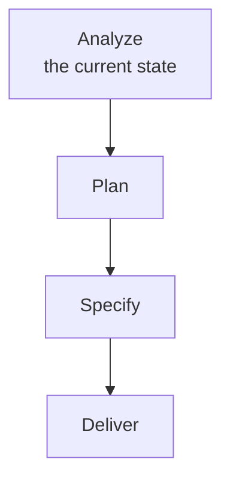
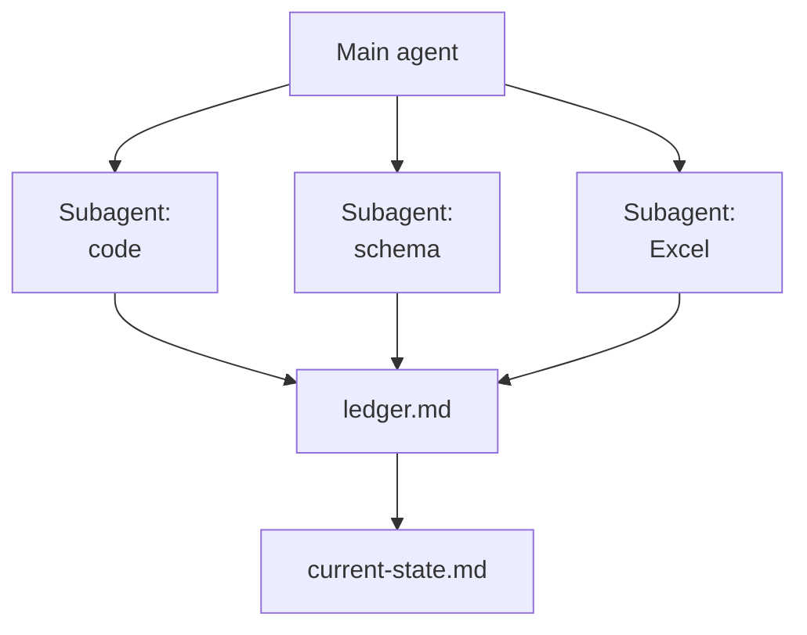

# Brownfield Analysis: Harvest the Current State

Most features are not built on an empty page. They land in a business that already runs: a process people follow every day, an Excel workbook that quietly holds half the rules, a database somebody designed years ago, and an application that works well enough that nobody wants to replace it. A plan written without that picture fills the gaps with guesses, and a spec built on those guesses is a checked contract about the wrong system.

This topic is the step before planning. An agent reads what runs today, how it gets used, and where it hits its limits, and writes it down as one current-state document. Planning, specifying and delivering then start from facts instead of from an interview.



## Build on what runs, do not replace it

The analysis has one guiding question: what already exists, and where does a gap remain? The answer decides what to build. Work that only pays off after a migration cannot start this quarter, so the useful result is a list of additions that layer on top of the systems, the data and the hosting already in place.

That reframes brownfield work. Legacy is not an obstacle to clear away before the real project begins; it is the specification nobody wrote down. The analysis writes it down.

## The four sources

A current state lives in four places, and each one needs a different way of reading. People describe the process, files hold the numbers, the database holds the structure, and the code holds the behaviour.

| Source | What the agent reads | What it yields |
| --- | --- | --- |
| Processes | Task notes, tickets, runbooks, the steps people record while they work | Who does what, how often, and which steps are repetitive typing between systems |
| Excel files | Workbooks, CSV exports, scheduled imports | Sheets, columns, formulas and the business rules hidden inside them |
| Data structure | Database schema, migrations, API contracts | Entities, keys, relationships, and fields that exist but are never filled |
| Current implementation | Source code, configuration, tests | What the system does today, where each capability lives, and what is tested |

The process source is the one teams skip, and the most valuable. The people doing the work record what they actually do for a week, spreadsheets and system-jumping included, and that record ranks which processes cost the most time.

## Agentic data harvesting

Each source is independent of the others, which makes harvesting a natural fit for parallel subagents. One subagent reads the code, one the schema, one the workbooks; in VS Code the agent starts them through `#agent/runSubagent`, and in the Copilot CLI `/fleet` runs them side by side.

Subagents are stateless, so they share their findings the same way the next topic does: every subagent appends under its own heading in one ledger file and writes nothing else. The ledger is the raw harvest, with a file path or a query behind every line.



The agent reads each source with the tools the source already has. A SQLite database answers `sqlite3 hr-data.db ".schema"`, an Entity Framework model is read from its `DbContext`, and a workbook is read by a short script the agent writes and runs:

```python
from openpyxl import load_workbook

wb = load_workbook("vacation-planning.xlsx", data_only=False)
for ws in wb.worksheets:
    print(ws.title, ws.max_row, ws.max_column)
    for row in ws.iter_rows(min_row=1, max_row=3):
        print([c.value for c in row])
```

`data_only=False` returns the formulas rather than the cached values, and the formulas are where a workbook keeps its rules.

## The current-state document

The harvest ends in one file the team reviews before any plan is written. It separates what was observed from what was concluded, so a reviewer can challenge a conclusion without re-reading the whole system.

| Section | Content |
| --- | --- |
| Inventory | Every process, file, table and component found, each with its path or source |
| How it is used | The observed process steps, their frequency and the manual hand-offs between systems |
| Limits | Where the current state breaks down: duplicated entry, missing fields, untested paths |
| Gap list | For each requested capability: already exists, partly exists, or missing |

The gap list is what the next topic plans against. A capability marked as existing is wiring, not a feature; a capability marked as missing is a candidate for a spec.

## Hands-On

- Lab: [Lab 09.1: Harvest the Current State of Vacancy Tracking](../../../labs/09-plan-spec-deliver/01-analyze/readme.md) runs four subagents over a process log, a vacancies workbook, the HR MCP server's database and its code, writes a current-state document with a gap list, and checks it against the sources.

## Links & Resources

- [Subagents in VS Code](https://code.visualstudio.com/docs/agents/run/subagents) - parallel subagents and why each one is stateless
- [Copilot CLI best practices](https://docs.github.com/en/copilot/how-tos/copilot-cli/cli-best-practices) - `/fleet` and running subtasks in parallel
- [openpyxl documentation](https://openpyxl.readthedocs.io/en/stable/) - reading workbooks, sheets and formulas from Python
- [SQLite command line shell](https://sqlite.org/cli.html) - the `.schema` and `.tables` dot commands

[Back to Plan, Specify, Deliver](../readme.md) | [Next: Planning with Agents →](../02-planning/readme.md)
