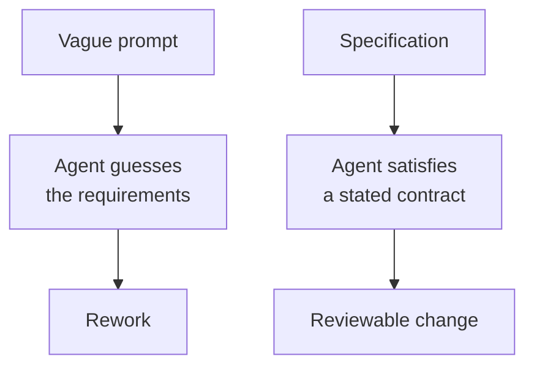
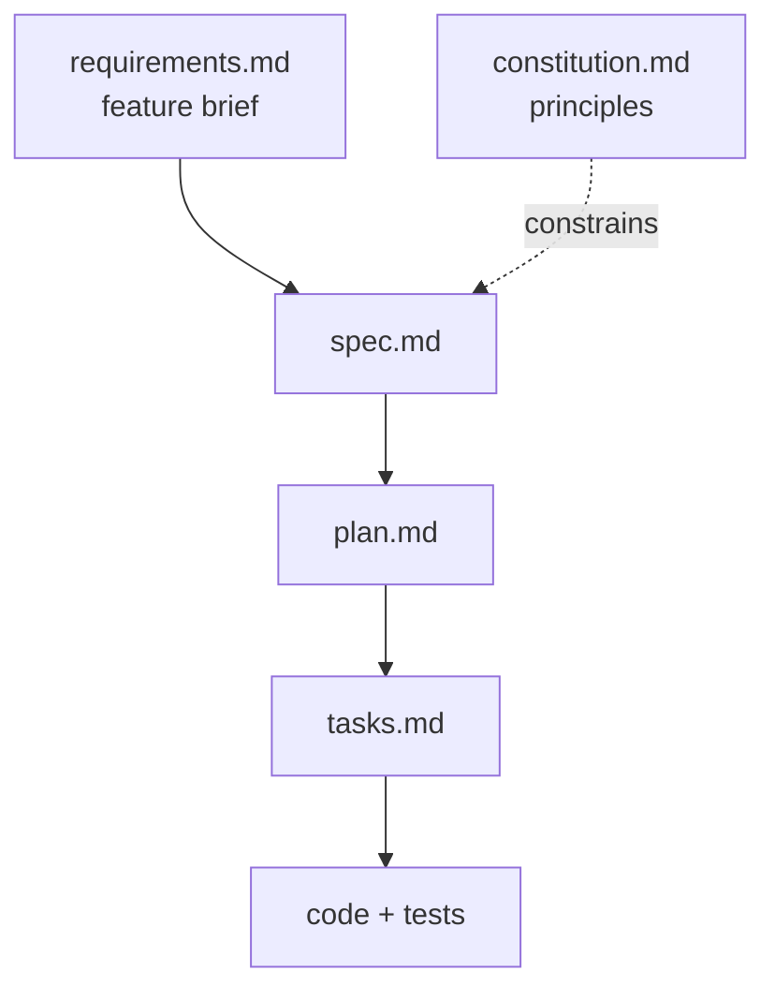
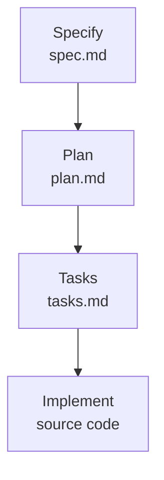

# Why Spec-Driven Development

Spec-driven development (SDD) reverses the code-first approach by starting with a specification that acts as an executable contract between your intent and the implementation. Instead of writing a vague prompt and hoping for the right output, you hand the agent a specification that becomes the source of truth for what gets built, tested, and validated.

This matters because coding agents are good at generating new functionality and bad at leaving working code alone. A specification gives the agent a boundary: it states what must be true when the work is done, so the agent improves the codebase instead of rewriting parts of it that were already stable.



## When the code becomes the spec

Den Delimarsky, who introduced Spec Kit on the Microsoft developer blog, puts the underlying problem plainly: "If you don't decide what you're building and why you're building it ahead of time, the codebase becomes the de-facto specification." Decisions then live in email threads, chat history, or one person's head, and the code is the only place they are written down. Code is also binding: once an implementation exists, it is hard to decouple a decision from it.

Spec Kit's own definition is the inverse: define the what and the why before deciding how to build it, turn the requirements into a specification, a technical plan and tasks, then guide the implementation against those artifacts. The goal is to make decisions explicit, reviewable and evolvable. That is not waterfall; the specification is a living document you change as easily as you refactor code, and the agent regenerates what depends on it.

## The example: a meeting cost calculator

Every example in this topic and the next comes from the lab you run at the end of the module, so the theory and the exercise use the same feature. An organizer enters a meeting duration and the hourly rate of each attendee, and a small Python library with a command line wrapper returns the total salary cost plus a per attendee breakdown: `python -m meeting_cost 60 100 80 60` must report 240.

The feature is deliberately small. A feature you can hold in your head is the only kind where you can see what the process added, rather than attributing the result to the size of the problem.

You start from two files that already exist in [labs/09-plan-spec-deliver/02-plan-spec-deliver](../../../labs/09-plan-spec-deliver/02-plan-spec-deliver/): [requirements.md](../../../labs/09-plan-spec-deliver/02-plan-spec-deliver/requirements.md), a feature brief written the way a product owner writes one, and [constitution.md](../../../labs/09-plan-spec-deliver/02-plan-spec-deliver/constitution.md), six project principles. Neither names a class, a file layout or a data type; the agent generates everything downstream and you review it.



The brief carries three user stories, five acceptance criteria, three constraints and four edge cases (zero attendees, zero minutes, a negative value, a non-numeric rate). It also leaves two things out on purpose: how the result is rounded, and what currency the numbers are in.

## Why an agent guesses

Every feature request is incomplete. A product owner writes down the intent and the obvious cases, and leaves out the details that feel self-evident: how a number is rounded, which currency it is in, whether an empty list is an error or a zero. A human developer asks about those details; an agent is built to keep moving, so it picks an answer and carries on.

The meeting cost brief is built to trigger exactly that. Its two unstated details both change the implementation, and in a code-first run the agent settles them silently inside a function; you find out later from a rounding bug or a dollar sign nobody asked for.

Spec Kit's own instructions to the agent say this out loud. The `/speckit-specify` skill tells it to "make informed guesses based on context and industry standards", to record them in an `Assumptions` section, and to raise at most three `[NEEDS CLARIFICATION]` markers for the decisions with the biggest impact. The guesses are not the problem; guesses nobody reads are.

In a code-first workflow those guesses are made during generation, inside a function body, and you find them later as a bug. In a spec-driven workflow they are made in a document you read before any code exists, where overruling one costs a sentence.

## What a specification is, and what it is not

A specification describes what the software must do and why, from the user's side: user stories, functional requirements, acceptance criteria, edge cases, and measurable success criteria. It is written so a reviewer who never sees the code can still say whether the result is right.

It is deliberately not a design. A spec that names a class, a file, a library, or a database has started to make the plan's decisions, and those decisions are then hidden in a document nobody reviews as architecture. Keeping the two apart lets you change the stack without touching the requirements, and review each against the right question.

| A spec says | A plan says |
| --- | --- |
| A 30-minute meeting with one attendee at 90 per hour costs 45 | Amounts are `decimal.Decimal`, rounded with `ROUND_HALF_UP` |
| Invalid input names the offending field | `calculate` raises `InvalidInputError` carrying a `field` attribute |
| The calculation is usable without the command line | Two modules, `calculator` and `cli`, and `cli` imports `calculator` |

The rows are taken from the lab's [reference solution](../../../labs/09-plan-spec-deliver/02-plan-spec-deliver/meeting-cost-solution/readme.md). The left column survives a switch from Python to Node unchanged; the right column is rewritten entirely.

## The four phases

| Phase | Question it answers | Artifact |
| --- | --- | --- |
| Specify | What should the software do, and why? | `spec.md` |
| Plan | How will we build it? | `plan.md` |
| Tasks | What are the concrete work items, in what order? | `tasks.md` |
| Implement | Does the code match the spec? | source code |



Each phase ends at a checkpoint where you read the artifact before moving on. Catching a wrong assumption in `spec.md` costs a sentence; catching it after implementation costs a rewrite.

## The constitution sits above the phases

A fifth document, the constitution, is written once per project rather than once per feature. It holds the non-negotiables: the dependency policy, how failures are reported, which numeric types money may use. Every principle is phrased so it can be checked, because the plan phase has to verify itself against each one and say so.

The constitution is what turns review from taste into a checklist. "Money is never a float" is a rule you can hold a plan against in seconds; "write clean code" is not, which is why a good constitution is short and every line in it is testable.

The lab's constitution has six principles, and each one is aimed at a later checkpoint:

| Principle | What it forbids | Where you check it |
| --- | --- | --- |
| 1. Separation of concerns | Calculation logic importing the command line layer | Plan: module boundary |
| 2. No hidden dependencies | Any package beyond the standard library and the test framework without a written rationale | Plan: technology choices |
| 3. Explicit failure | Invalid input silently coerced, defaulted or clamped | Spec: edge cases |
| 4. Money is never a float | Binary floating point for a monetary amount | Plan: the type named for the total |
| 5. Every acceptance criterion has a test | A criterion with no task and no test behind it | Tasks: coverage |
| 6. Offline by default | Network calls and writes outside the project | Plan: constitution check |

Principle 4 is the planted trap. Every figure in the brief is exact in binary, so a `float` implementation prints 240 and 45 correctly and passes its tests; the violation is visible only where a type is named, in `plan.md`.

## Checkpoints are where you work

The agent writes every artifact; you read them. That division is the whole method. Your job at a checkpoint is not to admire the document but to ask one question of it: did anything get dropped, softened, or decided without you?

Those three failures have different shapes. A dropped item is an acceptance criterion or edge case from the brief that is missing from the spec. A softened item is a principle that arrives as "should" instead of "must", and a decided item is a gap the agent closed on your behalf, such as a currency it picked because the brief did not name one.

The lab produces one of each on a typical run. The constitution template has five principle slots, so principle 6 tends to land in a constraints section instead of standing as a principle. The generated spec usually fixes the currency to US dollars and rounds every value for display, which is the agent deciding the brief's two gaps for you; at the specify checkpoint you overwrite that with your own rule, for example "round the total half up to two decimal places, keep breakdown values unrounded, amounts are currency-agnostic decimals".

## When SDD is worth it

The method has a cost: four documents and four reviews before the feature is done. For a one-line fix or a throwaway script that cost buys nothing, and a direct prompt is the right tool.

It pays off when a feature has acceptance criteria someone will hold you to, when the request comes from someone other than the person implementing it, or when the code will be changed later by an agent that needs to know what it must not break. The Spec Kit repository draws the line by the job: SDD is its process for building a feature or application, while diagnosing a bug and deciding whether an idea deserves investment are separate processes shipped as opt-in extensions (`specify extension add bug`, `specify extension add assess`).

The lab is deliberately small so you can see the method's effect without the feature's size hiding it.

## Getting started with GitHub Spec Kit

Spec Kit ships as a CLI called `specify`. Install it once, then scaffold a project:

```bash
uv tool install specify-cli --reinstall
specify init <PROJECT_NAME> --integration copilot
```

Initialization prompts for the script flavour to generate, Bash, PowerShell, or Python, and then writes the Spec Kit templates, scripts, and agent commands into the new folder. Open that folder as your VS Code workspace: the commands are skill files under `.github/skills/` inside the generated project, so Copilot only offers them once that project is the workspace root.

> Note: Keep `--reinstall` on the install command. Without it, a machine that already carries an older `specify-cli` installs nothing and leaves you on commands with a dot (`/speckit.specify`) instead of a hyphen.

These are the commands that drive the loop:

| Command | Use it to |
| --- | --- |
| `/speckit-constitution` | State the project principles every later phase is checked against |
| `/speckit-specify` | Describe what you are building and why, from the user perspective |
| `/speckit-plan` | Give technical direction, stack choices, and constraints |
| `/speckit-tasks` | Break the specification into actionable work items |
| `/speckit-implement` | Let the agent work through tasks with reviewable changes |

A 10-minute first run: specify one small feature, plan it, generate tasks, then let Copilot implement one or two of them and compare the result against the spec.

Every command on this page was executed against Spec Kit 1.0.9, and the output is recorded in [spec-kit-cli-solution/](./spec-kit-cli-solution/readme.md).

## Hands-On

- Demo: [spec-kit-cli-solution/](./spec-kit-cli-solution/readme.md) records the install, `specify init`, and the command names it registers, so you can tell a broken install from a changed tool.
- Lab: [Lab 09.2, steps 1 and 2](../../../labs/09-plan-spec-deliver/02-plan-spec-deliver/readme.md#step-1-initialize-the-project-8-minutes) install Spec Kit, initialize the `meeting-cost` project, and turn six principles into its constitution.

## Links & Resources

- [GitHub Spec Kit](https://github.com/github/spec-kit) - the toolkit repository and the agents it supports
- [Spec Kit installation guide](https://github.github.io/spec-kit/installation.html) - every install route, the `--integration` keys, and the script flavours
- [Spec Kit documentation](https://github.github.io/spec-kit/) - the method and what each artifact must contain
- [Diving into Spec-Driven Development with GitHub Spec Kit](https://developer.microsoft.com/blog/spec-driven-development-spec-kit/) - why the codebase should not be the specification, and how the constitution, spec, plan and tasks fit together

[← Previous: Planning with Agents](../02-planning/readme.md) | [Back to Plan, Specify, Deliver](../readme.md) | [Next: The Spec-Driven Workflow →](../04-spec-driven-workflow/readme.md)
