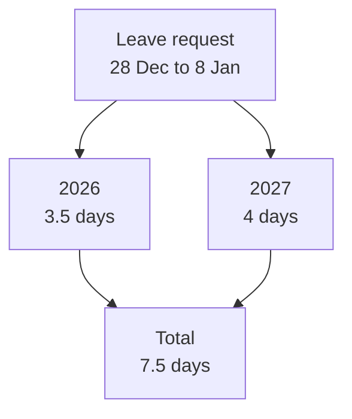

# Sample Case: Implement a Product Feature

The two spec-driven topics before this one used the lab's meeting cost calculator to explain each artifact. This topic runs a second, different feature through the whole loop, so you see the method on a problem from a real product backlog rather than an exercise: a leave days preview for an HR self-service portal.

The case is small enough to read in one sitting and real enough to have the traps real features have. Every artifact, the code and the test output are checked in at [leave-days-solution/](./leave-days-solution/readme.md), and the commands on this page were executed against it.

## The request

Every January the HR inbox fills with the same question: "why did my Christmas leave cost more days than I thought?" Public holidays, the company's half days on 24 and 31 December, and weekends all overlap in the same week, and employees only see the deduction after HR processes the request.

The product owner's [brief](./leave-days-solution/requirements.md) asks for a preview: the employee enters the first and last day of leave, and the tool returns the allowance days it deducts, using the holiday file HR already publishes. The file format is fixed by HR and not negotiable:

```text
2026-12-08
2026-12-24 half
2026-12-25
2026-12-26
2026-12-31 half
```

The brief carries three user stories, five acceptance criteria and three edge cases. The criterion that makes the case worth building reads: "Monday 21 to Friday 25 December 2026 deducts 3.5 days: 24 December is a half day and 25 December is a holiday."

## Checkpoint 1: the constitution

The [constitution](./leave-days-solution/constitution.md) repeats the shape of the lab's, with two principles written for this domain. Principle IV says leave is counted in exact half days using `decimal.Decimal`, and principle VI says no holiday date may appear in source code, because a new year or a new office must be a data change and never a code change.

Principle VI is the one this feature needs most. The fastest way for an agent to satisfy "25 December is a holiday" is to write that date into the code, or to install a third-party holiday package; both pass the acceptance criteria today and are wrong for every office and every year the brief did not mention.

## Checkpoint 2: the specification and its two gaps

Read against the brief, the [spec](./leave-days-solution/spec.md) has to answer two questions the product owner never asked. Neither shows up in the Christmas week example, and both change the code.

The first is a request across New Year. Allowances are per calendar year, so a request from 28 December to 8 January draws on two different balances, and the brief does not say which one to charge. The spec decides: each day is charged to its own year, and the result reports the split.



The second is a year the holiday file does not cover. HR publishes the file one year at a time, so in autumn it ends in December. Counted against that file, 1 and 6 January look like working days, and the preview overcharges by two days with no error anywhere; the spec rejects the request instead, naming `holidays`.

Both decisions land in the spec's `Resolved Gaps` section as requirements (`FR-005`, `FR-006`) with a success criterion behind the first: 28 December 2026 to 8 January 2027 deducts 3.5 from 2026 and 4 from 2027. The spec also states the obvious one explicitly, that the first and last day are both included, because "obvious" is exactly what an agent and a reviewer can read two ways.

## Checkpoint 3: the plan

The [plan](./leave-days-solution/plan.md) makes three decisions the spec deliberately left open, and the Constitution Check is where you verify each.

| Decision | Choice | Why the alternative fails |
| --- | --- | --- |
| Day count type | `decimal.Decimal` | `int` cannot hold 3.5; `float` violates principle IV |
| Holiday source | Parse HR's file into a `date` to `Decimal` map | A holiday package violates principles II and VI; hard-coded dates violate VI |
| Module boundary | `calculator` takes the file's lines, `cli` reads the file | A calculator that opens files cannot be called by the portal with data from its own store |

The type row is the one to read twice. An `int` day count passes the first acceptance criterion (5 days) and fails the second, so it would be caught by tests; a `float` passes both, which is why the constitution rules it out by name rather than trusting the tests to catch it.

## Checkpoint 4: the task list

The [task list](./leave-days-solution/tasks.md) runs T001 to T014 in five phases, with the tests for each user story placed before the task that implements it. It ends with a coverage table mapping every success criterion and edge case to its tasks, which is principle V turned into something you can check in a minute.

Two rows in that table exist only because of checkpoint 2. The New Year split (SC-006) and the uncovered year both have tests, so a later change that reintroduces either bug fails the suite instead of reaching an employee in January.

## Implement and verify

From [leave-days-solution/](./leave-days-solution/readme.md), with nothing to install:

```bash
python -m pytest -q
python -m leave_days 2026-12-21 2026-12-25 --holidays holidays-2026-2027.txt
python -m leave_days 2026-12-28 2027-01-08 --holidays holidays-2026.txt
```

```text
.....................                                                    [100%]
21 passed in 0.12s
Leave: 2026-12-21 to 2026-12-25
2026: 3.5 days
Total: 3.5 days
error: holidays has no entries for 2027
```

The third command is the one that proves the method paid off: the request is valid, the file is the one HR really had in autumn, and the tool refuses to guess. Without the decision made at the specify checkpoint it would have printed a confident, wrong number.

## What the checkpoints bought

| Decision | Made at | Without the checkpoint |
| --- | --- | --- |
| Charge each day to its own year | Specify | Chosen inside a loop, discovered at year-end by HR |
| Reject a year the file does not cover | Specify | Two days overcharged per request, no error |
| Half days are exact decimals | Constitution and plan | A type that passes one criterion and fails the next |
| Holidays come only from HR's file | Constitution and plan | A code change every year and every office |

None of these is hard to implement. Each is a sentence in a Markdown file, written before the code existed, by the person who owns the answer.

## Running the lab

The lab applies the same four checkpoints to the meeting cost calculator from the two spec-driven topics. It lives in [labs/09-plan-spec-deliver/02-plan-spec-deliver](../../../labs/09-plan-spec-deliver/02-plan-spec-deliver/), takes about 45 minutes, and needs GitHub Copilot in VS Code plus the Spec Kit CLI. The lab's own verification (its totals, the float check and its test output) is recorded in [sample-case-solution/](./sample-case-solution/readme.md).

## Hands-On

- Demo: [leave-days-solution/](./leave-days-solution/readme.md) holds this case's brief, constitution, spec, plan, tasks, code and executed output.
- Lab: [Lab 09.2: Ship a feature with GitHub Spec Kit](../../../labs/09-plan-spec-deliver/02-plan-spec-deliver/readme.md), or the fixed-stack [Python variant](../../../labs/09-plan-spec-deliver/02-plan-spec-deliver/readme-py.md).

## Links & Resources

- [Spec Kit documentation](https://github.github.io/spec-kit/) - reference for every `/speckit-*` command and the artifact templates
- [GitHub Spec Kit](https://github.com/github/spec-kit) - the toolkit repository and CLI install instructions

[← Previous: The Spec-Driven Workflow](../04-spec-driven-workflow/readme.md) | [Back to Plan, Specify, Deliver](../readme.md)
