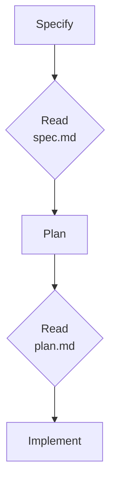

# Plan, Specify, Deliver

## From Prompt to Checked Contract

Coding agents generate new functionality well, but left unconstrained they fill every gap in a request with a guess and refactor code that already worked. Spec-driven development (SDD) answers that with executable contracts: a written specification the agent must satisfy, checked at each phase before the next one starts. The intent that usually lives in a chat scrollback becomes versioned Markdown next to the code, reviewed in the same pull request.

The module opens with the current state: an agent harvests the processes, Excel files, data structure and implementation of a brownfield system into one document that says what already exists and where the gaps are.

Planning follows, the lightest form of the discipline: how Copilot plans on every surface, how subagents research in parallel through a shared ledger, and how a plan becomes GitHub issues with sub-issues. It then teaches the full method through GitHub Spec Kit 1.0.9 running inside GitHub Copilot. You learn why a specification beats a longer prompt, what the four artifacts (constitution, spec, plan, tasks) each contain and who owns them, and which `/speckit-*` command produces and checks each one. The lab you run next, a meeting cost calculator with two gaps and one planted constitution violation, is the running example in the two spec-driven topics that follow; the last topic takes a second, real-world feature (a leave days preview for an HR portal) through the same four checkpoints.

| Topic | Description |
| --- | --- |
| [Brownfield Analysis: Harvest the Current State](./01-analysis/) | Reading what runs today from four sources (processes, Excel files, data structure, implementation) with parallel subagents, and writing a current-state document with a gap list |
| [Planning with Agents](./02-planning/) | The planning loop on every Copilot surface, custom planner agents, parallel research with subagents and a shared ledger, and filing a plan as issues with sub-issues |
| [Why Spec-Driven Development](./03-introduction/) | Why agents guess, what a specification is, the four phases with their checkpoints, and installing GitHub Spec Kit |
| [The Spec-Driven Workflow](./04-spec-driven-workflow/) | What each artifact contains, the project structure, the core commands, and the quality commands that check the artifacts |
| [Sample Case: Implement a Product Feature](./05-sample-case/) | A real HR portal feature, a leave days preview, taken through all four checkpoints with its artifacts, code and executed tests |

## Helpful Copilot Slash Commands

Spec Kit registers its commands as agent skills under `.github/skills/` in the generated project, so Copilot Chat offers them only when that project is the workspace root. The first five produce artifacts; the last three check them without writing code.

| Command | Usage |
| --- | --- |
| `/speckit-constitution` | Write the project principles every later phase is checked against |
| `/speckit-specify` | Turn a feature brief into `spec.md`: user stories, requirements, edge cases, success criteria |
| `/speckit-plan` | Turn the spec plus your stack choice into `plan.md`, with an explicit constitution check |
| `/speckit-tasks` | Break the plan into ordered, verifiable work items in `tasks.md` |
| `/speckit-implement` | Work through `tasks.md` task by task, resuming at the first unfinished one |
| `/speckit-clarify` | Ask up to five targeted questions about the spec and write the answers back into it |
| `/speckit-analyze` | Read-only consistency report across spec, plan and tasks; a constitution conflict is always critical |
| `/speckit-converge` | Compare the code against the artifacts and append the unbuilt work to `tasks.md` |

## Key Topics covered in this module

- [Brownfield Analysis: Harvest the Current State](./01-analysis/)
- [Planning with Agents](./02-planning/)
- [Why Spec-Driven Development](./03-introduction/)
- [The Spec-Driven Workflow](./04-spec-driven-workflow/)
- [Sample Case: Implement a Product Feature](./05-sample-case/)
- [Lab 09.1: Harvest the current state of vacancy tracking](../../labs/09-plan-spec-deliver/01-analyze/readme.md)
- [Lab 09.2: Ship a feature with GitHub Spec Kit](../../labs/09-plan-spec-deliver/02-plan-spec-deliver/readme.md)
- [GitHub Spec Kit](https://github.com/github/spec-kit) - the toolkit repository and the agents it supports
- [Spec Kit documentation](https://github.github.io/spec-kit/) - the method and what each artifact must contain
