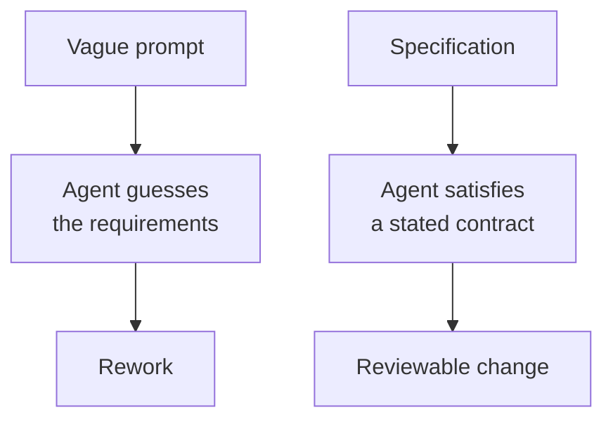
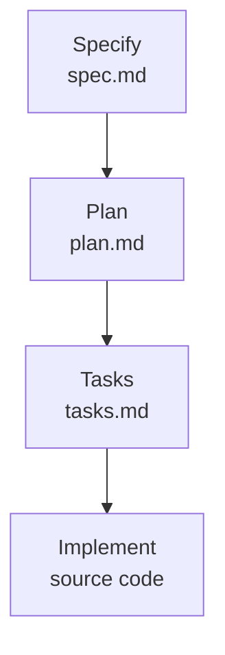

# Why Spec-Driven Development

Spec-driven development (SDD) reverses the code-first approach by starting with a specification that acts as an executable contract between your intent and the implementation. Instead of writing a vague prompt and hoping for the right output, you hand the agent a specification that becomes the source of truth for what gets built, tested, and validated.

This matters because coding agents are good at generating new functionality and bad at leaving working code alone. A specification gives the agent a boundary: it states what must be true when the work is done, so the agent improves the codebase instead of rewriting parts of it that were already stable.



## The four phases

| Phase | Question it answers | Artifact |
| --- | --- | --- |
| Specify | What should the software do, and why? | `spec.md` |
| Plan | How will we build it? | `plan.md` |
| Tasks | What are the concrete work items, in what order? | `tasks.md` |
| Implement | Does the code match the spec? | source code |



Each phase ends at a checkpoint where you read the artifact before moving on. Catching a wrong assumption in `spec.md` costs a sentence; catching it after implementation costs a rewrite.

## Getting started with GitHub Spec Kit

Spec Kit ships as a CLI called `specify`. Install it once, then scaffold a project:

```bash
uv tool install specify-cli --reinstall
specify init <PROJECT_NAME> --integration copilot
```

Initialization prompts for the script flavour to generate, Bash, PowerShell, or Python, and then writes the Spec Kit templates, scripts, and agent commands into the new folder. Open that folder as your VS Code workspace: the commands are skill files under `.github/skills/` inside the generated project, so Copilot only offers them once that project is the workspace root.

These are the commands that drive the loop:

| Command | Use it to |
| --- | --- |
| `/speckit-constitution` | State the project principles every later phase is checked against |
| `/speckit-specify` | Describe what you are building and why, from the user perspective |
| `/speckit-plan` | Give technical direction, stack choices, and constraints |
| `/speckit-tasks` | Break the specification into actionable work items |
| `/speckit-implement` | Let the agent work through tasks with reviewable changes |

A 10-minute first run: specify one small feature, plan it, generate tasks, then let Copilot implement one or two of them and compare the result against the spec.

Every command on this page was executed against Spec Kit 1.0.9, and the output is recorded in [spec-kit-cli-solution/](./spec-kit-cli-solution/readme.md).

## Links & Resources

- [GitHub Spec Kit](https://github.com/github/spec-kit) - the toolkit repository and the agents it supports
- [Spec Kit installation guide](https://github.github.io/spec-kit/installation.html) - every install route, the `--integration` keys, and the script flavours
- [Spec Kit documentation](https://github.github.io/spec-kit/) - the method and what each artifact must contain

[← Back to Spec-Driven Development](../readme.md) | [Next: The Spec-Driven Workflow →](../02-spec-driven-workflow/readme.md)
