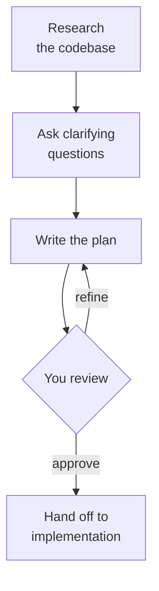
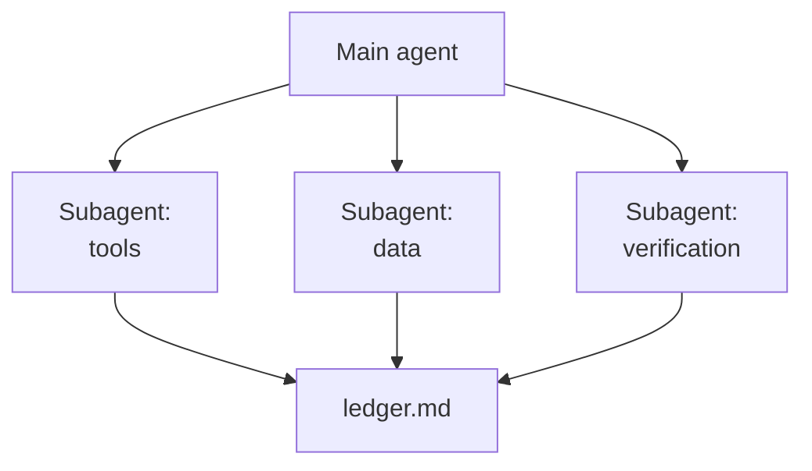

# Planning with Agents

An agent that starts coding the moment you press Enter makes its design decisions inside the diff, where they are expensive to review and harder to reverse. Planning moves those decisions in front of the code: the agent researches the codebase, asks what it cannot infer, and writes down what it intends to do before it changes a single file. You review a page of Markdown instead of a pull request.

Planning is also the lightest form of the discipline this module builds up to. A plan is a spec-driven artifact without the ceremony: no constitution, no templates, one file. The later topics add those layers when a feature needs a checked contract; this topic covers the plan itself, how to research it in parallel, and how to turn it into tracked work.

## The planning loop

Every planning mechanism in Copilot runs the same four moves. It researches the relevant code, asks clarifying questions where the request is ambiguous, writes a structured plan, and waits for you to approve, reject, or refine it before anything is implemented.



The review step is the reason to plan at all. A plan that nobody reads before approving is just a slower way to start coding.

## Where plans live in Copilot

Planning exists on every Copilot surface, and each one stores the plan somewhere you can open and edit.

| Surface | How you start it | Where the plan lives | How it hands off |
| --- | --- | --- | --- |
| VS Code, Plan agent | `/plan <task>` in chat, or Plan in the agent picker | `/memories/session/plan.md` in session memory | Start Implementation switches to the Agent and submits the plan |
| Copilot CLI, plan mode | `/plan <task>`, Shift+Tab to cycle modes, or `copilot --plan` | `~/.copilot/session-state/<session-id>/plan.md` | You approve, then it implements; `--plan --mode autopilot` approves and implements unattended |
| VS Code, todo list | The `#todos` tool, used by the agent during a long task | The todo list in the chat view | Items move from not started to in progress to completed |
| GitHub, Copilot coding agent | Assign an issue to Copilot | The pull request it opens | It researches, plans and commits on a branch |

The VS Code Plan agent is read-only by default, so research cannot turn into edits by accident. `github.copilot.chat.planAgent.additionalTools` widens what it may use, and `chat.planAgent.defaultModel` picks a model for planning separately from the one that implements.

> Note: The CLI rows apply wherever you run `copilot`, including Visual Studio and JetBrains terminals. The coding agent row needs a Copilot plan that includes the coding agent.

## Your own planner agent

The built-in Plan agent is general. A custom agent in `.github/agents/` lets a team fix how plans are produced: which tools research may use, which subagents it may call, and where the plan goes next. This repository ships one, [team-planner.agent.md](/.github/agents/team-planner.agent.md), that must verify library APIs against documentation and ends every plan with edge cases and open questions.

The `handoffs` field puts a button under the plan that moves the conversation to the next agent with a prepared prompt:

```yaml
---
name: Planner
description: Researches the codebase and writes an implementation plan. Never edits code.
tools: ['read', 'search', 'agent', 'todos']
agents: ['*']
handoffs:
  - label: Start Implementation
    agent: agent
    prompt: Implement the plan above, task by task.
    send: false
---
```

`send: false` leaves the prompt in the input box for you to read before submitting. That keeps the review step inside the handoff rather than skipping it.

## Parallel research with subagents

Research is the slow part of planning, and most of it is independent: the tool layer, the data layer and the tests can be read at the same time. Subagents do exactly that. In VS Code the agent calls them through `#agent/runSubagent`, and in the CLI `/fleet` runs subtasks in parallel; each subagent gets a fresh context, so the main conversation stays small.

The catch is in the documentation's own words: each subagent invocation is stateless. A subagent receives only the prompt the main agent writes and returns only its final result; it shares no memory, files or session state with its siblings. Three subagents researching one feature cannot see each other's findings, and the main agent sees each one only as a summary.

## The shared ledger

The fix is a file. Give every subagent the same ledger path and one rule: append your findings under your own heading, write nothing else. The ledger becomes the shared state the platform does not provide, and it outlives the session.



The main agent then writes the plan from the ledger rather than from three summaries. You get two artifacts for review: `ledger.md` shows what was found and where, and `plan.md` shows what will be done about it. A plan claim you doubt can be traced to the ledger line it came from.

## A plan someone else can execute

A plan is ready when a person or an agent who never saw the conversation could carry it out. That means numbered tasks, and for each one the files it touches, the tasks it depends on, and acceptance criteria that can be checked without asking you.

The file list does double duty. Tasks whose files do not overlap can run in parallel, which is exactly how this repository's [team-orchestrator.agent.md](/.github/agents/team-orchestrator.agent.md) splits a plan into phases. Tasks that share a file must run in order.

## From plan to tracked work

A plan in session memory disappears with the session. Filing it as GitHub issues makes it durable, assignable and visible to the team: one parent issue for the feature, one sub-issue per task, all carrying a `planning` label so planned work is easy to find.

This repository ships a [create-issue](/.github/skills/create-issue/SKILL.md) skill that Copilot loads when you type `/create-issue`. It checks the code before writing, creates the parent and the children with `gh issue create`, and links them through the sub-issues REST endpoint, because `gh` has no sub-issue command:

```bash
child_id=$(gh api repos/{owner}/{repo}/issues/<child-number> --jq .id)
gh api -X POST repos/{owner}/{repo}/issues/<parent-number>/sub_issues -F sub_issue_id=$child_id
```

The endpoint takes the child's database id, not its issue number, which is the one detail that makes a hand-rolled link fail. Once filed, each sub-issue can be assigned to the Copilot coding agent on its own.

## Hands-On

- Demo: [Plan the Vacancies Feature and File It as Issues](./demo-plan-vacancies.md) researches the HR MCP server with three subagents and a shared ledger, writes the plan, and files it as a parent issue with sub-issues.
- Lab: [Lab 09](../../../labs/09-spec-driven/readme.md) takes planning one step further, turning a brief into a checked spec, plan and task list.

## Links & Resources

- [Planning in VS Code](https://code.visualstudio.com/docs/agents/run/planning) - the Plan agent, where the plan is saved, and the handoff buttons
- [Subagents in VS Code](https://code.visualstudio.com/docs/agents/run/subagents) - parallel research and why each subagent is stateless
- [Copilot CLI best practices](https://docs.github.com/en/copilot/how-tos/copilot-cli/cli-best-practices) - plan mode, the session plan file, autopilot and `/fleet`
- [Sub-issues REST API](https://docs.github.com/en/rest/issues/sub-issues) - adding and listing sub-issues, and the `sub_issue_id` field

[Back to Spec-Driven Development](../readme.md) | [Next: Why Spec-Driven Development →](../02-introduction/readme.md)
