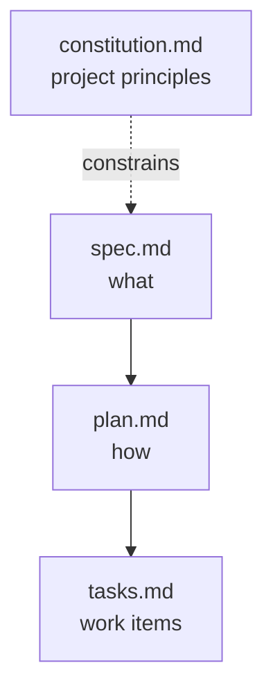

# The Spec-Driven Workflow

GitHub Spec Kit is an open-source toolkit that wires spec-driven development into AI coding assistants such as GitHub Copilot and Claude Code. Everything it produces is plain Markdown stored next to your code, so specifications, plans, and tasks live in Git with the same review and history as the implementation.

Because the artifacts are versioned files, a feature branch carries both the requirements and the code that satisfies them. Include `spec.md`, `plan.md`, and `tasks.md` in the pull request so a reviewer sees what was built and why.

## The four artifacts

| File | Role | Changes |
| --- | --- | --- |
| `constitution.md` | Non-negotiable project principles: technology standards, security requirements, coding standards. The agent checks proposals against it. | Rarely, once established |
| `spec.md` | What the software must do: summary, user stories, acceptance criteria, functional and nonfunctional requirements, edge cases. Requirements only, no implementation. | Per feature |
| `plan.md` | How it will be built: architecture, stack decisions with rationale, implementation sequence, constitution compliance. | Per feature |
| `tasks.md` | Discrete work items derived from the plan, sequenced so each is independently implementable and verifiable. | Throughout implementation |



## Project structure

Spec Kit keeps specification artifacts separate from implementation code:

```text
my-project/
├── .github/
│   ├── agents/
│   └── prompts/
├── .specify/
│   ├── memory/
│   │   └── constitution.md
│   ├── scripts/
│   └── templates/
├── src/
│   └── ...
└── specs/
    ├── 001-document-upload-feature/
    │   ├── plan.md
    │   ├── spec.md
    │   └── tasks.md
    └── 002-authentication-feature/
        ├── plan.md
        ├── spec.md
        └── tasks.md
```

Features are numbered sequentially and each gets its own directory, so two people can work on separate features without their artifacts colliding.

## Core commands

| Command | Purpose |
| --- | --- |
| `/speckit.constitution` | Establish project principles and constraints |
| `/speckit.specify` | Turn a feature description into a complete `spec.md` |
| `/speckit.plan` | Turn the specification into an architectural approach |
| `/speckit.tasks` | Break plan elements into actionable, sequenced work items |
| `/speckit.implement` | Generate code task by task, guided by spec and plan |

Beyond this intro, Spec Kit adds `/speckit.clarify` for gap analysis, `/speckit.analyze` for cross-artifact consistency, and `/speckit.checklist` for quality validation. Reach for them once the basic loop is familiar.

The workflow runs forward through those five commands, but it is not one-way. When requirements change, go back to the specification, regenerate the downstream artifacts, and let the change propagate instead of patching it into code where nobody can trace it.

## Links & Resources

- [Spec Kit documentation](https://github.github.io/spec-kit/) - reference for every `/speckit.*` command and the artifact templates
- [GitHub Spec Kit](https://github.com/github/spec-kit) - the toolkit repository and its `.specify/` directory conventions
