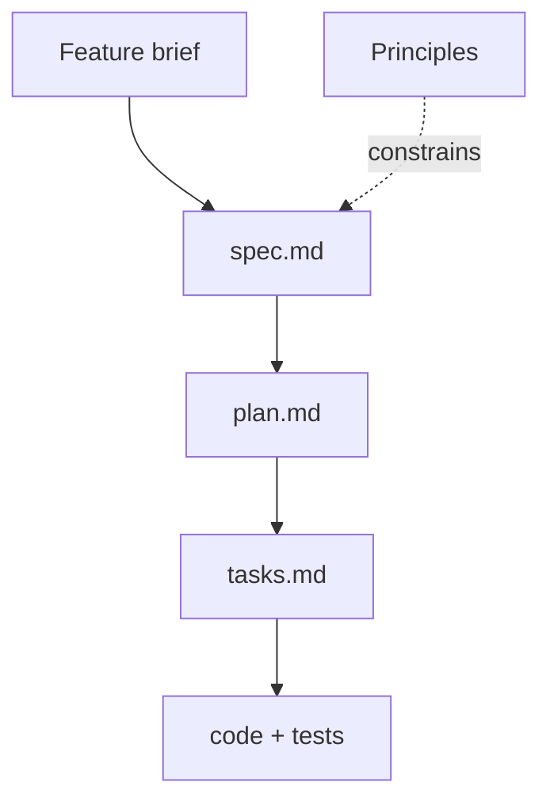

# Sample Case: Implement a Product Feature

The two previous topics described the spec-driven loop. This one describes what it feels like to run it, so you know what the hands-on lab asks of you before you open it.

The scenario is a meeting cost calculator: an organizer enters a duration and a list of attendee hourly rates, and the tool returns the total salary cost with a per attendee breakdown. It is deliberately small. A feature you can hold in your head is the only kind where you can see clearly what the process added, rather than attributing the result to the size of the problem.

## What the run looks like

You start from two inputs that already exist as files: a feature brief written the way a product owner writes one, and a short list of project principles. Neither mentions a language, a file layout, or a class name. Everything downstream is generated from those two documents by the agent, and reviewed by you.

The loop then runs through the previous topic's commands, from `/speckit-constitution` to `/speckit-implement`. What makes it a lab rather than a demo is that you stop after each one and read the artifact before the agent continues.

## What each checkpoint catches

| Checkpoint | The question you ask | What it typically catches |
| --- | --- | --- |
| Constitution | Did every principle survive, or did one get softened into a suggestion? | A dropped constraint, which then never gets enforced downstream |
| Specification | Is every acceptance criterion and edge case present, and is this still requirements rather than design? | Silently dropped criteria, and implementation detail leaking into the spec |
| Plan | Does it verify itself against the constitution, and give reasons for its technology choices? | A violated principle, caught before any code exists |
| Tasks | Is the sequence right, and does every acceptance criterion map to a task? | Untestable tasks such as "handle errors", and criteria with no work behind them |

## The gaps are the lesson

The feature brief leaves two things unstated on purpose: how the result should be rounded, and what currency the numbers are in. Both change the implementation. In a code-first workflow the agent picks an answer during generation and never mentions it, and you discover the choice later from a rounding bug.

In the spec-driven workflow the gap surfaces at the specification checkpoint, while it still costs one sentence to close. That is the whole argument for the method, reduced to something you can watch happen in a single sitting.

The lab also plants one constraint the agent tends to violate. The principles say monetary amounts are never binary floats, and the tell is a plan that names `float` for the total. Every figure in the brief is exact in binary, so a float implementation still prints the right answer and the test output never gives the violation away. Catching it at the plan checkpoint is the skill the exercise is training.

## Running the lab

The exercise lives in [labs/09-spec-driven](../../../labs/09-spec-driven/), where the feature brief is `requirements.md` and the project principles are `constitution.md`. It takes about 45 minutes and needs GitHub Copilot in VS Code plus the Spec Kit CLI.

The completed run is checked in. [sample-case-solution/](./sample-case-solution/readme.md) records the totals, the float check and the test output.

## Links & Resources

- [Spec Kit documentation](https://github.github.io/spec-kit/) - reference for every `/speckit-*` command and the artifact templates
- [GitHub Spec Kit](https://github.com/github/spec-kit) - the toolkit repository and CLI install instructions

[← Previous: The Spec-Driven Workflow](../02-spec-driven-workflow/readme.md) | [Back to Spec-Driven Development](../readme.md)
