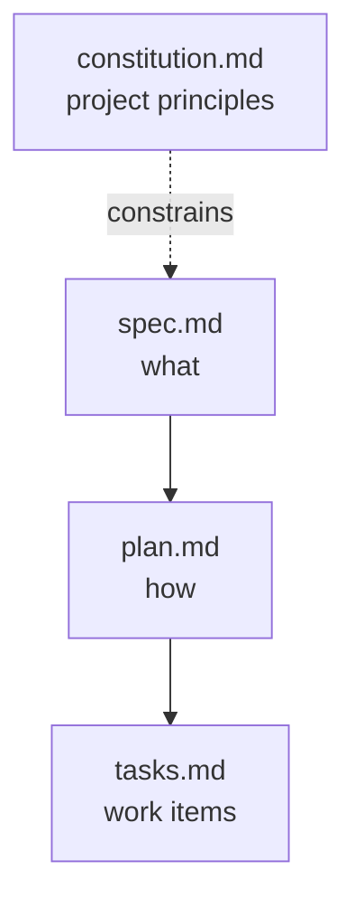
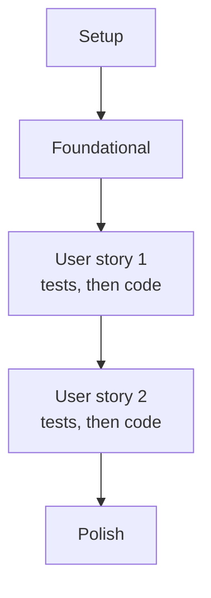
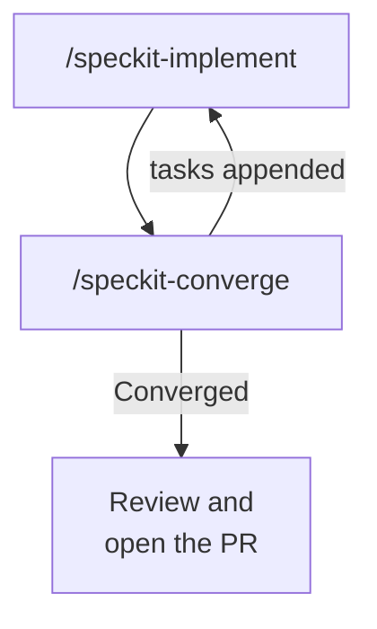

# The Spec-Driven Workflow

GitHub Spec Kit is an open-source toolkit that wires spec-driven development into AI coding assistants such as GitHub Copilot and Claude Code. Everything it produces is plain Markdown stored next to your code, so specifications, plans, and tasks live in Git with the same review and history as the implementation.

Because the artifacts are versioned files, a feature branch carries both the requirements and the code that satisfies them. Include `spec.md`, `plan.md`, and `tasks.md` in the pull request so a reviewer sees what was built and why.

## The four artifacts

| File | Role | Changes |
| --- | --- | --- |
| `constitution.md` | Non-negotiable project principles: technology standards, security requirements, coding standards. The agent checks proposals against it. | Rarely, once established |
| `spec.md` | What the software must do: summary, user stories, acceptance criteria, functional and nonfunctional requirements, edge cases. Requirements only, no implementation. | Per feature |
| `plan.md` | How it will be built: architecture, stack decisions with rationale, implementation sequence, constitution compliance. | Per feature |
| `tasks.md` | Discrete work items derived from the plan, sequenced so each is independently implementable and verifiable. | Throughout implementation |



Each artifact is generated from a template in `.specify/templates/`, and the templates are what make the output predictable. Reading them once tells you what a finished artifact must contain, which is exactly what you check at a checkpoint.

## Inside the constitution

`specify init` copies a constitution template with placeholder principles into `.specify/memory/constitution.md`. `/speckit-constitution` fills it from the principles you give it, stamps a semantic version and a ratification date, and prepends a sync impact report listing what changed.

The template has five principle slots. Give it six principles and the agent tends to demote the sixth into a constraints section, where it reads like background rather than a rule. Count the principles in the generated file against the ones you supplied, and check that each still says MUST.

## Inside the spec

`/speckit-specify` creates the numbered feature folder under `specs/` and writes `spec.md` from the spec template. The mandatory sections are User Scenarios & Testing (prioritized user stories, each independently testable, plus edge cases), Requirements (numbered functional requirements such as `FR-001`), and Success Criteria (measurable and technology-agnostic); an Assumptions section records what the agent decided for you.

Unclear points are handled two ways. The agent fills most gaps with a reasonable default and lists it under Assumptions, and it raises at most three `[NEEDS CLARIFICATION: ...]` markers for decisions that change scope, security, or user experience, then asks you to choose. The command also writes `checklists/requirements.md`, a quality checklist it validates the spec against before it hands control back.

The Assumptions section is the one to read first. It is where a silently resolved gap lives, and a gap resolved there is still a decision you did not make.

In the lab, step 3 is the longest checkpoint and the one that pays for itself. You hold the generated `specs/001-*/spec.md` against the brief with these checks:

| Check | What a good `spec.md` shows | Failure to catch |
| --- | --- | --- |
| Coverage | All three user stories and all five acceptance criteria | A criterion silently dropped |
| Edge cases | A stated outcome for each of the four edge cases | "Handled gracefully" with no defined behavior |
| The two gaps | A written rounding rule and a currency decision | The agent picked one and never told you |
| No implementation | No class names, file layout or library choices | The spec has quietly become a plan |
| No invented input | Attendees are a list of hourly rates, nothing more | A name per attendee that the brief never asked for |

The reference solution closes the gaps under a `Resolved Gaps` heading: the total rounds half up to two decimal places, breakdown values stay unrounded, and amounts are currency-agnostic decimals. Edit `spec.md` directly to get there; the file is yours as much as the agent's.

## Inside the plan

`/speckit-plan` takes your technical direction (language, framework, constraints) and produces more than one file. It runs in two phases: research first, then design.

| File | Phase | What it holds |
| --- | --- | --- |
| `research.md` | 0 | Each technology decision, the alternatives considered, and the reason for the choice |
| `plan.md` | 0 and 1 | Technical context, project structure, and the Constitution Check |
| `data-model.md` | 1 | Entities, fields, validation rules and relationships from the spec |
| `contracts/` | 1 | The interfaces the feature exposes, such as a CLI or an API, with inputs, outputs and errors |
| `quickstart.md` | 1 | How to run and verify the feature once it is built |

The Constitution Check in `plan.md` is a gate: it must pass before research and is re-checked after design. Each principle gets an explicit verification, and a violation must either be fixed or justified in a Complexity Tracking table.

Read `contracts/` next to `spec.md`. A contract is derived from the spec but it is what the tests and code are written against, so a contract that contradicts an edge case in the spec produces code that contradicts it too, with tests that pass.

The lab's step 4 exercises both reads. You pass the stack as the command's argument:

```text
/speckit-plan Use Python 3.11 with pytest, standard library only. A flat package meeting_cost with two modules, the calculation logic and a CLI wrapper using argparse, plus a __main__.py so it runs as python -m meeting_cost <minutes> <rate> [<rate> ...].
```

In `plan.md`, look for the type named for money. `decimal.Decimal` with `ROUND_HALF_UP` passes principle 4; `float` fails it, and the agent's own Constitution Check should say so. Then open `contracts/cli.md`: a generated contract has been seen listing `python -m meeting_cost 60` (no attendees) as an error, which contradicts the spec's zero attendees rule and would ship as a failing command backed by a passing test.

## Inside the task list

`/speckit-tasks` turns the plan into numbered tasks (`T001`, `T002`, ...) grouped in phases: setup, foundational work, then one phase per user story in priority order, then polish. Each task names the file it touches, `[P]` marks a task that can run in parallel because it touches a different file with no pending dependency, and `[US1]` ties a task to its user story.

Test tasks appear only when the spec or constitution asks for tests. When they do, they come first inside each story phase and must fail before the implementation task that makes them pass.



A task list is judged by two properties, not by its wording. Its order must let each task build on finished ones, and every acceptance criterion in the spec must have at least one task behind it.

The lab's reference [tasks.md](../../../labs/09-spec-driven/meeting-cost-solution/tasks.md) runs T001 to T027 across six phases and ends with two coverage tables, one mapping each acceptance criterion to its tasks and one doing the same for each edge case. That is principle 5 made checkable:

| Criterion | Tasks |
| --- | --- |
| AC-1: 60 minutes at 100, 80 and 60 totals 240 | T007, T009, T022, T026 |
| AC-5: invalid input exits non-zero naming the field | T004, T005, T016, T017, T020, T024, T025, T026 |

At step 5 you delete or merge any task too vague to verify, such as "handle errors", because a task nobody can check off is a criterion nobody tested.

## Project structure

Spec Kit keeps specification artifacts separate from implementation code:

```text
my-project/
├── .github/
│   └── skills/                  speckit-<cmd>/SKILL.md
├── .specify/
│   ├── memory/
│   │   └── constitution.md
│   ├── scripts/
│   │   └── powershell/          bash/, powershell/, or powershell/ plus python/, chosen at init
│   └── templates/
├── src/
│   └── ...
└── specs/
    ├── 001-document-upload-feature/
    │   ├── plan.md
    │   ├── spec.md
    │   └── tasks.md
    └── 002-authentication-feature/
        ├── plan.md
        ├── spec.md
        └── tasks.md
```

`specify init` creates everything except `specs/`. The first `/speckit-specify` run creates that directory and the numbered feature folder inside it. Features are numbered sequentially and each gets its own directory, so two people can work on separate features without their artifacts colliding.

The tree shows the three core files per feature. After a full run the feature folder holds the plan's supporting files as well; this is the lab's folder after `/speckit-tasks`:

```text
specs/001-meeting-cost-calculator/
├── checklists/
│   └── requirements.md
├── contracts/
│   └── cli.md
├── data-model.md
├── plan.md
├── quickstart.md
├── research.md
├── spec.md
└── tasks.md
```

## Core commands

| Command | Purpose |
| --- | --- |
| `/speckit-constitution` | Establish project principles and constraints |
| `/speckit-specify` | Turn a feature description into a complete `spec.md` |
| `/speckit-plan` | Turn the specification into an architectural approach |
| `/speckit-tasks` | Break plan elements into actionable, sequenced work items |
| `/speckit-implement` | Generate code task by task, guided by spec and plan |
| `/speckit-converge` | Assess the codebase against the artifacts and append the remaining work as tasks |

`/speckit-implement` checks the feature's checklists before it starts and asks before proceeding if items are open. It marks each task done in `tasks.md` as it finishes, which is why re-running it after an interruption resumes at the first unchecked task.

While it runs, watch which files it touches: in the lab, anything outside `meeting_cost/` and `tests/` means it has drifted from `plan.md`.

## Verify against the spec, not the tests

Step 7 of the lab runs the suite and then the acceptance criteria by hand:

```bash
python -m pytest
python -m meeting_cost 60 100 80 60
python -m meeting_cost 30 90
python -m meeting_cost 60
python -m meeting_cost -30 90
```

| Input | Expected result |
| --- | --- |
| 60 minutes, rates 100 / 80 / 60 | `Total: 240.00` |
| 30 minutes, rate 90 | `Total: 45.00` |
| 0 attendees | `Total: 0.00`, exit code 0 |
| -30 minutes | non-zero exit, message naming `duration` |

The two decimal places are the rounding rule you wrote into `spec.md` at step 3, arriving in the output. The reference solution passes 25 tests: five acceptance criteria and four edge cases, each with a test behind it.

The check that matters more than a green run is `spec.md` and `tasks.md` side by side. A suite that covers only the happy path passes just as green, and it means the task list was incomplete, not that the feature is done; that failure mode is what the whole lab is built around. When your run is finished, compare it with [meeting-cost-solution/](../../../labs/09-spec-driven/meeting-cost-solution/readme.md): the wording will differ because the agent generated it, but the structure and the coverage should not.

## Commands that check the artifacts

Four more commands produce no code. They exist to find problems in the documents while fixing them is still cheap.

| Command | When to run it | What it does |
| --- | --- | --- |
| `/speckit-clarify` | After specify, before plan | Scans the spec for underspecified areas, asks up to five targeted questions with options, and writes each answer back into the spec |
| `/speckit-checklist` | Any time after specify | Generates a domain checklist that tests the requirements themselves for completeness and ambiguity; Spec Kit calls these "unit tests for English" |
| `/speckit-analyze` | After tasks, before implement | Read-only report across spec, plan and tasks: duplicates, ambiguity, coverage gaps; a constitution conflict is always CRITICAL |
| `/speckit-taskstoissues` | After tasks | Turns the task list into GitHub issues |

`/speckit-analyze` never edits a file. It proposes remediation and waits for you, so it fits naturally as the last check before `/speckit-implement`.

## When requirements change

The workflow runs forward, but it is not one-way. When a requirement changes, edit `spec.md`, regenerate the plan and tasks, and let the change propagate, rather than patching it into code where nobody can trace it back to a requirement.

`/speckit-converge` covers the other direction: code that exists before its tasks do, or an implementation that stopped short. It compares the codebase against spec, plan and tasks, and appends whatever is still unbuilt to `tasks.md` so `/speckit-implement` can finish it. The Spec Kit README sums up the rhythm as constitution once per project, then specify, plan, tasks, implement and converge per feature, repeating implement and converge until converge reports "Converged".



The artifacts are also yours to shape. The templates in `.specify/templates/` are a starting point, and adjusting them to your organization's conventions changes every spec, plan and task list generated after.

The tree above is drawn from a real `specify init`. The full file listing, the ten command names and the script flavour matrix are in [project-structure-solution/](./project-structure-solution/readme.md).

## Hands-On

- Demo: [project-structure-solution/](./project-structure-solution/readme.md) lists every file `specify init` writes, the ten command skills, and what each `--script` value generates.
- Lab: [Lab 09, steps 3 to 7](../../../labs/09-spec-driven/readme.md#step-3-specify-the-feature-10-minutes) have you read a generated spec, plan, contract and task list against the checks on this page, implement, and verify against the spec. The [Python variant](../../../labs/09-spec-driven/readme-py.md) fixes the stack and calls out the traps above step by step.

## Links & Resources

- [Spec Kit documentation](https://github.github.io/spec-kit/) - reference for every `/speckit-*` command and the artifact templates
- [GitHub Spec Kit](https://github.com/github/spec-kit) - the toolkit repository, the implement and converge loop, and its `.specify/` directory conventions
- [Diving into Spec-Driven Development with GitHub Spec Kit](https://developer.microsoft.com/blog/spec-driven-development-spec-kit/) - the specify, plan and tasks split, the constitution, and customizing the templates

[← Previous: Why Spec-Driven Development](../02-introduction/readme.md) | [Back to Spec-Driven Development](../readme.md) | [Next: Sample Case: Implement a Product Feature →](../04-sample-case/readme.md)
