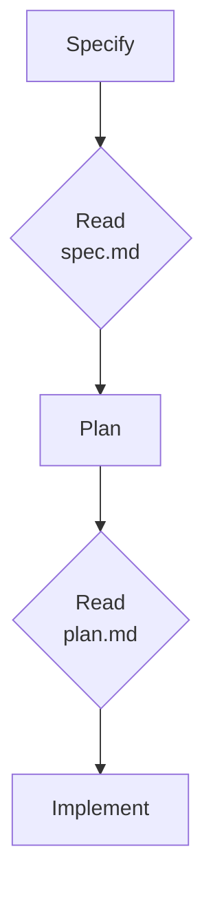

# Spec-Driven Development & Delivery

## Overview

Coding agents generate new functionality well, but left unconstrained they refactor or break code that already worked. Spec-driven development (SDD) answers that with executable contracts: a written specification the agent must satisfy, checked at each phase before the next one starts.

This module is an introduction, not a deep dive. It covers why SDD exists, the four phases of the GitHub Spec Kit workflow, the artifacts and commands that drive it, and points at a standalone lab for anyone who wants to run the full loop on a real feature.

## Module Structure

| Topic | Description |
| --- | --- |
| [Why Spec-Driven Development](./01-introduction/) | The case for SDD, the four phases, and installing GitHub Spec Kit |
| [The Spec-Driven Workflow](./02-spec-driven-workflow/) | Artifacts, project structure, and the core `/speckit.*` commands |
| [Sample Case: Implement a Product Feature](./03-sample-case/) | Optional take-home lab implementing a complete feature with Spec Kit |
