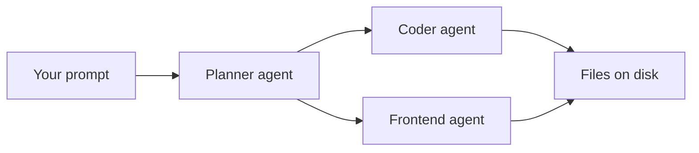

# Orchestrate a Multi-Agent Python Build with One Prompt

Orchestration is the difference between one agent doing everything in sequence and a lead agent that plans, splits the work, and runs specialists in parallel. This lab puts that behavior under test with a single prompt: a planning phase before any file is written, a parallel phase where two specialists own disjoint files, and a trace that proves the orchestrator actually invoked them. By the end you hold a working Python temperature converter in `src/scratch/delegation-test-py/` and a pass-or-fail audit you can run in under a minute.

This is the Python variant of [the orchestration lab](readme.md). The orchestration checks are identical; only the build target changes from a static JavaScript page to a Python standard-library web app.

> Note: The trace examples in this guide come from a workspace session with agent mode and custom agents configured. On GitHub.com, subagents follow the same automatic-delegation rules described in the Copilot documentation.

## What orchestration has to prove

An orchestrator is judged on its tool calls, not its prose. The prompt embeds its own grading criteria, so the outcome is checkable instead of vibes:

| Criterion | Where to look | Failure mode |
|-----------|---------------|--------------|
| An `## Execution Plan` block with phases | First response | Work starts without a plan |
| A Planner call before any build | Chat trace | No Planner invocation, or the plan is invented after the fact |
| Coder and Frontend in one parallel phase | Chat trace | Serial execution, or one agent touching the other's files |
| Actual agent tool invocations | Chat trace | Prose saying "I would delegate to Coder" with no tool call |
| Files on disk in `src/scratch/delegation-test-py/` | File explorer | Files missing, or contract mismatch between them |
| No `team-playwright` call | Chat trace | The prompt has no e2e wording, so any e2e agent call is a rule violation |

The failure to spot: the model narrates the orchestration instead of performing it. The summary reads fine; the trace is empty.

## Run the test

1. Confirm Python 3.10 or later with `python --version`. The build uses the standard library only, so there is nothing to install.
2. Open this repository as your workspace session. Files are available automatically; no attachments needed.
3. Start a fresh chat, select the `Team Orchestrator` agent, and make sure no earlier context contaminates the run.
4. Paste the prompt below and submit it.

```text
Build a small standalone utility under src/scratch/delegation-test-py/: a
temperature converter (Celsius <-> Fahrenheit) in Python, using only the
standard library. Keep the conversion logic in its own module, separate from
the markup. Add a small http.server app that serves a plain HTML page with a
form using that logic, a stylesheet, and a short readme explaining how to run
it. Do not touch anything outside that folder.
```

The task is shaped to force every orchestration behavior at once: non-trivial enough that the lead agent must plan first, deliverables that split cleanly across Coder (logic, server and readme) and Frontend (styling, and the markup when the plan gives it its own file) in one parallel phase with no file overlap, and no e2e wording, so a `team-playwright` call would be a rule violation you can spot.

## Read the trace like a reviewer

The plan is only the beginning. The pass condition lives in the trace, so read it as an audit of who was called, in what order, and with which files.



1. Confirm the first response opens with an `## Execution Plan` block that names the phases and the scope guard.
2. Confirm the trace shows a `Planner` invocation that returns the file layout and the shared contract: the conversion module and its functions, the form field names, the routes `app.py` serves, and the stylesheet path.
3. Confirm a single parallel phase contains both the `Coder` and `Frontend` invocations, and that no file appears in both briefs. The Python files belong to Coder; the stylesheet belongs to Frontend.
4. Reject the run if the trace narrates the split ("I would delegate to Coder") instead of invoking the agents. That is the standard failure mode.

Expected outcome: at least three agent invocations in the trace (Planner, Coder, Frontend), with Coder and Frontend batched in one parallel phase. Later phases may call Coder again, for example to write `app.py` once the conversion module exists.

The file layout is the Planner's call, not a fixed list. A verified run produced `temperature.py`, `app.py` with the markup inline, `static/styles.css` and `readme.md`; the [reference solution](orchestration-solution-py/readme.md) splits the markup into `index.html`. Both pass, because the pass condition is one contract stated once and carried unchanged into both briefs.

## Verify the artifact

A clean trace is half the result. The other half is whether the parallel agents produced parts that fit together:

```powershell
git status --short -- src/scratch/
```

Expected: the only change reported is the new `src/scratch/delegation-test-py/` folder. Nothing outside it was touched.

Check the conversion module on its own before starting the server. Replace `converter` with the module name your Planner chose, for example `temperature`:

```powershell
python -c "import sys; sys.path.insert(0, 'src/scratch/delegation-test-py'); from converter import celsius_to_fahrenheit as c2f, fahrenheit_to_celsius as f2c; print(c2f(0), c2f(100), c2f(-40), round(c2f(37), 1), round(f2c(98.6), 1))"
```

Expected: `32.0 212.0 -40.0 98.6 37.0`. Note that `37 * 9 / 5 + 32` is `98.60000000000001` in floating point, which is why the page rounds to one decimal place.

Then start the server and leave it running:

```powershell
python src/scratch/delegation-test-py/app.py
```

Expected: the server listens on the port your build's `readme.md` names, `http://127.0.0.1:8000/` in both verified builds. Open that URL in a browser and check the known conversion pairs:

| Celsius | Fahrenheit |
|---------|------------|
| 0 | 32 |
| 100 | 212 |
| -40 | -40 |
| 37 | 98.6 |

Expected: every pair converts in both directions, negative values work, and submitting `abc` shows a validation message instead of a stack trace, with what you typed still in the form. The reference solution displays one decimal place, so 0 C reads as `32.0`; other builds may format differently. A converter that fails here usually means the two agents worked from different contracts, not that either wrote bad code.

Unlike the JavaScript variant, the page does not update while you type: a plain form round-trips to the server on submit. Press `Ctrl+C` in the terminal to stop the server when you are done.

A reference solution that passes every check above is checked in at [orchestration-solution-py/](orchestration-solution-py/readme.md). Compare your run against it; do not copy it into `src/scratch/delegation-test-py/` before the run, or the trace you are auditing is not your own.

## Troubleshooting

| Symptom | Likely cause | Fix |
|---------|--------------|-----|
| The response narrates the split but the trace has no tool calls | The model is describing orchestration instead of performing it | Treat the run as a fail and re-run on a harness that emits real agent invocations |
| No Planner call before the build | The lead agent judged the task too simple to plan | The prompt is non-trivial by construction; a plan phase is mandatory |
| Coder and Frontend run serially | No parallel batch in the trace | Check for a single phase containing both invocations, not two sequential ones |
| The trace shows `404 The model ... does not exist` on the Planner or Coder call, then the orchestrator writes the files itself | The `model:` line in `.github/agents/team-*.agent.md` names a model this client cannot resolve, for example `DeepSeek V4 Flash (oaicopilot)` outside VS Code | Treat the run as a fail; set a model your client offers in the agent files, or remove the `model:` line, and re-run |
| Both agents wrote the same file | The shared contract was not stated in the briefs | Re-run with the contract (module, functions, field names, routes, stylesheet path) embedded in both briefs |
| The page shows raw placeholders such as `$celsius`, or an empty form after submit | The markup and `app.py` use different placeholder or field names | A contract mismatch between the two agents; compare both files against the Planner's contract |
| The page loads without styling | `app.py` does not serve the stylesheet, or the markup links a different path | Open the stylesheet URL the markup links; a 404 means the server side of the contract is missing |
| `OSError: [WinError 10048]` or `Address already in use` | An earlier server is still bound to port 8000 | Stop the earlier terminal with `Ctrl+C`, then start again |
| Some files exist, others do not | The run stopped after the first agent | A pass needs every file the Planner listed on disk |

## Summary

You ran one prompt that exercises the full orchestration path: plan first, a parallel Coder plus Frontend split with no file overlap, and a trace you can audit for real tool invocations. You can now:

- Tell narrated orchestration ("I would delegate to Coder") apart from real agent tool calls in a trace
- Fix a shared contract before fanning out: module and function names, form field names, routes, stylesheet path
- Confirm scope with `git status` that nothing outside the target folder changed
- Recognize an invented rule violation, such as a `team-playwright` call with no e2e wording

Next: reuse the same prompt shape to audit orchestration behavior in your own multi-agent workflows.

## Links & Resources

- [Using agent mode in GitHub Copilot](https://docs.github.com/en/copilot/how-tos/chat-with-copilot/chat-in-ide) - how agent mode plans, edits, and iterates on multi-step tasks
- [Creating custom agents for Copilot](https://docs.github.com/en/copilot/how-tos/copilot-on-github/customize-copilot/customize-cloud-agent/create-custom-agents) - how to configure the subagents that orchestration routes to
- [http.server](https://docs.python.org/3/library/http.server.html) - the standard-library HTTP server the build uses
